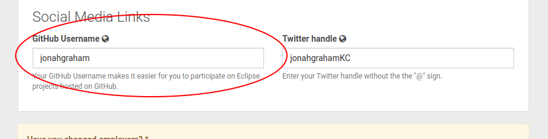

# Contributing to Eclipse C/C++ Development Tools

Thanks for your interest in this project.

## Developer resources

For any questions regarding developing, extending and contributing to Eclipse CDT you cannot find answers to here, please [Contact us](#contact). Please also help improving this page, once you got your answer.

## Contributing to CDT

### Setup CDT for development with Oomph

The recommended flow for most users is to use the "Oomph" installer. Just click the following link and follow the instructions or drag the following link and drop it onto the Installer's title area:

[](https://www.eclipse.org/setups/installer/?url=https://raw.githubusercontent.com/eclipse-cdt/cdt/main/releng/CDTConfiguration.setup&show=true "Click to open Eclipse-Installer Auto Launch or drag onto your running installer's title area")

### Setup CDT for development, manual setup

Many of the active Eclipse CDT developers manually setup their development environment instead of using Oomph as described above. *Developers new to Eclipse development should follow the Oomph instructions above.* The instructions in this section are brief and assume reader has experience in Eclipse development already.

1. Use *Eclipse IDE for Eclipse Committers* for development of Eclipse CDT
2. Import the projects from the repository that you are interested in. Other parts of CDT are available through the target platform so you can have only some of the projects imported into your workspace.
3. The target platform to use is `releng/org.eclipse.cdt.target/cdt.target`
4. The API baseline to use is `releng/org.eclipse.cdt.target/cdt-baseline.target` - see [Using API Tooling](POLICY.md#Using-API-Tooling)

### Launching

After all the CDT projects have successfully built, you'll probably want to run and/or do source-level debugging of the CDT code. Open the PDE (Plug-in Development Environment) perspective:  Window->Perspective->Other->"Plug in Development". There, you'll see a project with the name org.eclipse.cdt.ui, right click the org.eclipse.cdt.ui project, select "Run As"->"eclipse application". You should see a new instance of eclipse - with the latest version of eclipse CDT plugins.

Alternatively, you can create a Launcher: Go to Run - Debug Configurations... Select "Eclipse Application" and click New. Give the Debug Configuration a Name and the other defaults are OK. This appears to be a more widely used launching technique.

Until you are familiar with the CDT code base, using a Debug Launcher and experimenting with breakpoints is probably the best way to get a warm fuzzy feeling if you have doubts about modifications you are making.

### Testing

The Eclipse CDT project has extensive JUnit Plug-in tests covering many parts of the CDT code base.
These tests are run automatically by the CI system (currently Jenkins and GitHub actions) using Maven + Tycho Surefire.
See [CDT Testing notes](TESTING.md) for more information.

### Creating Pull Requests

To make changes to the CDT, whether it be code, docs, JUnits, etc., you will need to create a Pull Request. Below is the process for creating pull requests. The Eclipse CDT project uses GitHub, therefore the [standard help and advice](https://docs.github.com/en/pull-requests/collaborating-with-pull-requests/proposing-changes-to-your-work-with-pull-requests) on using GitHub Pull Requests are useful for additional details.

These steps apply to anyone, whether a member of Eclipse CDT or a contributor on the project.

- To fix anything in CDT first you can create or find an existing [issue](https://github.com/eclipse-cdt/cdt/issues) report for this particular problem/enhancement. Creating an issue is optional, but highly recommended for larger changes to provide a place to pull all aspects of the improvement together and to discuss acceptable solutions before a Pull Request may be ready.
- Setup your Eclipse Development environment and check out source code, see [Setup CDT for development with Oomph](#Setup-CDT-for-development-with-Oomph) below.
- Fix the source code 
- Comment your changes in the code
- For new files you must add copyright header, see [Copyright header policy](POLICY.md#Copyright)
- Follow [CDT Guidelines](POLICY.md) for code formating, java warnings/errors, etc. 
  - Code with any of the warnings/errors mentioned in the policy, including strings externalization and API errors will not be accepted.
- To minimize the change, do not re-format the source code you edited (except changed lines). Do not fix any warnings in the code you are not changing 
- If you want to do formatting or styling (such as modernizing code) - create a separate commit (it is good to fix warnings but it would clutter the patch, you want to solve one problem at a time).
  - For changes that are strictly cosmetc, a commit message of `Cosmetics.` is sufficient, any additional information that may help a reviewer is more than welcome.
  - This separate commit can be provided as a separate PR or as part of the PR that fixes the bug / introduces the new feature.
- To speed up process of applying your changes you should create one or more junit tests as well and include it in your change
- See [Commit messages matter. Here's how to write them well.](https://cbea.ms/git-commit/)
- Make sure your commit message and/or Pull Request [references the issue](https://docs.github.com/en/issues/tracking-your-work-with-issues/linking-a-pull-request-to-an-issue#linking-a-pull-request-to-an-issue-using-a-keyword) (if there is one), e.g.:
```
  Short Description Fixes #123
```
- Make sure GitHub Issue has a clear reproducible scenario, if not add one 
- Create a Pull Request for your commit(s).
  - Eclipse CDT follows standard [GitHub practice](https://docs.github.com/en/pull-requests/collaborating-with-pull-requests/proposing-changes-to-your-work-with-pull-requests/creating-a-pull-request) on using Pull Requests.
  - Eclipse CDT borrows process when possible from the Eclipse Platform project rather than duplicating it here. See the Eclipse Platform's [recommended workflow](https://github.com/eclipse-platform/.github/blob/main/CONTRIBUTING.md#recommended-workflow) for creating Pull Requests.
- There are various GitHub actions and Jenkins CI jobs that may run on the Pull Request. Click on the details of those runs to understand more about them.
- Normally committers are watching new Issues and Pull Requests and somebody would look at your contribution in a few days
- If it has not received attention in a week or so, some nagging can help. Send email to [cdt-dev](#contact) asking committers to look at the contribution. Continue sending e-mails until somebody would give up and look :)

### Copyright, License and Provenance

One of the fundamental rules that Eclipse follows is the ability to trace back who contributed what code and that the person who contributed it has ownership of the code, or has permission from their employer to contribute the code (since employers tend to own everything you write). To help keep this IP integrity going, please ensure your contributions are "clean".
- If you copy ANY code or images from somewhere else please clearly state it 
- If you copy GPL code we cannot take it
- If you copy EPL code, preserve the original copyright and contributors
- If your changes add more than 1,000 lines, the patch has to go through IP review process, unless it can be applied by the committer from the same company as you are (Member committer). Try to fix one bug at a time.
  - The 1,000 lines include code, comments and even whitespace.
  - You cannot simply split up a change into multiple commits to avoid this review process.
  - Sometimes the review process is slow, but generally it is quite fast and has little impact over the full contribution cycle.

If you are unsure, please send email to [cdt-dev](#contact) for clarification, if a committer doesn't know the answer we can liase with the staff at the Eclipse Foundation for clarity.

### Merge Pull Request

These are the steps that a committer should undertake for all Pull Requests.

1. Set the milestone field to the release in which patch would be applied, If it is applied in two branches set milestone to maintenance branch
2. Code inspect and test and the patch
3. If the patch is > 1,000 lines and from a non-committer, it must be submitted for IP review, i.e. CQ in IPZilla. See [IP Log](https://www.eclipse.org/projects/handbook/#ip-iplog)
4. Merge the Pull Request. Do so while keeping a clean history for CDT
- Use "Rebase and Merge" when the Pull Request has multiple commits separated in a logical fashion.
- Use "Squash and Merge" when merging the PR, especially one where subsequent commits are simply review fixes.
- Only use "Create a Merge Commit" when there is a natural grouping that will be best expressed by showing two branches plus a merge commit.
- It is not necessary for the commit to have a reference in the commit message to the pull request. This reference can be obtained from GitHub automatically. See this [Q&A](https://github.community/t/get-pull-request-associated-with-a-commit/13674)
5. If there is an associated Issue, close the issue and set the milestone.

### Building CDT (from the command line)

For information on building CDT from the command line using maven, refer to the [BUILDING](BUILDING.md) file which contains Command-line Build instructions.

## Eclipse Contributor Agreement

In order to be able to contribute to Eclipse Foundation projects you must
electronically sign the Eclipse Contributor Agreement (ECA).

* http://www.eclipse.org/legal/ECA.php

The ECA provides the Eclipse Foundation with a permanent record that you agree
that each of your contributions will comply with the commitments documented in
the Developer Certificate of Origin (DCO). Having an ECA on file associated with
the email address matching the "Author" field of your contribution's Git commits
fulfills the DCO's requirement that you sign-off on your contributions.

For more information, please see the Eclipse Committer Handbook:
https://www.eclipse.org/projects/handbook/#resources-commit

## Connect Eclipse Foundation and GitHub account

The Eclipse Foundation manages the permissions of the GitHub repositories using automation based on your state as a committer. Therefore you need to enter your GitHub username in the Eclipse [Account Management page](https://accounts.eclipse.org/user/edit) as per screenshot below. Once you make the change it can take a few hours for the synchronization scripts to update.



Once you have done this successfully and the synchronization scripts have had a chance to run you will see yourself listed in [tools-cdt-committers](https://github.com/orgs/eclipse-cdt/teams/tools-cdt-committers/members). If you get permissiong denied, the connection is not working. Reach out to the [CDT Dev list](#contact) for support.

## Contact

Contact the project developers via the project's "dev" list, raise an issue or start a discussion. Official communications, such as voting, is conducted on the dev list.

* Dev list: https://dev.eclipse.org/mailman/listinfo/cdt-dev
* Issues: https://github.com/eclipse-cdt/cdt/issues
* Discussions: https://github.com/eclipse-cdt/cdt/discussions

The Eclipse CDT project has a monthly call and everyone in the community is welcome to join.
See [Eclipse CDT Calls](https://github.com/eclipse-cdt/cdt/discussions/836)
