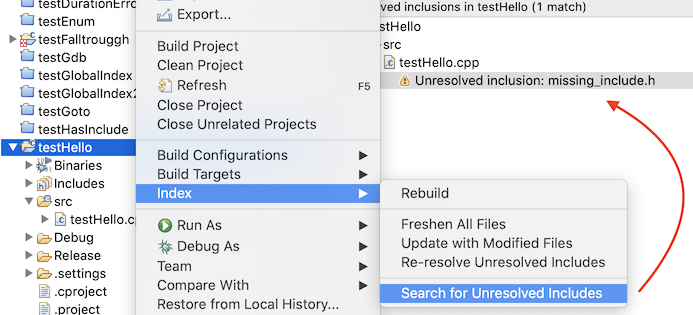
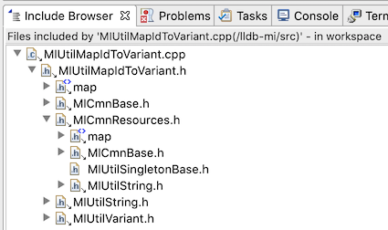
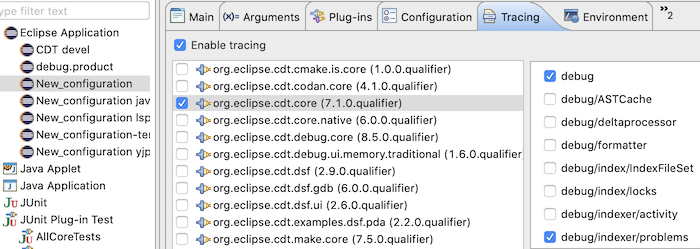
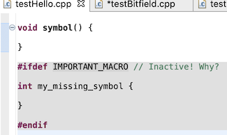
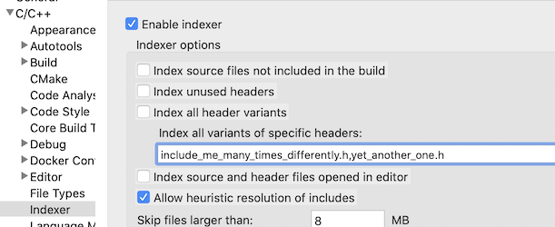

# How to troubleshoot indexing issues

## Tips on how to troubleshoot indexing-related issues.

Warning: This page is a work in progress (it started as a simpleresponse on bugzilla).
It is not well structured yet but might stillcontain useful information.

In case of semantic errors reported such as "Symbol 'foo' could not beresolved" ...

### Diagnosing the index

Doing a manual rebuild of the index will output a useful report in theview Error Log (the view comes by default with the Eclipse for C/C++package but might not be in your CDT installation depending how you gotit), you can also find the same report in your workspace log file under"your_workspace/.metadata/.log" file.
To rebuild the index, right-clickon the project \> Index \> Rebuild.

Example:

` !MESSAGE Indexed 'mariadb-server' (1,784 sources, 3,493 headers) in 505 sec: 688,918 declarations; 4,042,030 references; 11 unresolved inclusions; 411 syntax errors; 66,635 unresolved names (1.4%)`

Your goal should be to make the "unresolved names" number as low aspossible.
I would recommend to try to get it below 0.01% but your levelof tolerance for inaccuracies might vary (although remember that yourlevel of confidence in the index will be affected and you might startmaking bad programming decisions based on inaccurate results).

First, you should check if there are any unresolved includes as thesetend to produce a lot of unresolved symbols.
To reduce the noise for thenumber of unresolved inclusions (and names), you can set the Indexerpreference to disable "Index unused headers" and disable "Index sourcebuilds not included in the build".
Doing so will limit your thepossibility your you to do code completion on headers never used before(for example) but it will help you get a better picture.
Then rebuildthe index (as described above) to get an updated report (you might wantdo this after every configuration change you make to track yourprogress).

You can see the list of unresolved includes by right-clicking on aproject \> Index \> Search for Unresolved Includes.

<p align="center"></p>

You can also use the view "Include Browser" to help you understand whatthe indexer sees as header dependencies.
If an include path is missing,see the section further.

<p align="center"></p>

There is no easy way to display \*all\* unresolved symbols within in aproject in the UI but you can enable tracing of them using a .optionsfile (or enabling the equivalent in the Tracing tab if you are setup forCDT development and check the Console view of your Eclipse SDK).
Youshould enable "org.eclipse.cdt.core/debug" and"org.eclipse.cdt.core/debug/indexer/problems"

<p align="center"></p>

Here is an example .options file.
Start ./eclipse -debug (in a terminal)with the .options in the working directory or specify its path with./eclipse -debug /path/to/.options.
(use eclipsec.exe on Windows)

```
org.eclipse.cdt.core/debug=true
org.eclipse.cdt.core/debug/indexer/problems=true
```

The you can just rebuild the index to get a possibly huge output withlines such as:

```
Indexer: unresolved name at /Users/malaperle/git/lldb-mi/src/MIUtilVariant.cpp(126); Attempt to use symbol failed: MIunused
...
```

Then, you can inspect the headers to see if the unresolved symbols ofinterest are not in inactive preprocessor regions.
If they are ininactive regions but should be active, it's possible that you aremissing some defined macros, commonly either from the build outputparsing or the detection of built-in macros (those are the typicalsources that feed the indexer but there can be others).

<p align="center"></p>

To see if the indexer is truly missing macros or includes, you cancreate a parser log, by right-clicking on a source file (not header) \>Index \> Create Parser log file.
You can see there if the macros andinclude paths you expect are there.

### Tweaking language entries

How to troubleshoot missing macros or include paths will depend on thetype of project you created.
If you created a managed build project(TODO: explain which one that is), you should start by checking projectproperties \> C/C++ General \> Preprocessor Include Paths, macros.
Underthe entries tab, check that the entries are what you expect.
On Linux, Iwould expect you have the "CDT GCC Build-in Compiler Settings" enabled.For this one, a common problem is that the -std flag is not passed.
Youcan just add/hard-code it in the configuration of this provider underthe "Provider" tab next to Entries.
Any other flags that affect built-inmacros might be important here but -std is usually the biggest culprit.

If you rely on the build output to parse macros/include paths, youshould redo the same exercise and open the properties dialog on theproblematic source file (not the project) but instead look at theentries under the provider called "CDT GCC Build Output Parser".
If theyare not what you expect, double check the configuration of thisprovider, for example, the regex might not parse a gcc command with acustom name.

If all macros and include paths look OK in the parser log, there arefurther possibilities.
If the unresolved symbol is in the middle of asyntax error, it might be because of missing macros being parsed asregular identifiers but it could also be a bug or something notimplemented in the parser.
See [\#Importantlimitations](#important-limitations) If the unresolvedsymbol's declaration depends on another unresolved symbol, thedependency should be solved first and so on.

### Troubleshooting individual errors

#### Indexer shows errors on a project that previously worked

Sometimes it seems that CDT's metadata files can become corrupted and re-indexing the project does not resolve the issue.
In this case you can try importing the project into a new workspace.
Alternatively you can do a localized cleanup, wth Eclipse closed, delete `workspace/.metadata/.plugins/org.eclipse.cdt.core/<project name>.*`.

### Important limitations

- Language support is not nearly complete.
  In fact, at the time of this writing, C99, C++14, C++17, etc and later are not fully supported.
  Expect parsing errors due to this resulting in many different symptoms (syntax errors, symbols not found, etc).
  Support for new feature is not expected to improve drastically as the community is now small and efforts are put on language servers such as Clangd.- By default, the indexer only indexes \*one variant\* of a given header, if it detects "pragma-once semantics" (\#pragma once of \#ifndef FOO_H).
  If a header is meant to be included differently multiple times and it should declare new symbols, you might need to tell the indexer to explicitly to index all variants of this header.
  You can do so in the indexer preferences.
  Be aware that indexing all variants (especially of all headers) will incur a huge performance cost so this should be done sparingly.

<p align="center"></p>

- The index cannot maintain different typedefs with the same name.
  See [bug 337583](https://bugs.eclipse.org/bugs/show_bug.cgi?id=337583).
  You can sometimes work around this by strategically excluding files you don't care about in combination with disabling the indexer preference "Index source builds not included in the build".- Countless other bugs: See [Bugzilla](https://bugs.eclipse.org/bugs/buglist.cgi?bug_status=UNCONFIRMED&bug_status=NEW&bug_status=ASSIGNED&bug_status=REOPENED&component=cdt-indexer&component=cdt-parser&list_id=19992392&product=CDT&query_format=advanced) for older bugs, or GitHub issues for current ones.

### Debugging CDT

See [Setup for CDT Development](https://github.com/eclipse-cdt/cdt/blob/main/CONTRIBUTING.md#contributing-to-cdt)

#### Classes of interest

- [org.eclipse.cdt.internal.core.dom.parser.ProblemBinding](https://github.com/eclipse-cdt/cdt/blob/main/core/org.eclipse.cdt.core/parser/org/eclipse/cdt/internal/core/dom/parser/ProblemBinding.java): When you have a "Symbol 'foo' could not be resolved" error, put a breakpoint in the constructors of this class and you can work your way back in the stack where/why the parsing produced this.
- [org.eclipse.cdt.internal.core.parser.scanner.CPreprocessor](https://github.com/eclipse-cdt/cdt/blob/main/core/org.eclipse.cdt.core/parser/org/eclipse/cdt/internal/core/parser/scanner/CPreprocessor.java).executeInclude: This method is where the CDT preprocessor handles \#include.
This can be a useful starting point if you want to debug why a header is not resolved or the wrong one is included or skipped, etc.
