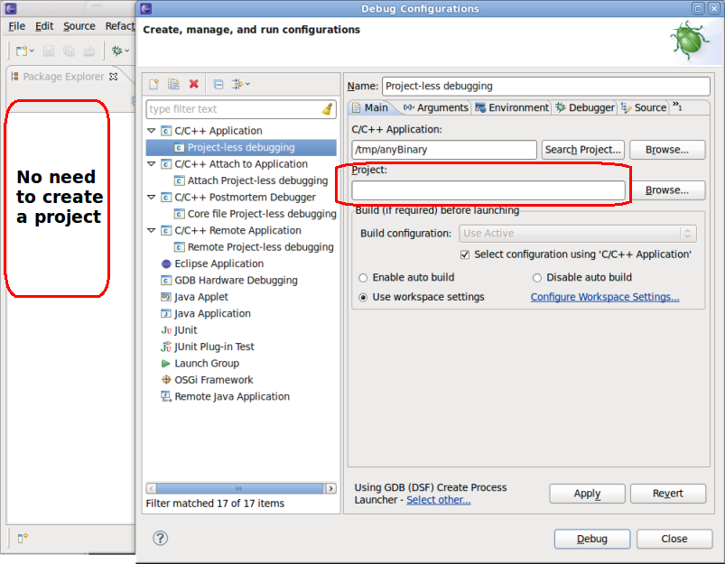

## Introduction

#### How do I contribute to this FAQ?

Fork this repo and provide a Pull Request with your changes.

#### How do I naviagate this FAQ?

This FAQ is very long, so you can use the automatically generated Table of Contents, see https://github.blog/changelog/2021-04-13-table-of-contents-support-in-markdown-files/ for more information.

## General

#### What is the CDT?

The CDT (C/C++ Development Tools) Project is working towards providing a
fully functional C and C++ Integrated Development Environment (IDE) for
the Eclipse platform.

There are a number of groups contributing to the CDT; We strongly
encourage interested parties to extend our work, thereby making the
Eclipse CDT project a richer set of freely available resources. We are
looking for contributions from the open source community in the areas of
test, development, documentation, and general users who can help us
ensure that the C/C++ tools work well on all the Eclipse platforms.

Our current release function includes:

- C/C++ Editor (basic functionality, syntax highlighting, code
completion etc.)

- C/C++ Debugger (APIs & Default implementation, using GDB)

- C/C++ Launcher (APIs & Default implementation, launches and external
application)

- Parser

- Search Engine

- Content Assist Provider

- Makefile generator

Default implementations of all interfaces and extension points will be
supplied for various platforms.

The CDT is fully open-source and implemented purely in java as a set of
plugins to the [Eclipse](http://www.eclipse.org/) platform. To learn
more visit the [CDT Home Page](http://www.eclipse.org/cdt).

#### How is the CDT licensed?

The CDT consists of software produced by the CDT team combined with
third party software developed from other Open Source Projects. The
software produced by the CDT team is licensed under the [Eclipse Public
License](https://www.eclipse.org/legal/epl-v10.html). The software
designed by third parties is made available under their respective
licenses. Refer to the about.html file in the root directory of every
CDT plugin for specific licensing information.

#### How is the CDT Project organized?

Visit the [CDT Project
page](http://www.eclipse.org/projects/project.php?id=tools.cdt) to find
out more about the organization of CDT (Release history, participants,
and project structure).

#### What's new and noteworthy in CDT?

It's worth reading even the older "What's new and noteworthy in CDT" to
understand CDT features.

<https://github.com/eclipse-cdt/cdt/blob/main/NewAndNoteworthy/README.md>

#### How do I find out about future releases of the CDT?

Eclipse CDT releases 4 times per year, in line with the Eclipse
[Simultaneous Release](https://wiki.eclipse.org/Simultaneous_Release).
In addition to lining up with the Simultaneous Release, CDT
releases bug fix releases whenever necessary.

To see issues being worked on, visit the [issues list](https://github.com/eclipse-cdt/cdt/issues)

#### What is the default configuration supported by the CDT?

This is a bit of a moving target, but currently the compiler supported
(from an error parsing point of view) is GCC, the debugger interface
will work with gdb 7.1.0 (or higher) and the default build command is
GNU "make".

#### Which operating systems does the CDT support?

The CDT Framework is platform independent. It will run where Eclipse
will run. However, the default implementations may depend on external
applications. To follow in the Eclipse spirit of open source, the
default implementations rely upon freely available open source tools,
such as the GNU Tools: GDB and Make. Therefore, the dependencies on GDB
for debugging, or Make for building, will require that these
applications are available for the platform that the user wishes to use.
References to some of the known implementations for each platform will
be indicated in the sections of this FAQ that include instructions for
installation, project creation and building the CDT on the various
platforms.

#### Which platforms are fully supported will ultimately depend on the needs of the community, as expressed by the participation in developing, and testing for each platform?

The core plugins are written in Java with no native code and thus may be
ported to any platform supported by Eclipse. However, some default
implementations may require that other software or tools, licensed under
GNU, may be required.

In general there is some version of Linux and some version of windows
used by the developers on the CDT. For an exact list of supported
platforms see the [Downloads
page](http://download.eclipse.org/tools/cdt/releases/callisto/dist/3.1.0/).

#### Why isn't the XXX operating system supported by CDT?

"Supported" has a particular meaning to us. It means that on that
platform we have a good level of confidence that CDT works correctly and
that its function is appropriate and complete. That means

- someone has ensured that the function addresses the important use
cases

- the function is exercised by regular execution of a test plan

- identified problems are tracked to resolution

- there is a recipient for user feedback

- code patches are developed as necessary to correct or extend CDT on
that platform

To make this all happen a platform has an Owner - someone who accepts
the responsibility to make sure those things all happen.

The Framework supports all the platforms that Eclipse does. The CDT team
is responsible for ensuring that this remains true for the framework.
Specific default implementations will work only on platforms where the
required applications are available. The following list is derived from
the initial CDT meeting in July 2002. The following companies have
agreed to provide support for the associated platforms:

| Platform     | Company                                       |
| ------------ | --------------------------------------------- |
| QNX Neutrino | QNX Software Systems Ltd.                     |
| Linux        | IBM, Red Hat                                  |
| Windows      | IBM, MontaVista with initial support from QNX |

If you have a favorite platform we highly encourage you to get involved
and volunteer to own a feature that does not currently have an
implementation that works on your platform of choice. See
[\#Working\_on\_the\_CDT](#Working_on_the_CDT "wikilink") for more
information.

#### How do I ask questions?

CDT related questions that are not answered in this FAQ or the
documentation should be posted to the [CDT
forum](https://www.eclipse.org/forums/index.php/f/80/). You will need an
[Eclipse account](https://accounts.eclipse.org/user/register). General
Questions about the Eclipse SDK which includes the [Eclipse
Platform](http://www.eclipse.org/platform),
[JDT](http://www.eclipse.org/jdt) (Java Development Tools), or
[PDE](http://www.eclipse.org/pde) (Plugin Development Environment)
should be posted to the [Eclipse newcomers
forum](https://www.eclipse.org/forums/index.php/f/89/).

Keep in mind that these forums are public, so do not include any
confidential information in your questions. You should also read ["How
to ask questions the smart
way"](http://www.catb.org/~esr/faqs/smart-questions.html) by Eric
Raymond before participating in the forums. NOTE: Please submit bugs to
[bugzilla](https://bugs.eclipse.org/bugs/), not to the forums. See the
[How do I report a bug or request a
feature?](http://dev.eclipse.org/viewcvs/index.cgi/%7Echeckout%7E/cdt-home/user/faq.html?cvsroot=Tools_Project#general_70)
section of this document.

People will still come into a forums asking questions that have been
answered before and often will not provide any information about what
versions they have installed, and what the problem is. You will be much
more likely to get help if you provide enough information to reproduce
the problem. The section on [how to report a
bug](http://dev.eclipse.org/viewcvs/index.cgi/%7Echeckout%7E/cdt-home/user/faq.html?cvsroot=Tools_Project#general_90)
gives a list of some information which could be useful.

#### How do I report a bug or request a feature?

The CDT Project (like the Eclipse Project) uses
[bugzilla](http://www.bugzilla.org/) as its bug and feature tracking
system. Entering a bug/feature report is as simple as filling in a web
form on the [eclipse bugzilla page](http://dev.eclipse.org/bugs/). The
first time you enter a bug you will need to [create a new bugzilla
account](http://dev.eclipse.org/bugs/createaccount.cgi) for yourself by
providing an email address and choosing a password.

Before entering a bug report, you should [search
bugzilla](http://dev.eclipse.org/bugs/query.cgi) to see if someone else
has already entered a bug report similar to yours. If you find a bug
report that outlines the problem you are seeing, you can simply annotate
it with your comments to let the developers know that you have also hit
the bug. Also you can add yourself to the CC list of the bug so that you
will notified when the status of the bug changes or someone adds
comments.

Once you have searched bugzilla and not found anything, you can go ahead
and enter a new bug report. Please read the bug writing guidelines
located on the [eclipse bug reporting
page](http://dev.eclipse.org/bugzilla.html).

To make your bug report more helpful include the following in your bug
reports:

Environmental settings:


1. The build level of Eclipse that you are using. For example,
"Eclipse 3.0M6"
2. The build level of CDT that you are using. For example, "CDT
build 2.0.0.0026"
3. Your computer's specifications (OS version + patch level,
memory, other pertinent info)
4. The contents of your .log file (or lack thereof). This is
especially important if you get a dialog that reports an internal
error. See What is this .log file I hear so much about? for
information on finding your .log file.
5. The Java runtime or development kit you are using to run eclipse
(use java -version or java -fullversion)

Problem Description:

1. A description of what you were doing,
2. A description of what behavior that you observed, and
3. An explanation of how the observed behavior differs from the
expected behavior

#### Where is this .log file that I hear so much about?

The .log file is located in the workspace/.metadata directory.

The .log file is used by the Eclipse Platform to log runtime errors. It
is useful to include it in bug reports because it contains stack traces
that occur in plug-ins. When you report a bug, make sure to include your
.log file\!

#### How can I generate the parser log file?

If you are having issues with CDT parsing your source files, it might be
useful to attach a parser log to a bug report. To generate the file,
right-click on the problematic source file in the Project Explorer,
Index, Create parser log file. When you attach the file to the bug,
select Content Type: select from list: plain text (text/plain).

## Download and Installation

#### Are there complete HowTos for setting up the CDT?

Yes, please see

  - <http://max.berger.name/howto/cdt/>
  - <http://www.cs.umanitoba.ca/~eclipse/7-EclipseCDT.pdf>
  - <http://zetcode.com/articles/eclipsecdevelopment/>

#### Which CDT build should I download?

The latest stable release version is available from the [CDT downloads
page](http://www.eclipse.org/cdt/downloads.php).

#### Where is CDT update site?

1. There is a p2 repository aggregated with eclipse repository so it
should be available with eclipse updates. It is possible to access it
directly. For the exact URL corresponding to the CDT update site, see
the [CDT downloads page](http://www.eclipse.org/cdt/downloads.php). Note
that some dependencies might be required from other update sites so it
is a good idea to also enable the main Eclipse update site. For example,
when using the CDT 9.2 update site, one should enable also the Neon
update site.

2. You can take the bleeding edge updates from nightly builds (they are
usually quite stable). The update site for most recent nightly builds is
<https://download.eclipse.org/tools/cdt/builds/cdt/main/>

#### I can't find the CDT download for the XXX operating system?

The CDT is supported on the platforms specified on the download page.
The downloads are structured and named to indicate, which OS and
windowing system it runs on. If you do not see your OS/windowing system
combination please contact us. We are always looking for volunteers to
test and support platforms.

Much of the CDT default functionality uses applications that are
available on most operating systems. The CDT leverages some default
system tools such as gdb (debugging), make (building). These tools are
available for many platforms and if they exist on your system, there is
a good chance that the default functionality will work. See Compilers
and other 3rd party tools for more information

The caveat is that the operation of the CDT on some operating systems
has not been fully tested and we cannot commit time to fixing platform
specific problems found on these platforms. However, code submissions
from developers wanting to improve the CDT will always be gratefully
accepted. See Working ON the CDT for more information.

#### Which version of CDT do I have installed?

1.  Select menu item *Help*, *About Eclipse*, or *Eclipse*, *About
    Eclipse* (The path differs if you're on Windows/Linux versus macOS)
    The *About Eclipse* dialogue appears.
2.  In the *About Eclipse* dialogue, click the *Installation Details*
    button. The *Eclipse Installation Details* dialogue appears. In the
    list of installed software, you should see "*C/C++ Development
    Tools*". The version displayed in the version column is the version
    of CDT.


#### How do I uninstall CDT?

Use the Eclipse uninstaller.

1.  Select menu item *Help*, *About Eclipse*, or *Eclipse*, *About
    Eclipse* (The path differs if you're on Windows/Linux versus macOS)
    The *About Eclipse* dialogue appears.
2.  In the *About Eclipse* dialogue, click the *Installation Details*
    button. The *Eclipse Installation Details* dialogue appears. In the
    list of installed software, you should see "*C/C++ Development
    Tools*", and perhaps other related CDT tools.
3.  Click to select the Installed Software items you wish to uninstall.
4.  Click on the *Uninstall...* button in the bottom right corner. A
    progress bar appears, some work happens, and the Uninstall dialogue
    appears.
5.  Click on the *Finish* button. A progress bar appears, some work
    happens, and the Software Updates dialogue appears. It asks if you
    would like to restart Eclipse now.
6.  Click on the *Yes* button to restart Eclipse.
7.  When Eclipse restarts, CDT should be uninstalled.

#### How do I convince Eclipse to "re-read" the configuration files?

Delete the following:

- /configuration/org.eclipse.osgi/manifests

- /configuration/org.eclipse.osgi/.bundledata

- /configuration/org.eclipse.osgi/.state

and restart eclipse.

#### I installed MinGW toolchain on my PC but Eclipse won't find it.

The following algorithm is used as of CDT 7.0 (Helios). Note that older
releases may use different algorithm. That is
org.eclipse.cdt.managedbuilder.gnu.mingw.MingwEnvironmentVariableSupplier
if you want more details.

1. Look at the mingw directory in the platform install directory.
CDT distributions like Wascana may distribute MinGW like that.
2. Try the directory above the install dir (another possible
distribution).
3. Look in PATH values. More specifically, it tries to find
mingw32-gcc.exe in each path.
4. Try looking if the mingw installer ran
(registry.getLocalMachineValue("SOFTWARE\\\\Microsoft\\\\Windows\\\\CurrentVersion\\\\Uninstall\\\\MinGW",
"InstallLocation"); ).
5. Try the default MinGW install dir ("C:\\\\MinGW\\\\bin").

Don't forget to restart eclipse if you changed PATH environment
variable.

If you define a MINGW\_HOME environment variable on Windows, you may
need to restart the system before the variable is visible in Eclipse (to
check that Eclipse knows of the MINGW\_HOME variable, right-click on any
project in a Project Explorer/Package Explorer/Navigator view, then on
Run As \> Run Configurations \> Environment \> Select; you should be
able to see MINGW\_HOME in the list).

Despite having g++.exe or gcc.exe on your PATH and having defined
MINGW\_HOME, you may still get a “Toolchain "MinGW GCC" is not detected”
message (CDT 8.4 on Luna 4.4.0). Make sure that a file called
"mingw32-gcc.exe" exists in MINGW\_HOME\\bin. If it doesn't exist (which
happens with MinGW-W64), copy a -gcc.exe file (e.g.
i686-w64-mingw32-gcc.exe) to mingw32-gcc.exe. If the dreaded message
still lingers around, reboot your system (don't just logout and login).

#### I installed Cygwin on my PC but Eclipse won't find it.

The following algorithm is used as of CDT 7.0 (Helios). Note that older
releases may use different algorithm. That is
org.eclipse.cdt.managedbuilder.gnu.cygwin.CygwinPathResolver if you want
more details.

1. Look in PATH values. Look for "cygwin1.dll" (normally under
"bin/" folder).
2. Try to find the root dir in registry:
readValueFromRegistry("SOFTWARE\\\\Cygwin\\\\setup", "rootdir").
3. Try to find the root dir in registry for 64 bit:
readValueFromRegistry("SOFTWARE\\\\Wow6432Node\\\\Cygwin\\\\setup",
"rootdir").
4. Try to find the root dir in mounts from registry:
readValueFromRegistry("SOFTWARE\\\\Cygnus
Solutions\\\\Cygwin\\\\mounts v2\\\\/", "native");
5. Try the default Cygwin install dir "C:\\\\cygwin".

Don't forget to restart eclipse if you changed PATH environment
variable.

#### I installed my compiler, which requires special environment. How can I instruct Eclipse to use it?

Some compilers may require configuring some set of environment variables
for proper operation. These variables are typically set by a script, and
are required for the compiler to find includes. Eclipse needs to have
those values in its local environment so that it can pass them on to the
compiler when invoked from Eclipse. You have two options:

1.  Run Eclipse from the command-line in the same shell after having
    configuring your environment as required
2.  Configure the environment of your desktop system if you want to
    invoke Eclipse by, for example, double-clicking on an icon.

For more details on environment variables and how they are local to a
process, see the the following [Wikipedia
page](http://en.wikipedia.org/wiki/Environment_variable#Working_principles_of_environment_variables).
For setting environment variables:

  - macOS: Use the
    [environment.plist](http://developer.apple.com/library/mac/#qa/qa1067/_index.html)
  - Linux/Unix: Setting [desktop-wide environment
    variables](https://help.ubuntu.com/community/EnvironmentVariables#Persistent_environment_variables)
    on Unix depends on the [desktop system being
    used](http://superuser.com/a/398881)
  - Window: [Setting system-wide environment variables on
    Windows](http://www-01.ibm.com/support/docview.wss?uid=swg21105412)

## C/C++ Project Creation

#### Creating a simple Managed C++ Project -- "Hello World on a Windows Platform"

(Note: See these two FAQ entries to decide whether to [use a Standard
Make
project](#When-do-I-use-the-standard-make-feature)
or [use a Managed Make
project](#When-do-I-use-the-managed-make-feature).)

This section will use an example to create the familiar "Hello World\!"
C++ program. First, ensure that you have the CDT installed within
Eclipse, as described above. Open a C/C++ Perspective and complete the
following steps:

1. Click "Project" from the menubar and ensure there is no
checkmark beside "Build Automatically" -- if there is one, click
"Build Automatically" to deselect it. ("Build Automatically"
disables the build menus and buttons; you may want to turn it on
later to avoid having to rebuild manually when modifying your
projects.)
2. In the "C/C++ Projects" View, right click and select "New
Project ..."
3. Expand "C++", then select "Managed Make C++ Project"
4. Enter a name for the new project and select "Finish". Note: you
can determine the build Settings from this dialog, but we will do so
later, in the build section.
5. In the "C/C++ Projects" view, right click and select "New" \>
"File". Name your file "hello.cpp" and click "Finish".
6. Copy or type the following text into the "hello.cpp" file:

<!-- end list -->

``` cpp
              
#include <stdio.h>
int main()
{
    printf("hello, world\n");
}
```

7. Save the file.

There are several ways to initiate builds and to run the executable from
the menu, toolbars, keyboard, and other objects. Descriptions of them
all can be found in the Eclipse documentation. These work from the
project object in the "C/C++ Projects" panel:

8. Right click the project panel and select "Build Project". A
popup and the Console tab will show the build status. If there are
errors they will show up in the "Problems " panel.
9. Right click the project panel and select "Run As" \> "Run Local
C/C++ Application". The Console tab will show your program's output.
The "Debug" panel will show the exit status, or the state of the
program if it failed to terminate correctly.

#### Creating a simple Standard C++ Project -- "Hello World on a Windows Platform"

(Note: See these two FAQ entries to decide whether to [use a Standard
Make
project](#When-do-I-use-the-standard-make-feature)
or [use a Managed Make
project](#When-do-I-use-the-managed-make-feature).)

This section will use an example to create the familiar "Hello World\!"
C++ program. First, ensure that you have the CDT installed within
Eclipse, as described above. Open a C/C++ Perspective and complete the
following steps:

1. In the C/C++ Projects View right click and select "New Project
..."
2. Select "C++" in the left pane and the select "Standard Make C++
Project" (or, in more recent CDT, select "C++ Project", click "Next"
and then "Empty Project" in the "Makefile project" folder)
3. Enter a name for the new project and select Finish. Note: you
can determine the "Build Settings" from this dialog, but we will do
so later, in the build section.
4. In the C/C++ Projects View right click and select "New" \>
"Simple" \> "File". Name your file hello.cpp
5. Repeat the previous step and name the second new file
"makefile".
6. Copy the following text into the "hello.cpp" file:

<!-- end list -->

``` cpp
#include <stdio.h>
int main()
{
    printf("Hello World\n");
    
    //block until user types something
    getchar();
    return 0;
} 
```

Now, save the file.

7. Copy the following text into the "makefile" file:
Remember that makefile requires that indented lines use a \<tab\>
character and not spaces

```make
hello.exe : hello.o
	g++ -o hello.exe hello.o

hello.o : hello.cpp
   	g++ -c hello.cpp

all : hello.exe
clean :
	-rm hello.exe hello.o
```

Now, save the file.

#### How do I create a new project using a directory full of existing source?

If the source is accessible to the user from their desktop using the
command line then it is possible to simply make the root directories
containing that source as Eclipse projects. This is accomplished by
invoking the New Project Wizard, selecting C or C++ and then Standard
Make Project as the project type. On the next page, enter a name for the
project, the deselect the "Use Default Location" checkbox. This will let
you Browse to the root folder of the source tree. After setting other
information and clicking on Finish, the project will be created in the
root of the source folder you have selected.

The resource for the project are maintained in the remote location
specified, not in the workspace folder for eclipse. Meta data for the
project, such as the index for the project and the "link" to the
project, is stored in the metadata directory in the workspace folder.

#### How do I create a new project using CVS?

If the existing source tree is managed in CVS, it is possible to use the
CVS Repository perspective to "Checkout As Project" any folder in the
repository. The first time this is done, a Simple Project is created for
the folder. To access the features of the CDT for this project, the
project must be converted to a C or C++ project using the "Convert to a
C or C++ Project" project type in the New Wizard.

This does a CVS checkout of the project into the project's location
(usually in the workspace).

#### How do I Import existing code into an existing project?

Another approach would be to create the C/C++ Project and then do an
"Import"→"File System". This will make a copy of the files from the
selected location into the selected folder in the project. With the
copy, this approach is more wasteful and detaches the source from any
control mechanism that existed in the original file location (e.g. a
ClearCase view)

#### How do I work on a C/C++ Project on a remote server?

There's multiple different setup scenarios possible. Look at the [TM and
RSE
FAQ\#How\_can\_I\_use\_a\_remote\_workspace\_over\_SSH.3F](https://wiki.eclipse.org/TM_and_RSE_FAQ#How_can_I_use_a_remote_workspace_over_SSH.3F)
for details.

#### Can I use CDT for Android native code?

Yes, you can use CDT to help you **edit** your C/C++ code. With [NDK r4
(June 2010)](http://developer.android.com/sdk/ndk/index.html) it is
really easy. You must choose "Makefile project/Other Toolchain" in New →
Convert to C/C++ project. You should manually set the include path to
follow the NDK toolchain:

`${NDK_ROOT}/build/prebuilt/windows/arm-eabi-4.4.0/lib/gcc/arm-eabi/4.4.0/include-fixed`  
`${NDK_ROOT}/build/prebuilt/windows/arm-eabi-4.4.0/lib/gcc/arm-eabi/4.4.0/include`  
`${NDK_ROOT}/build/platforms/android-8/arch-arm/usr/include`

You can **build** native code with CDT as part of the Android project
build. You set build command (C/C++ Build → Builder Settings):

`make -f ${NDK_ROOT}/build/core/build-local.mk`


Please don't forget to click Apply.

In Behavior tab, remove target names from both "Build" boxes. Leave
*clean* target for the third build type (Clean).


Unfortunately, you cannot **debug** your native code on Android with
Eclipse/CDT. Use [gdb](http://www.gnu.org/software/gdb/) provided with
NDK. You can use ELF binary parsers of CDT to examine the libraries that
are built.

## Adding C/C++ External Libraries

#### How do I add an external library to my C++ project?

Go to Your Project's Properties by right clicking on project's name and
selecting properties. Click on "C/C++ Build". Under Tool Settings Tab,
click on Directories. Click on The Add Button and Select FileSystem.
Select the folder with C/C++ libraries. Apply and then Ok. The new
library is included.

The option commented before didn't work when I tried it. I solve it
including the external library I want to add (libwsock32.a in my case)
in Project-\>Properties-\>Tool Settings Tab-\>C++
Linker-\>Miscellaneous.

14:26, 18 December 2007 (EST): Neither of these worked for me under
Linux. I had to open up the project's properties and go to "C/C++ Build"
-\> "Settings" and then hit the "Libraries" item under "GCC C++ Linker"
heading in the list on the right. Then, I entered the libraries as I
would in the command line ("pthread" for libpthread, etc...). (Dustin
Oprea)

## Editing C/C++ Projects

#### I'd like to use the code assist functionality, but it doesn't seem to work for me. I don't get anything showing up when I select CTRL+SPACE in a C/C++ source file.

If you fail to find a completion you expect to find, most probably this
is because of a failure in parsing your source file. In this case, check
that you have added the correct set of include paths to the project
containing your source file.

For example, in the following code:

`     int main() {`  
`       pr`  
`   }`

You should not expect "pr" to provide "printf" as a completion unless:

- You have an \#include \<stdio.h\> in the file

- the include path to stdio.h is available in the project

- any macro's necessary to read stdio.h are set (often a missing macro
will cause a system header to encounter a \#error in the header file --
for example on windows using cygwin, the defining the symbol
\_\_i386\_\_ will allow stdio.h to be understood)

There are limitations for content assist together with templates.

#### I am using a non gnu compiler and I get the following messages: "Error launching external scanner info generator (gcc -E -P -v -dD" and "File not indexed because it was not built ". How do I get rid of them?

In general the parser needs to know the include paths and macro
definitions for each source file and the compiler built-ins before it
can be parsed(the indexer is one client that will parse the files).

In CDT there is a scanner config feature that will invoke the compiler
"gcc -E -P -v -dD" to ask it for the default values. This feature will
also look at the output of running "make" and try to determine which
includes (-I) and which defines (-D) have bee set on the command line.

Your project has been setup to use the defaults for gnu to get this
info. Since you are using a non-gnu compiler, you should disable all of
the discovery feature. Got to the Properties on your project and open
the section "C/C++ Make project" and select the "Discovery Options" tab.
Deselect the "Automate discovery of paths and symbols" and these errors
will go away.

Note that you will then need to manually add the paths and symbols to
the project (or you will get a lot of other parser errors). This can be
done from the same dialog under "C/C++ Include paths and symbols".

#### How can I add another extension to CDT so that files other than c/cpp/cc/h files are recognized as source files? My compiler needs the file extension to be "xyz", and when I open xyz files there is no syntax highlighting.

There are a few places to find and set these associations. You may need
to add your file extension to all of these containers to get all of the
capabilities you expect:

1. Window \> Preferences \> General \> Content Types. This tree
associates a filename or filename pattern with its content type so
that tools can treat it properly. Source and header files for most
languages are under the Text tree.


2. Window \> Preferences \> Editors \> File Associations. This list
associates a filename or filename pattern with the program needed to
edit it, if the default editor is insufficient.

3. Window \> Preferences \> C/C++ \> File Types. This list
associates a filename or filename pattern with its generic content
type so that tools can treat it properly.

#### Search is broken

see below

#### Why does Open Declaration (F3) not work? (also applies to other functions using the indexer)

Check whether CDT has the include paths to resolve your headers: In the
context menu of the project select **Indexer - Search For Unresolved
Includes**. You can also use the Include Browser (from the Editor,
**Right-click \> Show in \> Include Browser**) to see which includes
have been resolved.

If your include paths are missing you can add them on **Project \>
Properties \> C++ Include Paths and Symbols \> Add Include Path from
Workspace**.

Then rebuild the index: **Select project, right-click \> Index \>
Rebuild Index**.

After rebuilding index, look at **Window \> Show View \> General \>
Error Log**: Hover over the "Info" entry, it shows some statistics about
what it just indexed. In a reasonably well setup C project, "unresolved
symbols" should be below 1% -- for C++ the value can be higher depending
on code complexity (CDT still has issues with Templates and complex name
lookups).

A very high number of syntax errors is often nonfatal, and may indicate
language extensions such as non-standard GNU extensions which are not
detected properly, or incorrect compiler inspection, or missing
preprocessor macros that should be set from the Makefiles. Try
discovering these by loading a log from running an actual "make" on your
project (you do this in the Project Properties, Paths and Symbols,
Discovery).

A nice help for finding indexer problems is enabling **Window \>
Preferences \> General \> Editors \> Text Editors \> Annotations : C/C++
Indexer Markers**. These will show up as markers in your open editors,
so you'll see if the indexer had problems understanding the syntax of
the code that you've just been working on. It will not reveal semantic
issues.

#### More on the Indexer

There is an entire [page dedicated to troubleshooting the Indexer](Indexer.md)

#### What is a Scanner Discovery?

See
<http://help.eclipse.org/latest/index.jsp?topic=%2Forg.eclipse.cdt.doc.user%2Fconcepts%2Fcdt_c_scanner_discovery.htm>

#### I installed a new version of my compiler but old include paths of old compiler are still there under "Paths and Symbols" in project properties. I cannot get rid of them\! What do I edit to remove the old paths by hand?

In CDT versions 7.0.1 and 8.0 and 8.1 - there is a button "Clear" on
"Discovery Option" page in project properties. You need to clean entries
for each language separately.

If you are using older version you will need to manually fix the
problem:

  - delete file ${projectname}.sc found under
    ${workspace}/.metadata/.plugins/org.eclipse.cdt.make.core
  - restart eclipse.

Starting from CDT 8.1 "Discovery Option" page is being deprecated and
**superceded by "Preprocessor Include Paths, Macros etc."** page. If
your project uses that you can rerun discovery via
Window-\>Preferences-\>C/C++-\>Build-\>Settings-\>\[Discovery tab\].
Select your provider (they are called language settings providers),
press "Clear Entries" and submit via "OK" button.


The problem with include paths not being updated automatically after
compiler upgrade still exist for language settings providers and being
tracked with [Bug 392416](http://bugs.eclipse.org/392416) in Bugzilla.

#### I heard that CDT can parse output of my build and set includes (-I) and macros (-D) per file but it never seems to work for me.

This feature is called Scanner Discovery, It could be tricky to set up
and you may need to work around a few bugs. If you feel adventurous you
can start from this:

  - Create a new makefile project "Hello World".
  - In project properties C/C++ Build -\> "Discovery Options" select
    "Configuration wide" and select Discovery profile "GCC per file
    scanner info profile". Save the properties.
  - Make sure file Hello.cpp is under the project's root.
  - Create folder "headers".
  - Create a make target to print "gcc -Iheaders -DHello=1 -c Hello.cpp"
    in the console. Make sure "Run all project builders" is enabled. For
    example:


  - Run the make target.

After that is done file Hello.cpp should be marked with "wrench" overlay
and you can check in file properties that /absolute/path/headers and
Hello=1 added to "Includes" and "Symbols" on "Paths and Symbols"
property page. Those entries are marked as "built-in" values.

Sometimes the entries are stubborn to appear. You can try to "Clear"
entries on "Discovery Options" page, closing and reopening your project
or removing temporary project files in workspace area in
.metadata/.plugins/org.eclipse.cdt.make.core/

Due to many issues Scanner Discovery is under redesign, see
<https://bugs.eclipse.org/bugs/show_bug.cgi?id=290631> for more
information.

Since Eclipse Juno this new Scanner Discovery is integrated in CDT, see
"What's new in CDT 8.1" here:
<https://htmlpreview.github.io/?https://raw.githubusercontent.com/eclipse-cdt/cdt/blob/main/NewAndNoteworthy/OlderReleases/CDT-8.1.html#Scanner_Discovery>

#### Why is this key/arrow/push pin emblem is shown on my file? Or maybe it is a wrench icon.

  
Yes it is a wrench overlay. It is shown when build settings for file or
folder are customized, i.e. differ from parent resource. This also
includes custom include paths and macros.

#### CDT does not recognize C++11 features

GCC needs the compiler option "-std=c++0x" or "-std=gnu++0x" depending
on your needs.

*(please note: check the GCC manual also, because different GCC version
may support different switches. For example GCC 4.7 accepts -std=c++11
also.)*

<u>Standard Project with managed make:</u>

Open Project Properties-\>C/C++ Build-\>Settings-\>Tool Settings-\>GCC
C++ Compiler-\>Miscellaneous-\>Other Flags. Put "-std=c++0x" at the end.

Since CDT 8.3 there is a new "Dialect" option in the compiler option
settings, see: <https://htmlpreview.github.io/?https://raw.githubusercontent.com/eclipse-cdt/cdt/blob/main/NewAndNoteworthy/OlderReleases/CDT-8.3.html#Toolchains>

<u>Makefile project:</u>

You must add the compiler option "-std=c++0x" to your Makefile.

**To make the code completion and code analysis work:**

You should add the option -std=c++0x to the scanner discovery in Project
Properties-\>C/C++ Build -\>discovery Options in the field "compiler
invocation arguments" (note the warning at the bottom of the page).

You then need to make the indexer update:

Open Project Properties-\>C/C++ General-\>Index-\>Index source and
header files opened in the editor.  If you are not using project
specific settings you need to follow the link to "Configure workspace
settings".  This needs to be checked.  Give it a minute to reindex.

**Since Eclipse Juno** a new Scanner Discovery is integrated in CDT
version 8.1. This new scanner has a "hidden" option to set the C++11
feature, see this message:

<http://www.eclipse.org/forums/index.php/mv/msg/373462/909018/#msg_909018>

  

#### The index is rebuilt every time the active configuration is changed and it takes too long

Several views in CDT contain information related to the index such as
the Outline view, the Project Explorer and the editor. By changing the
active configuration, the index is (by default) updated to match that
configuration and all views are updated with this new information. Since
there is only one index file on disk saved per project, the index is
rebuilt from scratch. This behavior can be undesired for large projects
that do not have configurations different enough to warrant this long
indexing time in order to update the views.

In this situation, it is possible to configure the indexer to always
index the same "fixed" configuration, regardless of the active
configuration selected by the user. You can use the workspace preference
in Preferences \> C/C++ General \> Indexer, then under "Build
Configuration for the indexer", select "Use the build configuration
specified in the project's indexer settings". You can change which
"fixed" configuration in your project properties \> C/C++ General \>
Indexer. You can also select whether to index the active or fixed
configuration at the project-level instead of at the workspace level.


Note for Eclipse extenders: the default for the preference can be
overridden for a product by using plugin\_customization.ini and setting

` org.eclipse.cdt.core/cprojectdescription.configRelations=1`

(1 for "fixed", 2 for "active")

#### How can I use the Clangd language server inside CDT?

1.  Make sure you installed Clangd, see
    <https://clangd.llvm.org/installation.html>
2.  Install the optional CDT feature "LSP4E C/C++ Support". You can find
    it under the CDT update site, under CDT Optional Features. See [CDT
    downloads](https://www.eclipse.org/cdt/downloads.php) if you don't
    have the update site configured.
3.  Go to preferences \> C/C++ \> C/C++ Language Servers. Choose Clangd
    and set the path to the executable (having it on PATH probably works
    too)
4.  In your project properties, C/C++ General \> C/C++ Language Servers,
    check "Prefer language server"
5.  Open source files by right-click \> Open With \> Generic Text
    Editor. You can also set this editor by default if you are satisfied
    by using Open With \> Other... \> check "Use it for all \*.cpp
    files".

This editor based on language server has less UI features than CDT's
internal editor but it supports the latest language features supported
by Clang.

## Building C/C++ Projects

#### When do I use the standard make feature

When you already have a makefile and you wish to use it.

#### When do I use the managed make feature

When you do not have a makefile, and do not want to write one, the
managed make feature will be able to generate one for you. Note that the
current CDT (1.2.1 and 2.0) generates makefiles that use GNU gcc and
g++. If you are not using this compiler, (and you do not have a managed
make plugin for your compiler), then you will need to use the standard
make feature.

#### Where are the Build menus? I could not invoke building action by clicking. However, after saving action, the project would be built and an executable would be generated.

The Build Automatically flag removes the build menus. (This was
proclaimed a feature and not a bug in [Bugzilla
Bug 71443](http://bugs.eclipse.org/bugs/show_bug.cgi?id=71443).)

For your first C/C++ projects Build Automatically should be turned off,
otherwise builds will be performed whenever a file is saved, including
makefiles and header files. Doing this manually will help you figure out
what is going on in Eclipse and CDT. It can also be helpful to turn it
off for large projects with intricate dependencies that generate a lot
of rebuild action when certain files are touched. And there are other
menu items and buttons that will be enabled.

Click Projects from the menubar and ensure there is no checkmark beside
Build Automatically. If there is one click Build Automatically to
un-check it.

You should now be able to Build and Clean a project.

#### In CDT 4.0 I check "Build Automatically" but my files don't get built when I save a source file.

Edit the project properties (context menu on the Project in Project
Explorer, Select 'Properties' at the very bottom) Select C/C++ Build and
click on the Behaviour tab. Check 'Build on resource save (Auto build)’

#### Building a simple C++ Project -- "Hello World" on a Windows Platform

1. Follow the instructions, on the respective web site, to install
your GNU tools.
2. Create a new C++ project
3. In the C/C++ Projects View, select your new C/C++ project, right
click and select "Rebuild Project"
4. You will have two additional files. "hello.o" and "hello.exe"
5. Double click on "hello.exe" or right click and select "Open
With" \> "Default Editor" to launch your simple program.

#### Can I see the raw compiler output? Where is this information placed?

The C-Build view is a console which shows all of the activity which
occurs once a project's build command is executed.

#### I get the error 'Build error (Exec error: Launching failed)'

This usually indicates that "make" is not on your path. Open a command
window and type "make". If you receive the equivalent of "command not
found" then you will need to ensure that the location of the make
executable is on your path. (If you have changed your build command to
something else, like "mingw32-make -f makefile" then this something else
needs to be on your path.)

Note that the managed build project will always use "make.exe". If
make.exe does not exist it will not work.

#### I get "make Error 127 line 0" when trying to build

Ensure that you have the appropriate GNU tool chain (make, gcc, g++,
gdb) installed and available on the path.

#### My Compiler errors seem to be truncated or split. What is going on?

When using GCC toolchain, you need to add to each compile/link line the
following (either in Makefile, add this to CFLAGS/CXXFLAGS/LDFLAGS, or
when using managed builds, add this in each configuration to the
misc-sections):

`-fmessage-length=0`

This will disable the line breaks in the compiler and linker error
messages.

\==== What causes the message 'make (e=2): The system cannot find the
file specified'? ====

This message usually indicates that the a tool called from inside the
makefile is not found (on the path). If the error looks like the
following, then "gcc" could not be found:

`gcc -c hello.c`  
`Process begin: CreateProcess((null), gcc -c hello.c, ...) failed.`  
`make (e=2): The system cannot find the file specified.`

You will need to ensure that the path to the executable "gcc" is on your
path.

You might also want to check that the path delimiter of the PATH
environment variable on Windows Systems is a backslash (\\), but eclipse
need to have the path delimited with forward slashes (/). So you might
have to change the appropriate environment variable string.

#### How do I exclude files from being built in a managed make project? I have tried setting up individual source folder in the Project-\>Properties panel, but the managed make seems to always include all source file in the project, regardless of the Project Paths settings.

The ManagedBuilder does not respect the src paths when generating the
makefile (as of CDT 2.0). However, there is a hack to prevent the
generated makefile from building files.

To remove the file "devices/devices.c\[pp\]" from the build, add a file
named "makefile.defs" to the project ROOT and added the following lines
to it:

`OBJS := $(OBJS:devices/devices.o=)`

That has the effect of removing the offending (i.e. non-compiling)
sources from the required objects and hence make will never attempt to
build them.

### Why does CDT with MinGW do full rebuilds on all of my build and launch actions although all settings suggest an incremental build?

For some reason the internal builder forces full rebuilds with MinGW,
when the option "Use parallel builds" in
Project-\>Properties-\>C/C++-Build-\>Behaviour is used.

### Why do I get the an error saying "make: \*\*\* No rule to make target \`all'."?

From one user on IRC.

*I've found the source of my troubles. MingW needs to be installed
to C:\\mingw, or CDT does not detect it. My own fault for choosing
an option in the installation that's not the default, when I don't
yet understand how everything works. The key here is to uncheck
"Show project types and toolchains only if they are supported on the
system." After that, I can select MingW GCC which I have installed
to a different location, and now makefiles are gene*

## Debugging C/C++ Projects

#### Can I debug a process that I didn't develop in Eclipse?

Yes, with the Indigo release, CDT supports project-less debugging.

This means that you can choose any binary on your system and ask Eclipse
to debug it.



Furthermore, for an attach session (local or remote), there is even no
need to specify the binary; for a local attach, GDB can find the binary
automatically, while for a remote attach, CDT will prompt for it when it
needs it.

With CDT 8.7 (Mars) project-less Run is also supported, where the user
can run any C/C++ program located on the file system.

#### I've been asked for 'gdb traces', where can I find them?

A special console output is available when doing debugging to monitor
the communication between CDT and GDB. This output can be very useful
when troubleshooting a problem with CDT or GDB. You must first make this
console visible through preferences, by going to
*Preferences-\>C/C++-\>Debug-\>GDB* and enable "Show the GDB traces
consoles...". You can then access this console by going to the Console
View and then selecting the little arrow next to the blue TV icon. You
will be shown a list of different consoles, where you will see one
called 'gdb traces'. Once selected, you can use the Save button of the
Console view to quickly save the output to a file.


Those traces can be enabled/disabled, and limited in size using
*Preferences-\>C/C++-\>Debug-\>GDB*. They are enabled by default and
should not affect your debugging session.


#### I don't see the debug preferences pages

Because CDT provides different debugger integration, there are different
preferences pages. This had the risk of confusing the user with
preferences that may not have any effect on the actual debugger being
used. To try to remedy that, debug preferences pages are only shown once
a particular debugger integration has been used at least once.

This implies that no debug preferences page will be visible until the
very first debug session is started.

#### I cannot attach to a process on Ubuntu

Starting with version 10.10 Ubuntu defaults to disallowing the ptracing
of non-child processes by non-root users. The argument for this change
is security. To allow gdb to attach to processes you can do the
following:

`echo 0 | sudo tee /proc/sys/kernel/yama/ptrace_scope `

For some background on why this change was made, see this [Ubuntu wiki
page](https://wiki.ubuntu.com/SecurityTeam/Roadmap/KernelHardening#ptrace_Protection)

#### How can I inspect the contents of STL containers?

CDT debug now supports full pretty-printing of STL structures using GDB
7.0 or later. This means that complex structures such as Maps, Lists and
Vectors, will be shown in a user-friendly fashion. This does require
proper setup of GDB as described below.

**Without pretty-printing:**


  
**With pretty-printing:**


  
**Configuring GDB for pretty-printing:**

  - You will need to have python installed on your machine

<!-- end list -->

  - If you want to pretty-print STL structures, you will need the Python
    pretty-printers for STL. Check-out the latest Python libstdc++
    printers to a place on your machine. (Note that you can create your
    own pretty-printers for any complex-structure). In a local
    directory, do:

`   svn co `<svn://gcc.gnu.org/svn/gcc/trunk/libstdc++-v3/python>

  - The following is a workaround for a gdb bug
    (http://sourceware.org/bugzilla/show\_bug.cgi?id=12555) until it is
    finally fixed there: In the printers.py, locate
    StdStringPrinter\#to\_string. Right after the calculation of len,
    add the following lines (use whatever limit you feel is
    appropriate):

`       if len > 100:`  
`          len = 100`

  - You will need to create a gdbinit file to tell GDB where the
    pretty-printers are. Create a gdbinit file with the following 6
    lines. The path needs to match where the python module above was
    checked-out. So if checked out to: /home/marc/gdb\_printers/, the
    path would be as written in the example:

` python`  
`import sys`  
`sys.path.insert(0, '/home/marc/gdb_printers/python')`  
`from libstdcxx.v6.printers import register_libstdcxx_printers`  
`register_libstdcxx_printers (None)`  
`end`

  - You will need GDB 7.0 or later. That latest version of GDB is
    recommended because it has bug fixes for the pretty-printing.

<!-- end list -->

  - In your CDT launch, make sure it says "Using GDB (DSF) ..."

<!-- end list -->

  - In your CDT launch, make sure you use the right GDB and the right
    gdbinit file. You need to tell eclipse where .gdbinit is located -
    Window -\> preferences -\> C/C++ -\> Debug -\> GDB

#### How do I do Reverse Debugging?

CDT Debug supports Reverse Debugging. This is a GDB feature that allows
you to not only execute your binary forwards, as expected, but also
backwards, reverting all memory and registers to their previous values.
This feature is only supported by GDB for Linux at the time of writing.

  - You will need GDB 7.0 or later for this feature.
  - Enabling Reverse Debugging *dramatically* reduces the performance of
    execution. A recommended approach is to execute the binary without
    enabling Reverse debugging until you are close to where the problem
    happens and only then enable the Reverse debugging feature.
  - Reverse debugging works also using gdbserver on a remote target.

**Enabling Reverse Debugging**

This only needs to be done once for a workspace.

  - Go to the "Window" menu and select "Customize perspective..."
  - Choose the "Commands group availability tab" and enable "Reverse
    debugging" as shown below


A single new button will appear, allowing you to enable/disable Reverse
debugging. When that button is pressed, GDB will start recording every
memory and register change. Once the button is unpressed, all recording
will be discarded. Also, when that button is pressed, the other Reverse
debugging buttons will appear, allowing you to do:

  - Reverse Resume
  - Reverse Step-into
  - Reverse Step-over
  - Reverse Step-return

  


#### What is the difference between Non-stop and All-stop multi-threaded debugging?

When using GDB 7.0 or later, CDT allows to choose between Non-stop
debugging and All-stop debugging. Non-stop debugging allows each thread
of a debug session to be controlled independently. This allows to stop
one or more threads while leaving others running. In contrast, All-stop
mode interrupts and resumes all threads at the same time.

Non-stop mode is useful when you are not interested in some threads and
prefer to leave them running. For example, a heartbeat thread or a
watchdog thread may need to keep running while other threads are being
inspected.

Choosing between Non-stop and All-stop mode is done per launch in the
Debugger subtab. You will require GDB 7.0 or later.


  
A global preference can be set in *Preferences-\>C/C++-\>Debug-\>GDB* to
default to Non-stop mode for any new launch.


#### How do I prevent the debugger from stopping on the first line?

By default CDT will stop the debugger at the first line of main(). If
you do not want this behavior, you can modify it or turn it off. Go to
*Run-\>Debug configurations...* and select your launch. Go to the
*Debugger* sub-tab, and at the top you will see an option to "Stop at
startup at:"


To set this preference for any new launch you create, go to
*Window-\>Preferences-\>C/C++-\>Debug-\>GDB* where you will find the
preference "Stop at startup at:"


#### How do I debug a remote application?

With CDT there are three launches to debug a remote application:

1.  Automatic Remote Launcher
2.  Manual Remote Launcher
3.  Remote Attach Launcher

The Manual and Automatic Remote Launchers are meant to be used to start
the application on the remote machine in debug mode. The Remote Attach
Launcher is meant to debug one or more already running applications on a
remote machine.

**Automatic Remote Launch**

This launch will automatically download your application to the remote
machine (unless specifically told not to), will start gdbserver on the
remote machine using that application, and will connect GDB to the
gdbserver just started. You can also specify some commands to be run
before gdbserver is started.

*Note that for this launcher to be available, you must have installed
the Remote System Explorer End-User Runtime (RSE).*


In Debug Configurations... select the C/C++ Remote Application debug
configuration type. If RSE is installed, the launch will automatically
use the "GDB (DSF) Automatic Remote Debugging Launcher", as can be seen
a the bottom of the launch dialog:


This Automatic launch needs extra information in its Main tab and
Debugger tab. In the Main tab, you must choose the Connection to the
remote machine. A new connection can be created directly from the tab if
needed. The remote machine can also point to the host itself if so
desired. You must then specify the path and binary name on the remote
machine where the application should be uploaded (or where it already
is); if the application is already on the remote machine, you can select
"skip download to target path", however the remote path and binary name
must still be specified (so we can tell gdbserver where the binary is
located).

As for the Debugger tab, it has a new "Gdbserver settings" subtab. In
this subtab, you must specify the location of gdbserver on the remote
machine. Note that when connecting to the remote machine, the PATH
variable may not be set properly, therefore it is safer to use an
absolute path for the gdbserver location. In this subtab you also have
the option to change the default port that will be used for the
connection.


**Manual Remote Launch**

This launch expects you to manually start gdbserver on the remote
machine using the application that you downloaded yourself. Every time
your re-launch, you will need to restart gdbserver (as it usually
terminates when the debug session terminates). If you don't have RSE
installed, you cannot use the "Automatic Remote Launch" and will need to
use this one instead.

When using this launch, you should first start gdbserver like this:

`remote> <gdbserverPath>/gdbserver :<port> <applicationPath>`

for example:

`remote> /usr/bin/gdbserver :9999 /home/user/testing/myapp`

Then, from Debug configurations... select C/C++ Remote Application debug
configuration type. If RSE is not installed, the launch will
automatically use the "GDB (DSF) Manual Remote Debugging Launcher", as
can be seen a the bottom of the launch dialog:


This Manual Remote launch needs extra information in its Debugger tab
where you will see a "Connection" subtab. In this subtab, you must
specify the type of connection, the remote machine's address, and the
port that will be used for the connection; **the port must be the same
as the one that was used when launching gdbserver**.


**Remote Attach Launch**

This launch allows you to debug any of the running applications on a
remote machine. In fact, you can debug more than one running process at
once.

*You must have a gdbserver* daemon *running on the remote machine.*

If a gdbserver is not already running on the remote machine, or if all
running instances are already connected to, you must start one like
this:

`remote> <gdbserverPath>/gdbserver --multi :<port>`

for example:

`remote> /usr/bin/gdbserver --multi :9999 `

Then, from Debug configurations... select C/C++ Attach to Application
debug configuration type. The launch will use the "GDB (DSF) Attach to
Process Launcher".

*This launch configuration type is used for both local attach and remote
attach, and defaults to the local attach case. You must tell it to use
gdbserver, to enable to the remote case. This is done in the Debugger
tab using the 'Debugger' dropdown box.*


This launch needs extra information in its Debugger tab where you will
see a "Connection" subtab. In this subtab, you must specify the type of
connection, the remote machine's address, and the port that will be used
for the connection; **the port must be the same as the one that was used
when launching gdbserver**.

Note that the Project and C/C++ Application fields of the Main tab are
optional for this launch. In fact the Project field will not be used.
The Application field can be filled to specify in advance the location
of the binary that you will attach to. If the application field is left
empty, you will be prompted for the patch to the application when doing
the remote attach.

Once you press Debug and start the launch, a connection will be made
with gdbserver on the remote target, but no application will be debugged
just yet. You must click on the 'Connect' button of the Debug view to
choose the process to connect to.


Normally, when you press 'Connect' you should get a list of all running
processes; you can select one or more process to connect to; you will be
prompted for the path to the binary for each process, the very first
time you attach to such binary.


#### How do I use multi-process debugging?

With the CDT 8.0 (Indigo) release, you can now debug multiple processes
in a single debug session. It allows to attach/detach and start/stop
processes repeatedly and easily.

Requirements:

  - GDB 7.2 or greater
  - Currently, only Non-Stop debugging sessions support multiple
    processes.
  - Note that this feature was developed and tested on Linux systems,
    and may not work on Windows.

To use multi-process debugging, simply launch an application as you
normally would, locally or remotely, using gdbserver, and make sure to
select Non-stop mode in the Debugger tab. Then, use the Debug View's
"Connect" button to trigger a dialog with allows you to either attach to
a running process, or to create a new process using the "New..." button.
Currently, the "New..." button is only supported for Local debug
sessions.


  
You will then have the newly selected process added to your debug
session, where you can control it and examine it. You can use the
"Disconnect" button to remove processes from your debug session, or you
can use the "Connect" button to add new ones.


  
An option to automatically attach to a forked process is also available.
This means that whenever any process you are currently debugging forks a
new process, that new process will be added to your debug session.

  


#### What is the Multicore Visualizer?

Please see the early sections of [this
article](http://www.eclipse.org/community/eclipse_newsletter/2013/october/article2.php)
for a description of the *Multicore Visualizer*.


#### What are Enhanced Expressions?

Please see the later sections of [this
article](http://www.eclipse.org/community/eclipse_newsletter/2013/october/article2.php)
for a detailed description of *Enhanced Expressions*. We provide a
summary below.

The Expressions view has been extended to allow the user to manually
create *enhanced-expressions*. *Enhanced-expressions* define a set of
expressions which can be easily described using glob-pattern matching.
The user specifies an *enhanced-expression* by prefixing it with '='.
For example:

  - pattern-matched sorted groups of local variables, where the symbols
    \* \[\] ? can be used e.g.,

`=v?r     -- Will show local variables starting with a 'v' and ending with 'r' with a single character in between`  
`=*       -- Will show all local variables of the selected stack frame in sorted order (the '=' is optional for this expression, i.e., '*')`  
`=*x      -- Will show local variables ending with 'x'`

  - array ranges including glob-expressions

`=array[30-40]        -- Will show array elements from 30 to 40`  
`=array[1-5,20,30-31] -- Will show array elements from 1 to 5, 20 and 30 to 31`  
`=array?[1-5]         -- Will show array elements from 1 to 5 for any array starting with 'array' followed by a single character`

  - pattern-matched sorted registers groups, where the symbols \* \[\] ?
    can be used e.g.,

`=$e?x     -- Will show all registers starting with 'e' and ending with 'x' with a single character in between`  
`=$*       -- Will show all registers (the '=' is optional for this expression, i.e., '$*')`  
`=$*x      -- Will show registers ending with 'x'`  
`=$st[3-5] -- Will show registers $st3, $st4, $st5`

  - semi-colon-separated, individually sorted groups of expressions,
    e.g,

`var1; var2 -- Will create a group containing both var1 and var2 `  
`$eax; var1 -- Will show a group containing register $eax and variable var1`  
`var1; =$e*  -- Will show a group containing variable var1 as well as all registers starting with 'e'`

This feature allows to quickly define multiple expressions that interest
the user. Because groups are created from these special expressions,
they can be collapsed when uninteresting and re-expanded later, without
having to be re-entered by the user.


#### How does the multi-select Resume/Suspend operations behave?

Starting with CDT 8.1 (Juno) a Resume or Suspend operation can be
performed on multiple selections of the same debug session. Because such
a concept only adds value in a Non-Stop debug session, it is only
supported in such a session (see [Non-Stop
Debugging](#What-is-the-difference-between-Non-stop-and-All-stop-multi-threaded-debugging.3F)).
The behavior of a multi-selection Resume/Suspend is as follows:

  - Any selected stack frames implies a selection of their corresponding
    thread.
  - If one or more threads are selected (not processes) and the
    resume/suspend operation is triggered, each selected thread on which
    the operation is currently valid will be resumed/suspended.
  - If one or more processes are selected (not threads) and the
    resume/suspend operation is triggered, each selected process will be
    resumed/suspended. Resuming/suspending a process implies
    resuming/suspending each one of its threads on which the operation
    is currently valid.
  - If both thread(s) and process(es) are selected, and the
    resume/suspend operation is triggered, each selected process will be
    resumed/suspended, and each selected thread **which is not part of
    any selected process** will be resumed/suspended. The idea is that
    if a process is being resumed/suspended, each of its threads will be
    automatically resumed/suspended, and therefore, should not be
    resumed/suspended a second time because it is also selected.

As hinted above, CDT takes a permissive approach to multi-select
resume/suspend. This means that if a multi-selection includes both
stopped and running threads, a resume operation is still allowed, and
only the suspended threads will be resumed; similarly, on such a
multi-selection, a suspend operation is allowed, and only the running
threads will be suspended.

**Example**


In the above screenshot if the user were to press the Resume button with
the current multi-selection the following would happen:

1.  The *Consumer* process node is selected, therefore the entire
    process will be resumed. This means that the suspended threads 7 and
    9 will be resumed, while threads 6, 8 and 10 will be ignored, as
    they are already running.
2.  Note that the fact that threads 9 and 10 are selected is ignored, as
    those threads are part of the selected *Consumer* process, which
    will be resumed.
3.  Stack frames *doWork()* and *work()* are selected and belong to
    thread 4, which becomes implicitly selected in their place. Thread 4
    will therefore be resumed.
4.  Thread 2 is selected and suspended, and will be resumed.
5.  Thread 5 is selected but running, so it will be ignored.

#### How can I trace my application using C/C++ Tracepoints?

In some applications, it is not feasible for the debugger to interrupt
the program's execution long enough for the developer to learn anything
helpful about its behavior. If the program's correctness depends on its
real-time behavior, delays introduced by a debugger might cause the
program to change its behavior drastically, or perhaps fail, even when
the code itself is correct. It is useful to be able to observe the
program's behavior without interrupting it.

Using C/C++ Tracepoints, you can specify locations in the program,
called tracepoints, and arbitrary expressions to evaluate when those
tracepoints are reached. Later, you can examine the values those
expressions had when the program hit the tracepoints. Because
tracepoints record these values without interacting with the user, it
can be done quickly and unobtrusively, hopefully not disturbing the
program's behavior.

Requirements:

  - GDB 7.2 or greater, although the latest available GDB is highly
    recommended
  - Only remote debugging sessions support Tracepoints. However, running
    gdbserver on your host allows you to trace the host.
  - Non-Stop debugging is recommended
  - Note that this feature was developed and tested on Linux systems, I
    don't believe it is supported on Windows.

To perform a GDB Tracepoint session, follow the below steps.

**Enable the C/C++ Tracepoint functionality**

This only needs to be done once for a workspace.

  - Go to the "Window" menu and select "Customize perspective..."
  - Choose the "Commands group availability tab" and enable "C/C++
    Tracepoints" as shown below


Doing this will allow you to choose between creating C/C++ Breakpoints
or C/C++ Tracepoints.

**Create Tracepoints**

Tracepoints are handled as a type of breakpoint. There are two
differences to note:

1.  When a tracepoint is created in a debug session, it is not actually
    planted in the binary code until the user explicitly starts the
    tracing experiment. This means that creating/modifying/deleting
    tracepoints does not affect the program until tracing is actually
    started.
2.  Simply creating a Tracepoint has very limited value as it won't
    collect any information by default. It is important to add Actions
    to the Tracepoint to tell it what to do. This will be explained
    below.

The first step in creating Tracepoints is to tell Eclipse that we want
to create Tracepoints instead of breakpoints. To do so, right-click on
the margin of the editor, and select "Breakpoint types-\>C/C++
Tracepoints". If you don't see this type of breakpoint available, you
probably didn't enable the Tracepoint functionality. See the previous
step. You can also access this menu from the main "Run" menu and select
Breakpoint types-\>C/C++ Tracepoints".


Once this is done, double-clicking on the Editor or the Disassembly view
margin will set Tracepoints instead of Breakpoints. To set breakpoints
again, simply right-click again on the margin of the editor, and select
"Breakpoint types-\>C/C++ Breakpoints".

Note that Tracepoints and Breakpoints can co-exist in the same
workspace, and even debug session.

**Adding actions to a Tracepoint**

Once you have created one or more Tracepoint, they need to be told what
to do. Access the Tracepoint properties (actually called "Breakpoint
Properties..."). You can do this by right-clicking on the editor margin
or through the Breakpoints view.

Tracepoint properties currently contain two pages:

1.  Actions. Used to tell the Tracepoint what to do, such as collecting
    data.
2.  Common. To modify other Tracepoint attributes such as the condition,
    enablement or passcount.

In the Actions page, you will need to define a set of actions that can
be re-used for different Tracepoints. This is mirrored on the handling
of CDT Breakpoint Actions.


There are three types of Tracepoints actions supported by GDB:

1.  Collect. This action will tell the tracepoint to collect data.
2.  Evaluate. This allows to manipulate trace state variables.
3.  While-stepping. This allows to perform a set of sub-actions more
    then once, as GDB steps the program after hitting the tracepoint.


*Collect*

This command accepts a comma-separated list of any valid expressions. In
addition to global, static, or local variables, the following special
arguments are supported:

`$regs `  
`     Collect all registers. `  
`$args `  
`     Collect all function arguments. `  
`$locals `  
`     Collect all local variables.`

You can give several consecutive collect commands, each one with a
single argument, or one collect command with several arguments separated
by commas; the effect is the same.

With GDB 7.4 the tracepoint Collect action now allows for an optional
modifier "/s" to indicate that a string should be collected, when
appropriate. It effectively dereferences pointer-to-character types and
collects the bytes of memory up to a zero byte. An optional integer
directly following the "/s" (no space in between) sets a bound on the
number of bytes that will be collected. This "/s" modifier must be added
manually by the user as in the screenshot below. However, we plan an
incorporating this in Eclipse in a graphical way.


  
*Evaluate*

Evaluate the given expressions when the tracepoint is hit. This command
accepts a comma-separated list of expressions. The results are
discarded, so this is mainly useful for assigning values to trace state
variables without adding those values to the trace buffer, as would be
the case if the collect action were used.

*While-stepping*

Perform *n* single-step instruction traces after the tracepoint,
collecting new data after each step. The while-stepping will prompt for
a set of sub-commands of what to collect while stepping.

Once you have at least one available Tracepoint action, you can select
it and attach it to the current Tracepoint.


**Using passcount**

The passcount attribute is a way to automatically stop a trace
experiment. If a tracepoint's passcount is *n*, then the trace
experiment will be automatically stopped when that particular tracepoint
is hit *n* times. Note that hitting the passcount limit will stop the
*entire* tracing experiment and not simply the enablement of this
particular tracepoint. To disable a tracepoint after a certain count,
one must use a tracepoint condition and a *trace state variable*.

  
Now that your Tracepoints are all setup, it is time to run the
application and trace it. Note that creating Tracepoints does not
automatically start tracing the application, even if the debug session
is running. Instead, once all tracepoints are created, you must manually
enable tracing.

**Start a remote debugging session using gdbserver**

Since GDB currently only supports tracepoints while using a remote
session, we have to use such a session. Note that if you want to trace
your local host, you can still use a remote session and gdbserver, but
have it run on the host.

The simplest way to run a remote debug session is to use the Automatic
Remote launch delegate if you have RSE installed. It will start
gdbserver automatically for you. If you don't have RSE, haven't
installed the remote launcher feature, or simply prefer to do it by
hand, use the Manual Remote launch delegate.

It is recommended to use Non-Stop mode.

**Open the TraceControl view**

The TraceControl view is contributed by CDT and allows you to control
the tracing of your application. It provides different buttons to:

1.  Start/Stop tracing
2.  Refresh the view. As trace information can change rapidly, the view
    does not always show the latest information. Pressing the Refresh
    button will fetch the latest data
3.  Start/Stop Visualizing data
4.  Deal with TraceState variables


**Start tracing**

Once all tracepoints are properly created, press the "Start Tracing"
button in the TraceControl view to start tracing your application. Have
the application resume execution. As tracepoints are silently hit, data
is being collected and the size of the content of the trace buffer can
be seen to increase in the TraceControl view.

Until GDB 7.4, once a trace experiment is started, changes to
tracepoints would not affect the ongoing experiment. However, starting
with GDB 7.4, tracepoints can be enabled and disabled at any time after
a trace experiment has been started, and will immediately take effect
within the ongoing experiment. Note: Although GDB 7.4 seems to allow a
tracepoint to be created during a trace experiment and will add it to
the ongoing experiment, this behavior seems to have some issues. One of
which is that deleting a tracepoint during an experiment will not remove
that tracepoint from the ongoing experiment. Until this is fixed in GDB,
it is recommended that the user stick to enable/disable operations
during a tracing experiment.

**Stop tracing**

Once you feel you have collected enough trace data, press the "Stop
Tracing" button in the TraceControl view. The trace data can then be
examine directly in your current debug session, or can be saved to a
trace file for post-mortem examination, in a manner reminiscent of
corefiles.

To optionally save the trace data to a file, use the TraceControl
view-menu and select "Save Trace Data"


**Examine the data**

Once you have stopped your tracing experiment, you can examine the
collected data. This can be done in two ways:

1.  Directly in the debug session used to collect the data. This will
    put GDB in a mode where it reads the collected data instead of the
    data of the current running program. This mode will keep your
    application running.
2.  Post-mortem from a saved trace file, using a new debug session.

To immediately start looking at collected data, one can simply press the
trace selection button (the one pointing down) and it will select the
first trace record. Then, using the up/down trace selection buttons, one
can navigate the trace records.


The standard debug views (expressions, variables, registers) can be used
to display the data that was collected. Note that if a particular
variable or expression was not collected, it will show as empty or with
an error in the view; this is fine.


#### How can I trace my application using C/C++ Fast Tracepoints?

Fast Tracepoints are a faster alternative to normal tracepoints, that
have a lower execution overhead. They have some limitations and require
a more complicated setup. Here are some pointers on how to use them

Fast Tracepoints rely on a library, libinproctrace.so, that is compiled
or packaged alongside gdbserver. The traced program has to be linked
with that library. In the CDT perspective, right-click on your project
and chose "Properties". Then under "C/C++ Build", select "Settings".
Under "GCC C++ Linker", select "Libraries". In that dialog, you need to
add library "inproctrace" (upper dialog) and a library search path
(lower dialog) - for the path, point the "lib" sub-directory of gdb, if
you compiled gdb yourself. If you have a distro-supplied gdbserver, the
library might already be deployed so it's available to gcc and adding
the path might not necessary.


By default CDT will use normal Tracepoints. To force Fast Tracepoints,
you have to select them in the Debug Configurations launcher. It's under
the Debugger tab, option "Tracepoint mode". Select Fast, instead of
"Normal". Fast Tracepoints are not installable everywhere - it depends
on the size of the instruction where it is set. So it's a bit of
trial-and-error process. To fall-back to normal Tracepoints if a fast
one can't be installed, chose "Automatic" mode.

It's also required to use the Manual Remote Debugging launcher to
capture Fast Tracepoints, since we will need to start gdbserver in a
special way. This is settable at the bottom of the launcher dialog -
click on "select other..." and chose "GDB(DSF) Manual Debugging
Launcher".


Also under the Debugger tab, in the "Connection" sub-tab configure the
host where gdbserver will run - use "localhost" if it's the same machine
where Eclipse runs. Take note of the port number, as it will be re-used
when manually starting gdbserver.


Before launching the debug session, you have to start gdbserver
nanually. In a shell, run :

`LD_PRELOAD=`<path to libinproctrace library>`  gdbserver
 `<host>`:`<port>`   `<program>

<path to libinproctrace library> is the full path and name of the
inproctrace library

<host><port> are the host and the port number that matches the ones
defined in the Connection tab in the launch configuration

<program> is your program, probably found somewhere under your
workspace. For example :

`LD_PRELOAD=/var/tmp/gdb.7.8/lib/libinproctrace.so gdbserver
localhost:9999 ~/workspace/long1/Debug/long1`

From this point-on, the procedure is the same as for normal tracepoints.

#### Must the Debugging views refresh automatically?

By default CDT will refresh its debugging views automatically (but only
when necessary) to keep the displayed data up-to-date at all times.
However, in certain cases, such as debugging a slow target, you may want
setup the CDT debugging views to refresh less often. In such situations,
you will also require the ability to refresh the views manually. To
configure different views to refresh less often you will need to make
this feature accessible:

  - Go to the "Window" menu and select "Customize perspective..."
  - Choose the "Commands group availability tab" and enable "Debug
    Update Modes" as shown below
  - Note that you only need to do this once for a workspace


Enabling this feature will allow you to set different *update modes*,
and will provide most individual debugging view with a *refresh* button,
as well as add a *global refresh* button to the main toolbar. **These
buttons are not visible by default and must be enabled as shown above.**


The different *update modes* can be access from each view menu under the
"Update Policy" sub-menu, as shown below for the Variables view.


#### Since the debugger is gdb, can I simply access the gdb command line interface (CLI)?

Yes, partially. To access the gdb CLI, select the gdb process node in
the Debug view. The gdb command line will then be available in the
Console view. Though no prompt is visible, you can enter commands at the
bottom line of the Console view. Doing so may desynchronize the IDE and
gdb, so be careful when driving the debugger using this interface.

There are plans to provide a full gdb-console in CDT, including prompt,
command-history, command-completion, and synchronization with Eclipse.
Stay tuned to know when it will be available.

#### I'm using cygwin and when launching the debugger, it complains that it can't find the source file

You must provide a mapping from /cygdrive/c to c:\\ (or whatever your
drive letter is).

To do this,

1.  From the editor error page, select the "Edit Source Lookup Path..."
    button and select the "Add..." button
      - Or, in the eclipse IDE, go to menu Window -\> Preferences -\>
        C/C++ -\> Debug-\> Common Source Lookup Path -\> Add.
2.  From the list of lookup containers, choose Path Mapping and OK. You
    get a New Mapping in the list.
3.  Select the mapping and then Edit. In the Modify the path mappings
    dialog, select Add, and then enter:
      - /cygdrive/c as the compilation path and
      - c:\\ as the local file system path.
4.  Select OK, OK, OK to finish the dialogs.
5.  Terminate the debug session and restart; it should find your source
    files now.

This setting will apply to any debug sessions launched from this
workspace.

You can also modify the settings in each individual launch
configuration.

#### I get the message "gdb: unknown target exception 0xc0000135 at 0x7c9766c6"

This cryptic message means "Hey can't found a DLL bro, guess which
one\!".

GDB uses the PATH environment variable on Windows to load DLLs needed by
the target that is debugged. You can change the environment via the
Debug Launch Configuration. Unfortunately, there is a bug in gdb 7.0 and
7.1 that prevents gdb from passing the new environment to the target.
Therefore, you have to set the PATH environment variable outside of
Eclipse (before you start Eclipse\!). See the discussion
[here](http://www.eclipse.org/forums/index.php?t=msg&th=170932&start=0&)
for further details.

#### Other Questions

Not yet available, in the meantime see [old
FAQ](http://dev.eclipse.org/viewcvs/index.cgi/%7Echeckout%7E/cdt-home/user/faq.html?cvsroot=Tools_Project#toc).

#### HOWTO debug applications which require a real terminal

A tip has been posted to the cdt-dev mailinglist recently:
<http://dev.eclipse.org/mhonarc/lists/cdt-dev/msg17396.html>.

  
The idea is to start a new terminal yourself such as xterm:

`      term -title "debugger terminal" -e /bin/sh -c "tty; sleep 3600" &`

You can also reuse an existing terminal. tty will tell you its path.

Then you tell gdb that the application should be connected to that
terminal:

`     echo "tty /dev/pts/X" > /path/to/CDT/project/.gdbinit`

where /dev/pts/X is the path which tty has printed previously.

Be careful: The "\>" redirection will override your existing .gdbinit\!

#### How can I choose another debugger integration for CDT?

CDT provides different options for debugging. The default one is called
DSF-GDB and is automatically selected for you. It uses GDB and provides
support for the latest features such as Reverse Debugging, Non-stop
multi-threaded debugging, Multi-process debugging, Tracepoints, and
more. If for some reason, you wish to use the older GDB integration or
you prefer to use EDC you can do the following can go to your launch
window, and at the bottom of any of the tabs, you will see a hyperlink
"Select other...". This is how you can modify which debugger you will
use.


"Standard Create Process Launcher" is the old GDB integration.

#### What should I do when the debugging session misbehaves?

If your debugging session does not behave as it should, there could be a
bug in the debugging software. Assuming you are using the default
debugger integration of CDT, we heavily rely on GDB for almost all
debugging operations. Therefore, if there is a problem, the first step
is to determine if the problem is in CDT or in GDB.

  - Behaviors pointing to a CDT problem
      - GDB is not launched or killed properly
      - Views don't behave as expected
      - List of threads or processes is incorrect
      - Breakpoints cannot be set

<!-- end list -->

  - Behaviors pointing to a GDB problem
      - Debug session abruptly terminates (GDB or gdbserver crash)
      - Step or Resume operations don't behave as expected
      - Breakpoint error messages in gdb console

If the problem is likely to be GDB, it should be confirmed. To do this,
one can reproduce the same debug session outside of Eclipse, using GDB
command-line.

  - Gather the *gdb traces* on the eclipse session (see this FAQ for
    information on *gdb traces*)
  - Edit the traces to only keep the commands that are sent from Eclipse
    to GDB (remove all ^done and ^error lines)
  - Optionally remove any commands that are not essential to reproducing
    the problem
  - Start gdb from the command line using the MI flag so that GDB
    accepts the commands as sent from Eclipse :

`gdb -i mi`

  - Copy/paste each command from *gdb traces* into the GDB command-line
    (outside of eclipse) to try to reproduce the problem
  - If the problem does happen, then you have confirmed it is highly
    likely to be a GDB problem. The only other explanation is that the
    sequence of commands used by Eclipse should not be used like that.

Once you know you are dealing with a GDB problem, you can try to
understand it better. You can:

1.  Try the scenario with the latest version of GDB to see if it has
    already been fixed.
2.  If the problem happens in the latest GDB version, you can download
    the GDB code for HEAD, compile it and try the scenario again. This
    will show if the problem has been recently fixed in GDB or is still
    present.
3.  Search the web for the problem.
4.  You can debug GDB itself. You can use Eclipse/CDT to do that.
5.  Post a question to the gdb mailing list. Here are some
    recommendations to increase your chances of getting a quick answer:
      - Make sure you have searched the web first.
      - Reduce the source code you use to reproduce the problem to the
        bare minimum.
      - Reduce the GDB session you use to reproduce the problem to the
        bare minimum.
      - Shortly describe your problem
      - Specify you have tried with the latest GDB and mention if you
        have tried with HEAD or not.
      - Shortly describe your environment (OS, Architecture, if using an
        emulator, etc)
      - Include the minimal GDB session and source code. This will
        clearly show your problem and will allow others to reproduce it
        more easily.

#### How do I use GDB on recent versions of macOS?

In recent versions of macOS and Xcode, Apple's GDB is not provided by
default. However, it is possible to use the "normal" GDB provided by the
Free Software Foundation. For easy installation, you can use package
systems such as [Brew](http://brew.sh/) and
[MacPorts](http://www.macports.org). Once installed, when you start
debugging with GDB you will see an error message such as:

`Unable to find Mach task port for process-id 28885: (os/kern) failure (0x5).`  
` (please check gdb is codesigned - see taskgated(8))`

In this case, you need to code sign GDB by following the instructions
available at <http://sourceware.org/gdb/wiki/BuildingOnDarwin>

Note that if GDB is installed with MacPorts, the executable will be
named 'ggdb'. You can adjust the preferences in Eclipse to always use
this command by going in Preferences \> C/C++ \> Debug \> GDB then
change the command to ggdb instead of gdb.

For macOS Sierra (10.12), there seems to be additional problems with GDB
that might make it unusable, see the [GDB bug
report](https://sourceware.org/bugzilla/show_bug.cgi?id=20266).

#### How do I get the LLDB debugger?

CDT has experimental support for LLDB starting from CDT 9.1. The minimum
recommended version for LLDB is 3.8.

  - Ubuntu

Using Ubuntu 16.04, install with

`sudo apt-get install lldb`

This will install lldb 3.8 along with the necessary lldb-mi executable.
CDT should find lldb-mi on the PATH (environment variable).

Note that previous versions of LLDB that were in previous Ubuntu
releases could be buggy and not as well tested with CDT.

  - Fedora

Using Fedora 24, install with

`sudo dnf install lldb`

This will install lldb 3.8 along with the necessary lldb-mi executable.
CDT should find lldb-mi on the PATH (environment variable).

Note that previous versions of LLDB that were in previous Fedora
releases could be buggy and not as well tested with CDT.

  - Other Linux

LLDB is also available on other distributions. To make it work, just
make sure that the version is at least 3.8 and that lldb-mi is on PATH
environment variable (or that the debug configuration is pointing to
it). If LLDB is not available (or too old) on your distribution, it is
not that difficult to build from source, see [LLDB Build
documentation](http://lldb.llvm.org/build.html#BuildingLldbOnLinux).
Make sure you have plenty of free space (\~20GB) if you plan to build
the whole LLVM+Clang+LLDB.

  - macOS

Install Xcode (version 7.3.1 is known to work). The simplest way is to
get is from the [App Store](http://appstore.com/mac/xcode). Once it is
installed, lldb-mi will reside somewhere under the Xcode folder (it
normally is /Applications/Xcode.app/Contents/Developer/usr/bin/lldb-mi).
CDT will initialize the default LLDB path to this value if it is
present.

Note that if you had previous debug configurations with a non-default
path for LLDB or if you changed the path in the preferences, the path to
lldb will not be automatically set for you. You will have to edit the
LLDB path manually in the debug configuration and/or you need to reset
the preferences to defaults (if it was modified).

  - Windows

Debugging on Windows with LLDB is not as mature at this moment and still
very much in progress. This is very likely to improve in the future
versions of LLDB (and CDT).

#### How do I install the LLDB debugger integration?

1.  Go to Help \> Install new Software
2.  Select the CDT update site (9.1 or greater)
3.  Under **CDT Optional Features**, select **C/C++ LLDB Debugger
    Integration**


#### How do I debug with LLDB?

Only local debug (new process) and local attach are supported right now.
First, create a debug configuration just like you would when debugging
with GDB. Then you need to set the launcher to **LLDB-MI Debug Process
Launcher**.


#### What are the limitations of using the LLDB debugger in Eclipse?

There are quite a few limitations right now but the LLDB integration is
very new and evolving:

  - Remote debugging is not implemented
  - Core dump debugging is not implemented
  - Watch points do not work
  - Variables cannot be edited (Variables view)
  - Memory cannot be edited (Memory view)
  - Move to Line, Resume at Line actions are not implemented (but Run to
    Line works)
  - Modules view is not populated
  - Other more advanced features offered by GDB are not available:
      - Reverse debugging
      - Non-stop debugging
      - Automatically debug forked processes
      - Pretty printing
      - Multi-core visualizer

## C/C++ Unit Testing Support

#### HOWTO use C/C++ Unit Testing Support

1.  **Create a test module.** C/C++ unit tests should be compiled to
    executable binary (test module), which contains test suites and test
    cases, implemented using one of the supported testing frameworks
    ([Boost.Test](http://www.boost.org/doc/libs/1_46_1/libs/test/doc/html/index.html),
    [Qt Test](http://doc.qt.nokia.com/solutions/4/qttestlib), [Google
    Testing Framework](http://code.google.com/p/googletest/)). It is
    also possible to store the tests in dynamic library and use a
    special executable launcher that will load and run tests from it
    (some of testing frameworks (e.g. Boost.Test) provide a standard
    launcher in distribution). CDT does not require any additional
    manipulations for adding tests somewhere and currently does not
    provide any assistance for creating them. If you have no test module
    but want to try C/C++ Unit Testing Support, you could just compile
    one of the demos from any testing framework.
2.  **Launch testing session.** Once you have a test module you should
    launch it to see the testing results. To do it you should add a new
    run configuration of type "C/C++ Tests":
      - specify project name on the "Main" tab;
      - specify your test module on the "Main" tab;
      - choose the tests runner on the "C/C++ Testing" tab;
    <!-- end list -->
       
    <!-- end list -->
      - you could also configure sources path on the "Source" tab if
        necessary;
      - click "Run" to launch the testing session.
3.  **View the results.** When the testing session is started the "C/C++
    Unit" view is activated. It will show the testing progress
    interactively (note that there are a few limitations about the
    testing progress showing, see the details in the other questions of
    the FAQ).

       
        In this view you could:
          - navigate through the testing hierarchy;
          - look at the test messages for the selected suites and cases
            (multi-select is supported);
          - go to the line of file the test message points to (if file
            paths are absolute or source paths were configured properly
            in launch configuration);
          - rerun all or only selected tests suites and cases (note,
            that some of testing frameworks (e.g. Boost.Test) are not
            able to rerun a few test cases/suites at once, so
            multi-select is not supported for them);
          - start a debug session for the whole test module or only for
            selected tests suites and cases.

#### Red/green bar is not accurate for the first running of a test module.

For some frameworks (e.g. Boost.Test) there is not way to obtain list of
tests without running them, so currently tests count from previous
launch of the same configuration is used to calculate the progress. For
some frameworks (e.g. Qt Test) list of tests can be accessed without
running and it will be supported in future.

#### Testing hierarchy is not updated accurately for tests running with Boost.Test.

Communication with boost test module is done through standard output
(which is buffered by default). Boost.Test does not provide a way to
flush the data about tests execution when they are available. Possible
solution is to turn off the standard output buffering like this:

`   static struct DisableStdCoutBuffering`  
`  {`  
`      DisableStdCoutBuffering()`  
`      {`  
`          std::cout.setf(std::ios_base::unitbuf);`  
`      }`  
`  } s_disableStdCoutBuffering;`

## Miscellaneous Troubleshooting

Under construction. In the meantime see [old
FAQ](http://dev.eclipse.org/viewcvs/index.cgi/%7Echeckout%7E/cdt-home/user/faq.html?cvsroot=Tools_Project#toc).

#### When I attempt to run my application, I get the following error

`     Entry Point Not Found - The procedure entry point __getreent could not be located in the dynamic link library cygwin1.dll.`

Cause: a different cigwin1.dll is picked up from your PATH first.
Solution: make sure that only the cygwin1.dll that comes with your
active installation of Cygwin is available in the PATH environment
variable.

#### Eclipse console does not show output on Windows

In Eclipse CDT on Windows, standard output of the program being run or
debugged is fully buffered, because it is not connected to a Windows
console, but to a pipe. See
[bug 173732](https://bugs.eclipse.org/bugs/show_bug.cgi?id=173732) for
more details. Either add fflush calls after every printf or add the
following lines in the start of the main function:

``` c
 
setvbuf(stdout, NULL, _IONBF, 0);
setvbuf(stderr, NULL, _IONBF, 0);
```

## Compilers and other 3rd party tools

#### Does CDT include a compiler?

CDT does not come with a compiler, so if you do not have one you will
need to install one. Follows are options available to you:

- macOS: Install Xcode from the App Store or from Apple Developer web
site.

- Linux: If not already installed, it should be available in your
distribution's package system on your installation CDs.

- Windows: You have a choice of compilers available:

  - [Cygwin](http://www.cygwin.com/): Cygwin is a Linux-like environment
for Windows, includes GCC.

  - [MinGW](http://www.mingw.org/): Environment that includes
development toolsets

  - [DJGPP](http://www.delorie.com/djgpp/): DJGPP is a complete 32-bit
C/C++ development system for Intel 80386 (and higher) PCs running DOS.

The web page <http://www.thefreecountry.com/compilers/cpp.shtml>
contains a list of free C and C++ compilers for various platforms and
targets.

  

#### How to handle Resource-Script-Files '\*.rc' with CDT?

Currently handling of windres.exe with CDT is not possible. You can not
add the .rc file to the project to be compiled and linked with
automatically. This is already raised as a bug in bugzilla.

- One way is to create a Pre-Build Step. Under menue

  - Project | Properties | C/C++-Build | Settings | Build Steps |
Pre-Build Steps

- fill in the command-line:

  - windres --use-temp-file -i..\\MyProject.rc
-o..\\MyProject\_rc\\MyProject\_rc.o

- Make the object known to the linker. Under menue

  - Project | Properties | C/C++-Build | Settings

  - Tool Settings | MinGW C++ Linker | Miscellaneous | Other Objects

- click the icon 'Add', fill in the line:

  - "C:\\MyWorkspace\\MyProject\\MyProject\_rc\\MyProject\_rc.o"

'MyWorkspace' and 'MyProject' replace with whatever is fitting for your
purpose.

You have to add the folder .\\MyProject\_rc before you build.

The path to windres.exe must be known to eclipse.

## Working on the CDT

#### How do I get a more recent build than is on the downloads page?

<https://download.eclipse.org/tools/cdt/builds/cdt/main/>

These plugin builds can be installed for use in the usual way via
Software Updates -\> Find and Install... but are packed which the
corresponding PDE project files and source code.

Once installed you can import the project and source code into the PDE
(Plugin Development Environment) so you can modify rebuild and test
using the PDE. The PDE function to do this is accessible from File -\>
Import... -\> Plugin Development -\> Plug-ins and Fragments.
Alternatively, from the Plugin Development perspective's Package
Explorer you can access it via a right-click. In either case if you're
new enough to eclipse to be reading and following this you almost
certainly want import the CDT plugins as with-source projects (so you
can change stuff) but import the eclipse plugins the depend on as
binary-only projects.

The
[self-hosting](http://dev.eclipse.org/viewcvs/index.cgi/~checkout~/pde-ui-home/selfhosting/selfhosting.html)
instructions explain how to do this in the (misleadingly named) section
'Importing binary projects'. The basic recipe is:

1.  Import the cdt plugin as projects with source code...
    1.  Use the default import source (its the **design** eclipse you're
        running right now and Install the CDT build package into).
    2.  Select 'Select from all' and 'Projects with source folders'.
    3.  Next\>
    4.  Select the org.eclipse.cdt.\* plugins/fragments you want to play
        with (for first experiments you probably want all of them) and
        'Add'.
    5.  Finish.
2.  Import the remaining plugins as binary-only projects so the run-time
    eclipse you're going to start from the PDE has all the prerequisite
    plugins the CDT relies on.
    1.  Use the default import source
    2.  Select 'Select from all' and 'Binary projects'
    3.  Next\>
    4.  Select your already imported plugins using the 'Existing Plugin'
        button.
    5.  Swap these for all the rest using the 'Swap' button.
    6.  Finish.

#### How do I build CDT from source if I want an even more recent build and I want all the pieces and parts?

See [BUILDING.md](../BUILDING.md) on building CDT from source at the command line, or [CONTRIBUTING](../CONTRIBUTING.md) for how to setup your development environment.
#### How do I export it so that it can be used with an external Eclipse installation?

You can either:

<!-- end list -->

a) Export the CDT feature via File-\>Export-\>Plugin
Development-\>Deployable Features. This will automatically export
all the required plugins.

<!-- end list -->


b) Export all the plugins etc. individually or all at once via
File-\>Export-\>Plugin Development-\>Deployable Plugins and
Fragments. However, this is more error prone and you're better off
doing a).

<!-- end list -->

c) Use the ANT stuff in org.eclipse.cdt.releng to build CDT the way
the nightly build does.

#### How do I use eclipse to develop eclipse?

The
[self-hosting](http://dev.eclipse.org/viewcvs/index.cgi/~checkout~/pde-ui-home/selfhosting/selfhosting.html)
instructions explain how to use eclipse to develop eclipse.

- If you want to work with the current version of the eclipse code,
  you will need to connect to the Eclipse Project CVS repository. To
  connect to the [Eclipse Project CVS
  repository](http://dev.eclipse.org/viewcvs/index.cgi/?root=Tools_Project),
  open the CVS repositories view (Perspective-\>Show
  View-\>Other...-\>CVS-\>CVS Repositories) and create a new CVS
  repository location (right click-\>New-\>CVS Repository Location.
  Enter the following information into the "Add CVS Repository"
  dialog.

- Connection type: pserver

- User name: anonymous

- Password: \<leave empty\>

- Host name: dev.eclipse.org

- Repository path: /cvsroot/tools

NOTE: When you are connected as anonymous you will have read rights to
the repository, but you will not be able to commit any code.

#### How do I modify the code and build the result

Its best to work using the PDE perspective - change any file you want\!
The PDE perspective is basically an extension of the normal Eclipse Java
development perspective so the basic mechanics are the same.

However, the source packaging may be a little erratic here and there (it
certainly was in the 4.0.2 packages) and so a little hand tidying up may
be necessary before things finally build cleanly.

  - If when you build you get hundreds of errors and warnings relating
    to the use of the assert statement the packaged projects Java
    Compiler source compatability settings are wrong. You'll need to
    tweak the corresponding project settings so that at least JDK 1.4
    source compatibility is set. In early experiments I found a quick
    and dirty
  - Similarly, a few CDT plug-in projects imported might lack source
    code (in 4.0.2 some xlc and gdbjtag projects) - which can cause PDE
    errors. You'll need to delete these and re-import them as binary
    plugins.

#### How do I run with my changes?

After successfully building the CDT inside Eclipse, one typically wants
to run an instance of Eclipse with the freshly built plugins (perhaps
after making some changes to the source code). This is very easy to do
in the PDE. Here are the steps:

1. Open the "Plug-in Development" perspective (you may have to go
to "Others" to find it).
2. Select the menu action Run -\> Run As... -\> Run-time workbench.
3. You may also use the drop down on the debug icon, select
Run-time workbench
4. It is a good idea to check that your change does not break
something else. Run CDT JUnit test suite and make sure the tests
still pass. Add a test case for your changes.

#### How do I run CDT JUnit test suite?

Please see instructions in the testing readme section [How do I run CDT JUnit test suite?](../TESTING.md#how-do-i-run-cdt-junit-test-suite)

#### How do I submit a fix for a bug?

See instructions at [CONTRIBUTING](../CONTRIBUTING.md) for how to setup your development environment.

#### How do I distribute my changes to my customers?

Anyway that you see fit\! Actually, if anybody has suggestions for this
answer, please send them to the cdt-dev mailing list.

#### How do I generate JavaDocs?

The following steps can be used to create JavaDocs for any CDT project.

1. Check out the project (i.e. org.eclipse.cdt.debug.core) from
dev.eclipse.org with cvsroot /home/tools
2. Ensure that you have JavaDoc installed and configured (go to
preferences-\>Java-\>Javadoc and set the location for the javadoc
command
3. Select the project in the package explorer, right-click Export,
select Javadoc and follow the wizard instructions. It will generate
the Javadoc html in a doc directory for that plugin

The result will be a complete JavaDoc hierarchy of all the public APIs
for the selected plugin.

#### How do I add a CDT extension to my PDE project?


1. Make sure that you have the C/C++ Development Tools SDK feature
installed (Help \> About \> Feature Details).
2. If not, use the software update feature to install it, or
download the appropriate zip file distribution from the CDT update
site.
3. Open the Plugin.xml file for your PDE project.
4. On the "Dependencies" tab, add a dependency on one or more of
the CDT plugins in the "Required Plug-ins list", for example
org.eclipse.cdt.managedbuilder.core
5. On the "Extensions" tab, any extension points supplied by the
plugins you specified as required should now be visible in the list.

#### How do I add an Error Parser (or The project seems to build file, but doesn't parse my error output what can I do?)

CDT 7.0 provides RegexErrorParser. You can set up your own custom
expressions in Preferences.

If you need to develop a new error parser for ur BuildTool in your
plugin its quite easy. Create an Extension for
org.eclipse.cdt.core.ErrorParser

``` xml
<extension
        id="NewErrorParser"
        name="New Error Parser"
        point="org.eclipse.cdt.core.ErrorParser">
    <errorparser
        class="com.xxx.ErrorParser.NewErrorParser">
    </errorparser>
</extension>
```

have a look at the source code for (CDT GNU C/C++ Error Parser)
GCCErrorParser.java . Then write a new class NewErrorParser. You could
also find a stand-alone error parser in separate package which you can
copy to start with. For example,
org.eclipse.cdt/xlc/org.eclipse.cdt.errorparsers.xlc contains
XlcErrorParser. But use unique ID for your own one.

In CDT 7.0 extension point schema was added where you can use UI to
create ErrorParser extension and copy SampleErrorParser example from
extension point description.

#### How do I add a Cross platform debugger?

The ELF parser only recognizes a fixed set of architectures. If it is
not recognized as a valid type then it is recognized as "none".

E.g. To create an "AVR" aware debugger, create a plugin with the
following extension:

``` xml
<plugin>
    <extension point="org.eclipse.cdt.debug.core.CDebugger">
        <debugger
                platform="native"
                name="AVR GDB Debugger"
                modes="run,attach"
                cpu="none,avr"
                class="org.eclipse.cdt.debug.mi.core.GDBServerDebugger"
                id="org.eclipse.cdt.debug.mi.core.GDBServerCDebugger">
        </debugger>
    </extension>
</plugin>
```

The "cpu="none,avr"" part is of course the magical stuff...

#### I am developing a plug-in that requires a parsing a c file and obtaining the information such as method signatures, parameter types etc. How can I do this using the CDT parser?

To use the parser, all you need to do is put cdtparser.jar in your class
path and code away. As an example, here is how the CDT Core Model
instantiates and uses an IParser to build its model.

``` java
IProject currentProject = null;
boolean hasCppNature = true;
String code = ""; //$NON-NLS-1$

// get the current project
if (translationUnit != null && translationUnit.getCProject() != null) {
    currentProject = translationUnit.getCProject().getProject();
}
// check the project's nature
if (currentProject != null) {
    hasCppNature = CoreModel.hasCCNature(currentProject);
}
// get the code to parse
try {
    code = translationUnit.getBuffer().getContents();
} catch (CModelException e) {

}
// use quick or structural parse mode
ParserMode mode = quickParseMode ? ParserMode.QUICK_PARSE : ParserMode.STRUCTURAL_PARSE;
if(quickParseMode)
    quickParseCallback = ParserFactory.createQuickParseCallback();
else
    quickParseCallback = ParserFactory.createStructuralParseCallback();

// pick the language
ParserLanguage language = hasCppNature ? ParserLanguage.CPP : ParserLanguage.C;

// create the parser
IParser parser = null;
try
{
    IScannerInfo scanInfo = new ScannerInfo();
    IScannerInfoProvider provider = CCorePlugin.getDefault().getScannerInfoProvider(currentProject);
    if (provider != null){
        IScannerInfo buildScanInfo = provider.getScannerInformation(currentProject);
        if (buildScanInfo != null){
            scanInfo = new ScannerInfo(buildScanInfo.getDefinedSymbols(), buildScanInfo.getIncludePaths());
        }
    }

    parser = ParserFactory.createParser(
    ParserFactory.createScanner(
            new StringReader( code ),
            (translationUnit.getUnderlyingResource() != null ?
                    translationUnit.getUnderlyingResource().getLocation().toOSString() :
                    ""), //$NON-NLS-1$
            scanInfo,
            mode,
            language,
            quickParseCallback,
            quickParseMode ? new NullLogService() : ParserUtil.getScannerLogService(), null),
            quickParseCallback,
            mode,
            language,
            ParserUtil.getParserLogService() );
}
catch( ParserFactoryError pfe )
{
    throw new ParserException( CCorePlugin.getResourceString("CModelBuilder.Parser_Construction_Failure")); //$NON-NLS-1$
}
// call parse
hasNoErrors = parser.parse();
if( (!hasNoErrors) && throwExceptionOnError )
    throw new ParserException(CCorePlugin.getResourceString("CModelBuilder.Parse_Failure")); //$NON-NLS-1$
return quickParseCallback.getCompilationUnit();
```

Here's a quick description of the ParserFactory interface methods you
require:

``` java
/**
 * @param scanner tokenizer to retrieve C/C++ tokens
 * @param callback the callback that reports results to the client
 * @param mode the parser mode you wish to use
 * @param language C or C++
 * @param log a log utility to output errors
 * @return
 * @throws ParserFactoryError - erroneous input provided
 */
public static IParser createParser( IScanner scanner, ISourceElementRequestor callback, ParserMode mode, ParserLanguage language, IParserLogService log ) throws ParserFactoryError;
```

``` java
/**
 * @param input the java.io.Reader that reads the source-code input you want parsed
 * @param fileName the absolute path of the file you are parsing (necessary for determining location of local inclusions)
 * @param config represents the include-paths and preprocessor definitions you wish to initialize the scanner with
 * @param mode the parser mode you wish to use
 * @param language C or C++
 * @param requestor the callback that reports results to the client
 * @param log a log utility to output errors
 * @param workingCopies a java.util.List of IWorkingCopy buffers if you wish for include files to use CDT Working Copies rather than saved files
 * @return
 * @throws ParserFactoryError - erroneous input provided
 */
public static IScanner createScanner( Reader input, String fileName, IScannerInfo config, ParserMode mode, ParserLanguage language, ISourceElementRequestor requestor, IParserLogService log, List workingCopies ) throws ParserFactoryError;
```

For other information you can perhaps attach to the CVS repository @
dev.eclipse.org in order to see the rest of the code. The repository
path is /home/tools and you can attach anonymously to get the source.

  

#### Missing org.eclipse.cdt.templateengine

if you are reading *How to register a project template with CDT*, the
correct dependencies should be org.eclipse.cdt.core and
org.eclipse.cdt.ui, you are probably reading an outdated documentation.

#### CEnvironmentTab

@see org.eclipse.debug.ui.EnvironmentTab

#### What's the best way to set up the CDT to navigate Linux kernel source?

Because of way the Linux kernel source code is architected and
configured, it's a bit subtler than you might think.


**Disclaimer: These steps were last updated for Eclipse 2019‑03, CDT 9.7.0, and Linux v5.1-rc4**

Tip: Increase heap size before starting the index for Linux Kernel. See [How do I increase Heap Size](https://wiki.eclipse.org/FAQ_How_do_I_increase_the_heap_size_available_to_Eclipse%3F)

- Download and install Eclipse plus the CDT.
- Configure and build your kernel to define CONFIG_* and generate autoconf.h.
- Start up Eclipse.
- Click **File** -&gt; **New** -&gt; **Project**
- In the pop-up window, choose **C/C++**-&gt; **C Project**. Click **Next**
- Fill in a project name like *Linux v5.1*
- Uncheck the **Use default location** box and type in the root directory of your kernel into the **Location** box.
- In the **Project type:** pane, click the **Makefile project** and select **Empty Project**
- On the right side, select **Linux GCC**. Click **Next**
- Click **Advanced settings...** and a Properties dialog will pop up.
-  Note: At this point, and starting from Eclipse Oxygen, Eclipse will aggressively start indexing your project, which can make Eclipse painfully slow for the rest of the configuration steps below. To mitigate that, temporarily disable indexing now by opening **C/C++ General** section, click on **Indexer**, click on **Enable project-specific settings**, then unmark the **Enable indexer** option.
- Open the **C/C++ General** selection on the left.
- Click on **Preprocessor Include Paths**
- Select **GNU C** in the **Languages** list
- Select **CDT User Setting Entries** in the **Setting Entries** list
- Click on **Add...**. Choose **Preprocessor Macros File** from the top left dropdown, **Project Path** from the top right dropdown, and enter "`include/linux/kconfig.h`" into the **File** text box.
- Also add any other macros files you are using.
- Click on **Indexer**
- Checkmark the **Enable project specific settings** box.
- Uncheck **Index source files not included in the build**
- Click on **Paths and Symbols** on the left.
- Select the **Includes** tab and then select **GNU C**
- Click **Add...**
- Click **Workspace...** then select your kernel's `include`, and `include/uapi` directories
- Do another Add, Workspace and add both `arch/`*architecture*`/include`, and `arch/`**architecture*`/include/uapi` directories. e.g., `arch/powerpc/include` and `arch/powerpc/include/uapi` (The UAPI directories are due to the kernel's user/kernel header split covered [here](http://lwn.net/Articles/507794/) in-detail)
- Click the **# Symbols** tab
- Click **Add...**
- Set the name to `__KERNEL__`
- Set the value to `1` and click **OK**
- Click the **Source Location** tab
- Click the plus sign (or arrow/triangle) next to your project name.
- Select the **Filter** item and click **Edit Filter...**
- Click **Add Multiple...** and then select all of the `arch/*` directories in your kernel source that will not be used (i.e. all the ones that are not for the architecture you are using)
- Click **OK** and **OK** again to dismiss that dialog.
- Under **C/C++ General**, select **Preprocessor Include Paths, Macros etc.**
- Click the **Providers** tab and select **CDT GCC Built-in Compiler Settings**
- Uncheck **Use global provider shared between projects
- Append `-nostdinc` to the curretly-existing **Command to get compiler specs**. The kernel is a *free-standing* environment by ISO C99 definition. That is, it does not want to be polluted, and obviously cannot work with, the "host" header files and libraries.
- Open a terminal, and type "echo -isystem $(gcc -print-file-name=include/)". Append *the resulting output* to the **Command to get compiler specs** mentioned above. If you're using a cross-toolchain to compile the kernel, use the full path of *that* cross GCC compiler, instead of just typing `gcc` in the command mentioned. Rationale for this step: `-nostdinc` already asked gcc to *not* search the standard system directories for header files. But the Linux Kernel depends on GCC-provided "freestanding environment" headers like *stdarg.h*, *stdbool.h* and so on, which are typically hosted by GCC under */usr/lib/gcc/<arch>/<version>/include*. Thus this step.
- Click **OK** on the Properties dialog.
- Note: If you temporarily disabled indexing as earlier recommended. This is the right time to re-enable it. Under **C/C++ General**, click on **Indexer**, and mark the **Enable indexer** option.
- Click **Finish** on the C Project dialog.
- The Project will index automatically.
- On a platter drive indexing will take upwards of 20 minutes to complete, on a SSD indexing will take about 5 minutes to complete.


Authored, and continuously updated from Linux v2.6.33 to Linux v5.1, by:

* Ahmed S. Darwish [mailto:darwish.07@gmail.com darwish.07@gmail.com]

Migrated from https://wiki.eclipse.org/HowTo_use_the_CDT_to_navigate_Linux_kernel_source

Based on earlier work by:

* Corey Ashford [mailto:cjashfor@us.ibm.com cjashfor@us.ibm.com]
* Adam Duskett [mailto:Aduskett@gmail.com Aduskett@gmail.com]


#### What are some areas that are not complete

This is an endless list, but here are a few examples:

  - Source code formatting
  - Integration with profiler
  - Refactoring engine
  - Full DOM read/write

#### In addition to submitting fixes, how else can I contribute to the CDT Project?

One initially thinks of submitting patches and enhancing components as
the way to contribute. However, there are many other valuable ways to
get involved and help.

  - You can contribute to this FAQ. Some of the questions could use
    better answers or you could add Q\&A for a particularly nasty
    problem you've just solved.
  - You can participate in the forums. There are many questions that
    arise on the forums; you can use your eclipse experience to help
    others.
  - You can report bugs.
  - You can develop your own plug-ins and provide feedback based on your
    experience.
  - You can write articles.
  - But the most important contribution you can make to the success of
    CDT (or eclipse) is to build real, useful tool plugins for CDT (or
    eclipse) that solve real problems for users - either as commercial
    products or open source projects. Take a look at committing to CDT
    development to learn more about what's involved in contributing on a
    deeper level.


### Is it fun writing code for the CDT?

You betcha\! And the Eclipse SDK is such a great environment to work in.
We've pumped out quality code by the boat load without a lot of effort.

  - Before you contribute, try reading [Code like you won't be there
    tomorrow](http://cdtdoug.blogspot.com/2008/02/code-like-you-wont-be-there-tomorrow.html)

### How can I programmatically create a new CDT project?

Check out those:

  - ResourceHelper.createCDTProject(...) in plugin
    org.eclipse.cdt.core.tests
  - ManagedBuildTestHelper.createProject(...) in
    org.eclipse.cdt.managedbuilder.core.tests
  - BuildSystemTestHelper.createProject(...) in
    org.eclipse.cdt.managedbuilder.core.tests
  - CProjectDescriptionSerializationTests in
    org.eclipse.cdt.managedbuilder.core.tests

They sport a few flavors of creating CDT projects.

### How to substitute build variables in a string?

You can use CdtVariableManager which will resolve environment variables,
build variables, and eclipse variables:

``` java
    ICdtVariableManager varManager = CCorePlugin.getDefault().getCdtVariableManager();
    String resolvedValue = varManager.resolveValue(value, "", null, cfgDescription);
```

### How do I contribute Include/Library paths or Macros to a project configuration using LanguageSettingsProvider extension point?

1.  Implement interface **ILanguageSettingsProvider** in your plugin.
    Most commonly:
      - If you need to parse build output - extend
        **AbstractBuildCommandParser** (or even
        **GCCBuildCommandParser**);
      - If you need to run external program, perhaps on some event, and
        parse its output - extend **ToolchainBuiltinSpecsDetector** (or
        **AbstractBuiltinSpecsDetector**);
      - If you need a simple one just to persist the entries (and
        optionally edit them) - use **LanguageSettingsGenericProvider**.
        Typically there is no need to extend it, just use this class. If
        you really really need to extend - copy its implementation and
        start with that;
      - for special logic that does not fit above - extend
        **LanguageSettingsBaseProvider**.
2.  Add extension of **org.eclipse.cdt.core.LanguageSettingsProvider**
    extension point and specify your provider in "class" attribute.
3.  In order to get providers created for new projects with New Project
    Wizard - use
    **org.eclipse.cdt.managedbuilder.core.buildDefinitions** extension
    point to associate the provider with your project type. Specify
    attribute "languageSettingsProviders" for element "configuration" or
    "toolchain". There is a brief description in the extension point
    schema which may be useful.
4.  There is one more extension point
    **org.eclipse.cdt.ui.LanguageSettingsProviderAssociation**. You can
    define there a custom icon, allow or disallow editing in UI and
    provide a custom page for editing options in Options pane.

For more details see JavaDoc for **ILanguageSettingsProvider** and other
classes. There is a number of providers implemented that way in CDT.
Search plugin.xml files to find out how extensions of
**org.eclipse.cdt.core.LanguageSettingsProvider** extension point are
implemented.

### How do I contribute Include/Library paths or Macros to a project configuration using externalSettingsProvider extension point?

The external Settings Provider extension point can be used to register a
build settings provider and have it dynamically called back at your own
control. You can use this to contribute paths to your build
configuration, making decisions at runtime on what should be added.

1.  Use the org.eclipse.cdt.core.externalSettingsProvider extension
    point, give it an "ID"
2.  Create a 'provider' element pointing at a class that extends
    CExternalSettingProvider
3.  Register the class on your CDT projects by adding your
    settingsProvider ID to the configuration descriptions list of
    settings providers:
    1.  externalSettingsProviders = new
        LinkedHashSet<String>(Arrays.asList(ICConfigurationDescription.getExternalSettingsProviderIds()));
    2.  extSettings.add(ID)
    3.  ICConfigurationDescription.setExternalSettingsProviderIds(externalSettingsProviders.toArray(new
        String\[0\]));
4.  You will get a call-back on:
    1.  public CExternalSetting\[\] getSettings(IProject project,
        ICConfigurationDescription cfgd) {
5.  which allows you to return appropriate macros and includes for the
    given configuration desc.
6.  CDT will cache this response, when there is a configuration change
    which may require a change to your settings, you should call:
    1.  cfgd.updateExternalSettingsProviders(new String\[\] {ID});

[Bug 222738](https://bugs.eclipse.org/bugs/show_bug.cgi?id=222738) has
an attachment with a sample plugin employing this technique. You can
download it to get started.

### How to add new make targets in the "Make Target" view?

Something like that could do the trick:

``` java
    IMakeTargetManager manager = MakeCorePlugin.getDefault().getTargetManager();
    String[] ids = manager.getTargetBuilders(project);
    IMakeTarget target = manager.createTarget(project, "name", ids[0]);
    target.setStopOnError(false);
    target.setRunAllBuilders(false);
    target.setUseDefaultBuildCmd(true);
    target.setBuildAttribute(IMakeCommonBuildInfo.BUILD_COMMAND, "make");
    target.setBuildAttribute(IMakeTarget.BUILD_LOCATION, "/build/location");
    target.setBuildAttribute(IMakeTarget.BUILD_ARGUMENTS, "args");
    target.setBuildAttribute(IMakeTarget.BUILD_TARGET, "target");
    manager.addTarget(container, target);
```

container here is a subfolder in the project where you wish to place the
target.

### I developed my own property page but my changes to configuration description are not being saved or being reversed. They are only saved if Cancel button is pressed? It's puzzling.

This happens because when user opens project properties CDT gets its own
writeable configuration description to work with. If you get your own
copy after that and save it it is going to be overwritten by that CDT
configuration when user uses Apply or OK buttons. You need to apply your
changes to that CDT configuration. You can get hold of it using call
getResDesc() provided that your page extends AbstractCPropertyTab.

### Writing to a Console in Eclipse

[See solution based on
MessageConsole](http://www.jevon.org/wiki/Writing_to_a_Console_in_Eclipse)

### Am I headless?

[See solution based on Platform &
PlatformUI](http://aniszczyk.org/2007/07/24/am-i-headless/)

## Code Snippets for CDT Developers and Extenders

During CDT development, you may be interested in using code snippets to
get certain things done. This page categorizes and provides these code
snippets and explains their usage context.

Please feel free to fix bugs in code below or suggest improvements on
talk page.

### Launch a dialogue from a non-ui thread and get a return value

Please see
[https://wiki.eclipse.org/Eclipse\_Plug-in\_Development\_FAQ\#How\_do\_I\_launch\_a\_dialogue\_from\_a\_non-ui\_thread\_and\_get\_a\_return\_value
Launch a dialogue from a non-ui thread and get a return
value](https://wiki.eclipse.org/Eclipse_Plug-in_Development_FAQ#How_do_I_launch_a_dialogue_from_a_non-ui_thread_and_get_a_return_value_Launch_a_dialogue_from_a_non-ui_thread_and_get_a_return_value "wikilink")

### Dialogue for caught exceptions

Often when catching exceptions, it's puzzling as to what one is suppose
to do with them.

Please see
[https://wiki.eclipse.org/Eclipse\_Plug-in\_Development\_FAQ\#How\_do\_I\_show\_a\_message\_dialogue\_for\_exceptions\_and\_log\_them.3F
Message Dialogue for
exceptions](https://wiki.eclipse.org/Eclipse_Plug-in_Development_FAQ#How_do_I_show_a_message_dialogue_for_exceptions_and_log_them.3F_Message_Dialogue_for_exceptions "wikilink")

### Programmatically set an option in the project settings UNDER CONSTRUCTION

Before we get into the code, you have to understand a couple of
concepts:

C and C++ build settings are stored in the .cproject file in the root
folder of your project. It's an xml file with your settings.

  - **ITool** -- an ITool is a sort of utility.

The parent tool is one of these guys:

`Archiver, GCC C++ Compiler, GCC C Compiler, GCC C Linker, GCC C++ Linker, GCC Assembler`

  - ITool *extends* IHoldsOptions -- i.e, methods that ask for an
    IHoldsOptions will happily accept an ITool.

<!-- end list -->

  - **IOption** -- an IOption holds some configuration. E.g a boolean
    whether a checkbox is checked/unchecked.

Now one must note, there are instances of an IOption that are generic
'abstract' instances of an option, and there are more concrete IOptions
that can be used to save to disk.

One must also be careful as to how one aquires the IHoldsOptions. You
should avoid getting IHoldsOption from the option directly, because if
setting it for the first time, it might not be defined and your
save-to-disk won't work. Instead get the IHoldsOption directly from your
configuration and then get a mutable copy of IOptions from this IHolds
options.

The code below assumes you have access to your IProject instance. If not
please see: [getting IProject](http://cdt-devel-faq.wikidot.com/#toc4)

``` java
     public static boolean setOption_inCDT(IProject project, String optionIDString, boolean value, String parentToolName) {

        // ------ Get configuration
        IConfiguration ActiveConf = helper_getActiveConfiguration(project);

        // Get the ITool the option.
        ITool gccCompileriTool = helper_getGccCompilerTool(parentToolName, ActiveConf);

        //------- Get Template Opiton.
        //Get Option ~Immutable. This is like a 'templete' that we will base the actual option on.
        IOption optionTemplate = gccCompileriTool.getOptionById(optionIDString);


        //Check that we got a good option.
        if (optionTemplate == null) {
            MessageDialogSyncedRunnable.openErrorSyncedRunnable("Error", "Could not aquire Option template VREF__0000040"); //$NON-NLS-1$ //$NON-NLS-2$
            return false;
        }

        //------- Get Actual Option .
        // Now we acquire an option that can be 'set' to something.
        // In contrast to the immutable option above, if the user never checked/unchecked the option by hand,
        // then the first time 'set' of this option will work correctly. Whereas
        // the immutable option would only work if the user checked/unchecked the option by hand before.
        IOption MutableOptionToSet = null;
        try {
            MutableOptionToSet = gccCompileriTool.getOptionToSet(optionTemplate, false);
            MutableOptionToSet.setValue(value);
        } catch (BuildException e) {
            //This is reached if the template that was provided was bad.
            MessageDialogSyncedRunnable.openErrorSyncedRunnable("Error", "Failed to get option for writing VREF__0000034"); //$NON-NLS-1$ //$NON-NLS-2$
            e.printStackTrace();
        }

        // -- get resource info. (where things are saved to).
        IResourceInfo resourceInfos[] = ActiveConf.getResourceInfos();
        IResourceInfo resourceInfo = resourceInfos[0];

        // ------ Mark the option as enabled in the build manager.
        ManagedBuildManager.setOption(resourceInfo, gccCompileriTool, MutableOptionToSet,
                true);

        // ------ Save this business to disk.
        ManagedBuildManager.saveBuildInfo(project, true);
        return true;
    }
```

Originally from:

``` html4strict
org.eclipse.linuxtools.profiling.ui.CProjectBuildHelpers.setOption_inCDT(IProject, String, boolean, String) 
```

### Programmatically add/remove a language settings provider

The code below assumes you have access to your **IProject** instance. If
not please see: [getting
IProject](http://cdt-devel-faq.wikidot.com/#toc4)

The CDT's API does not make it easy to find how to do this, because
**ICConfigurationDescription** doesn't extend
**ILanguageSettingsProvidersKeeper**, but standard implementations (i.e.
**CConfigurationDescription**) do. Note that this setting is stored in a
project's **.settings/language.settings.xml** file, not in
**.cproject**.

``` java
/* Inspired by org.eclipse.cdt.core.language.settings.providers.LanguageSettingsProviderReferencedProjectsTests.testReferencedProjectProvider() */
private void fiddleProjectLanguageSettingsProvider(IProject project) throws CoreException {
        final CoreModel cmodel = CoreModel.getDefault();

    final ICProjectDescription projDesc = cmodel.getProjectDescription(project);
    final ICConfigurationDescription[] projConfigs = projDesc.getConfigurations();
    final ICConfigurationDescription projConfig = projConfigs[0];

        /* Get language settings provider */
    final ILanguageSettingsProvidersKeeper lspKeeper = (ILanguageSettingsProvidersKeeper) projConfig;
    final List<ILanguageSettingsProvider> lspProviders = lspKeeper.getLanguageSettingProviders();
    final List<ILanguageSettingsProvider> fiddled = new ArrayList<>(lspProviders);
      
        /* Prepare new language settings provider by modifying 'fiddled' */
        your own business...;

        /* Set them back: */
    lspKeeper.setLanguageSettingProviders(fiddled);

        /* Don't forget to save the changes! */
    final ICProjectDescriptionManager pdMgr = cmodel.getProjectDescriptionManager();
    pdMgr.setProjectDescription(project, projDesc);
}
```


### Contributing to Source pop-up menu

The motivation of this page(draft of the draft quality) is to allow the
plug-in developer to add more menus to the Source menu. It stem from
spending two working days trying to learn how to add a submenu with 3
items.


#### Plug-in used

Eclipse PDE 3.3.1.1  
CDT 4.0.2  
Plug-in in development (CUTE)  

#### Steps

1.  add extension
2.  add contribution
3.  add menu
4.  add groups
5.  add action

#### extension

Extension allows Eclipse IDE to be added with modules for various
purpose. `org.eclipse.ui.popupMenus` will be required. For further
information, see [Platform
architecture](http://help.eclipse.org/help33/topic/org.eclipse.platform.doc.isv/guide/arch.htm)


#### contribution

Contribution are for managing shared UI items. see [Actions and
contributions](http://help.eclipse.org/latest/topic/org.eclipse.platform.doc.isv/guide/jface_actions.htm)
A viewer Contribution was created with the targetID as \#CEditorContext


#### menu

An option that may/may not be displayed. In this case, **Test Code**
will not be shown, where as **Add Test** will be shown. Each menu
requires an unique identifier, a label which may include mnemonic and a
path. see [Pop-up
Menus](http://help.eclipse.org/help33/topic/org.eclipse.platform.doc.isv/reference/extension-points/org_eclipse_ui_popupMenus.html?resultof=%22%70%6f%70%75%70%4d%65%6e%75%22%20%22%70%6f%70%75%70%6d%65%6e%75%22%20)
The path is separated by **/**, and thus you can have an id with period
within as shown. For CDT Source, the path is
**org.eclipse.cdt.ui.source.menu**. For **Test Code** the group marker
was omitted and thus defaulted to the group called **additions**  


Invalid path resulting in menu not shown  
*Image missing from wiki source* ``

Paths are not cumulative, no menu  


Right clicking for menu is no longer possible  
*Image missing from wiki source* ``

Added to a new named group called **abcd**, just above
**additions**,possible to appear after.  
*Image missing from wiki source* ``

It appears that only one menu maybe added to additions, no Add Test
shown  


The working path that creates the submenu that I wanted
**org.eclipse.cdt.ui.source.menu/ch.hsr.ifs.cutelauncher.testCodeMenu**

#### groups

Groupmarker are virtual entity used to represent the menu. It doesnt
have any visual representation but action are attached to it.

#### action

Action do the processing work, the Action class doesnt have any UI, its
UI is represented via popupMenus.

For the desired submenu, the menubarPath:
**org.eclipse.cdt.ui.source.menu/addTestMenu/addTestGroup**

  
  
  
*Image missing from wiki source* ``
  
(menu)/(menu)/(GroupMarker)

No menu shown as based on IWorkbenchActionConstants.MB\_ADDITIONS which
is empty at the moment. see popup menu 

#### plugin.xml extract

```xml

    <extension point="org.eclipse.ui.popupMenus">
        <viewerContribution
              id="ch.hsr.ifs.cutelauncher.cEditorContribution"
              targetID="#CEditorContext">
           <action
                 class="ch.hsr.ifs.cutelauncher.ui.sourceactions.NewTestFunctionActionDelegate"
                 definitionId="cute_plugin.command1"
                 id="ch.hsr.ifs.cutelauncher.addTestMemberSuiteAction"
                 label="Add Test Member to Suite"
                 menubarPath="org.eclipse.cdt.ui.source.menu/addTestMenu/addTestGroup">
           </action>
           <action
                 class="ch.hsr.ifs.cutelauncher.ui.sourceactions.NewTestFunctionActionDelegate"
                 definitionId="cute_plugin.command1"
                 id="ch.hsr.ifs.cutelauncher.addTestFunctorSuiteAction"
                 label="Add Test Functor to Suite"
                 menubarPath="org.eclipse.cdt.ui.source.menu/addTestMenu/addTestGroup">
           </action>
           <action
                 class="ch.hsr.ifs.cutelauncher.ui.sourceactions.NewTestFunctionActionDelegate"
                 definitionId="cute_plugin.command1"
                 id="ch.hsr.ifs.cutelauncher.addTestFunctionSuiteAction"
                 label="Add Test Function to Suite"
                 menubarPath="org.eclipse.cdt.ui.source.menu/addTestMenu/addTestGroup">
           </action>
           <action
                 class="ch.hsr.ifs.cutelauncher.ui.sourceactions.NewTestFunctionActionDelegate"
                 definitionId="ch.hsr.ifs.cutelauncher.newTestFunctionCommand"
                 id="ch.hsr.ifs.cutelauncher.newTestFunctionAction"
                 label="New Test Function"
                 menubarPath="org.eclipse.cdt.ui.source.menu/ch.hsr.ifs.cutelauncher.testCodeMenu">
           </action>
           
           <menu
                 id="ch.hsr.ifs.cutelauncher.testCodeMenu"
                 label="Test Code"
                 path="org.eclipse.cdt.ui.source.menu">
              <groupMarker
                    name="ch.hsr.ifs.cutelauncher.testCodeMenu">
              </groupMarker>
           </menu>
           <menu
                 id="addTestMenu"
                 label="Add Test"
                 path="org.eclipse.cdt.ui.source.menu/ch.hsr.ifs.cutelauncher.testCodeMenu">
              <groupMarker
                    name="addTestGroup">
              </groupMarker>
           </menu>
        </viewerContribution>
     </extension>

```

#### ideas

Writing XML by hand is difficult. The wonderful wizards in Eclipse
lighten the load, but troubleshooting are still extremely difficult. If
only it were smart enough to know the different linkage.

popupMenus extension Designer similar to Visual Studio Menu
editor\[<http://msdn2.microsoft.com/en-us/library/55af98fa(VS.71>).aspx\].

#### References

[Platform Plug-in Developer Guide \> Reference \> Extension Points
Reference \> Pop-up
Menus](http://help.eclipse.org/latest/topic/org.eclipse.platform.doc.isv/reference/extension-points/org_eclipse_ui_popupMenus.html)

[C++ Unit Testing Easier](http://www.ifs.hsr.ch/Projects/Projects/Cute)

## More Developer FAQs

  - [Andras Varga's CDT Developers FAQ](http://cdt-devel-faq.wikidot.com)

# How do I naviagate this FAQ?

This FAQ is very long, so you can use the automatically generated Table of Contents, see https://github.blog/changelog/2021-04-13-table-of-contents-support-in-markdown-files/ for more information.

# Want to contribute?

Please visit [Contributing](../CONTRIBUTING.md) for more information.
