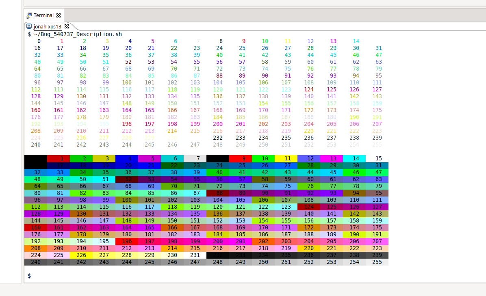
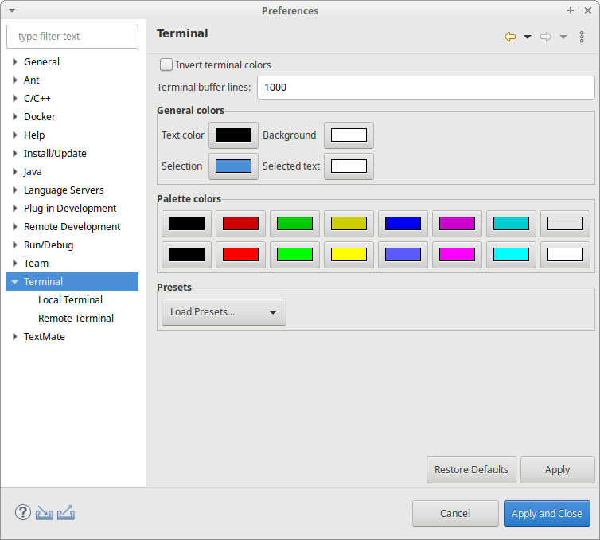

# Release

This is the New & Noteworthy page for CDT 10.0 which is part of Eclipse 2020-09 Simultaneous Release

## Java 11 or later required to run CDT

Starting with CDT 10.0 Java 11 or later is required to run CDT.
This align with requirements of Eclipse IDE which also requires Java 11 to run starting in 2020-09.
See [Bug 562494](https://bugs.eclipse.org/bugs/show_bug.cgi?id=562494).

## CDT's native components built on CI/docker

For many years CDT required advanced knowledge to rebuild the native components of CDT (e.g.
process spawning, pty and serial port handling).
This is now buildable from any platform that docker can run and integrated into the builds.
The .dll/.so files are still checked into CDT's git repo so that each developer does not have to build it locally.
The "check code cleanliness" scripts verify that the dll/so files checked in match the source.
See [Bug 521515](https://bugs.eclipse.org/bugs/show_bug.cgi?id=521515).

## Builds for Linux AArch64 (aka Arm64) added

Binaries for Linux AArch64 (Arm64) are available for testing.
With the raising popularity of this architecture people can continue using the Eclipse IDE even when changing their machine.
See [Bug 565836](https://bugs.eclipse.org/bugs/show_bug.cgi?id=565836).

## Arduino specific plug-ins removed

The source code for Arduino (org.eclipse.cdt.arduino.\*) is no longer part of CDT and is not receiving any updates.
Please consider using The Arduino Eclipse IDE and plug-ins named [Sloeber](https://marketplace.eclipse.org/node/2637354) for your future Eclipse CDT powered Arduino development.
See [Bug 562498](https://bugs.eclipse.org/bugs/show_bug.cgi?id=562498).

## XLC, LRParser and UPC removed

XLC, LRParser and UPC removed components of CDT have been removed.
See [Bug 559474](https://bugs.eclipse.org/bugs/show_bug.cgi?id=559474).

## Two changes in how CDT treats environment variables

On windows Imported environment variables in CDT are no longer uppercased (except for the path variable).
All environment variables inside CDT are now treated case sensitive on all supported os'es.

Secondly using \${ "to not resolve" functionality has been removed

For implementation details see

Handle environment variables more consistent and avoid uppercasing in windows.
See [Bug 564123](https://bugs.eclipse.org/bugs/show_bug.cgi?id=564123).

managed build's "expand env.
variable refs in Makefiles" eats \ in ${envVar1}\${enVar2}.
See [Bug 560330](https://bugs.eclipse.org/bugs/show_bug.cgi?id=560330).

# Code Analysis

## Nodiscard checker

Added new 'no discard' checker.
See [Bug 534420 ](https://bugs.eclipse.org/bugs/show_bug.cgi?id=534420).

# Parser

## Deduction guides

Parser support has been added for C++17 constructor template deduction guide.
See [Bug 541239](https://bugs.eclipse.org/bugs/show_bug.cgi?id=541239).

# Build

## Tool-chain integration

Options of value type "libs" and "userObjs" now respect the ApplicabilityCalculator and the CommandGenerator settings.
If these settings are set on your custom tool-chain integration, please make sure that the integration still works as intended after an upgrade.

## Docker support using Windows

When using Windows, mounting file system paths and Docker volumes is now possible, again.
See [Bug 538147 ](https://bugs.eclipse.org/bugs/show_bug.cgi?id=538147)

# Debug

## Launch Group removed

The Launch Group, previously marked as deprecated, has been removed from CDT.
The Launch Group was moved to the Eclipse Platform and substantially enhanced many years ago.
See [Bug 517813](https://bugs.eclipse.org/bugs/show_bug.cgi?id=517813).

# Terminal

## Terminal Serial Connection support arbitrary baud rates

Connections using the serial terminal now support arbitrary baud rates, choose from a drop-down of common and widely supported speeds, or type a custom value if connected hardware supports it.
See [Bug 543122](https://bugs.eclipse.org/bugs/show_bug.cgi?id=543122).

## Support for 4, 8 and 24-bit color in Terminal

The terminal now supports escape sequences for 4, 8 and 24-bit color.
See the [Wikipedia article](https://en.wikipedia.org/wiki/ANSI_escape_code) for some general details or [Bug 540737 Description](https://bugs.eclipse.org/bugs/show_bug.cgi?id=540737#c0) for a little script to demo the feature.
See [Bug 540737](https://bugs.eclipse.org/bugs/show_bug.cgi?id=540737) and [Bug 549697](https://bugs.eclipse.org/bugs/show_bug.cgi?id=549697).

## Editing Color palette (including better dark theme support)

The color palette of the terminal can now be edited.
This allows users to change foreground and background colors as well as the colors used in the 4-bit color palette.
The defaults used for foreground and background will be automatically set based on use of the Dark or Light themes in Eclipse.
See [Bug 549697](https://bugs.eclipse.org/bugs/show_bug.cgi?id=549697).

# API modifications

## CDT 10.0.1 Reverted some new API added in CDT 10.0.0

Classes org.eclipse.cdt.core.dom.ast.cpp.ICPPASTDeductionGuide and org.eclipse.cdt.core.dom.ast.cpp.ICPPASTParameterListOwner which were added for CDT 10.0.0 have been removed in CDT 10.0.1.
See [Bug 567261](https://bugs.eclipse.org/bugs/show_bug.cgi?id=567261)

## API Deletions and Deprecations

Please see the [CDT Policy](https://github.com/eclipse-cdt/cdt/blob/main/POLICY.md#deprecating-and-deleting-api) on Deprecating and Deleting API for more details of API that has been changed, removed, deprecated or scheduled for removal.
The current version of the Deprecation and Removals is stored in git [here](https://github.com/eclipse-cdt/cdt/blob/main/NewAndNoteworthy/CHANGELOG-API.md)

## [SerialPort](../native/org.eclipse.cdt.native.serial/src/org/eclipse/cdt/serial/SerialPort.java) supports arbitrary baud rates

The [SerialPort](../native/org.eclipse.cdt.native.serial/src/org/eclipse/cdt/serial/SerialPort.java) class now supports arbitrary baud rates with the new setBaudRateValue/getBaudRateValue which take/return an int.
See [Bug 543122](https://bugs.eclipse.org/bugs/show_bug.cgi?id=543122).

## Class creation wizard

The [NewClassCreationWizardPage](../core/org.eclipse.cdt.ui/src/org/eclipse/cdt/ui/wizards/NewClassCreationWizardPage.java) class now supports final option.
See [Bug 561770](https://bugs.eclipse.org/bugs/show_bug.cgi?id=561770).

## Terminal Control Embedding

In order to better support color palettes and deeper color depths in the terminal, new API could be added for the terminal control.
For example TerminalColorsFieldEditor is currently internal, but allows consumers of the terminal API to maintain their own color preferences.
Please raise a bug to request TerminalColorsFieldEditor become API if desired.

## Windows environment variables are no longer uppercased

This change is not literally an api change but will impact your code if you automatically import environment variables on windows or when you use OS environment variables.
This because, even though the methods remain the same, the implementation on windows has changed.
Except for the PATH environment that is still uppercased on windows there is no more os specific handling of os environment variables.

## environment variables no longer support \${ to avoid expanding

This change is not literally an api change but will impact your code if you used \${ to not expand environment variables.
It may impact your code if you import environment variables and had to workaround path\${childPath} resolving to path${childPath}.

# Known Issues with Java 15 Compatibility

## Java 15 generates an error on startup with CDT 10.0.0 (Fixed with CDT 10.0.1)

The recently released Java 15 causes a startup error when running with Java 15.
This error "An internal error occurred during: Load QML Analyzer" can be safely ignored.
Uninstalling the CDT Qt plug-ins will remove the error, as will using Java versions before Java 15.
See [Bug 562494](https://bugs.eclipse.org/bugs/show_bug.cgi?id=562494).

## QML file editor does not work with Java 15 in CDT 10.0

Editing files with QML extension (Part of Qt) in Java 15 will cause the UI to freeze.
Please use Java 14 or earlier if editing QML files in CDT's QML Editor.
See [Bug 562494](https://bugs.eclipse.org/bugs/show_bug.cgi?id=562494).

# Bugs Fixed in this Release

See Bugzilla report [Bugs Fixed in CDT 10.0](https://bugs.eclipse.org/bugs/buglist.cgi?bug_status=RESOLVED&bug_status=VERIFIED&bug_status=CLOSED&classification=Tools&product=CDT&query_format=advanced&resolution=FIXED&target_milestone=10.0.0&target_milestone=10.0.1)
