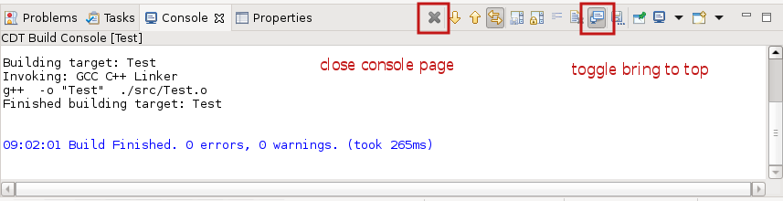

# Release Notes and New & Noteworthy page

This is the New & Noteworthy page for CDT 10.1 which is part of Eclipse 2020-12 Simultaneous Release

# Release Notes

## Dark Mode all black dialogs window in Eclipse 2020-12

The 2020-12 release of the Eclipse C/C++ and Eclipse Embedded C/C++ package contains an error that causes black text on black background in most dialogs. This can be resolved by either updating the Trace Compass Plug-ins in the install or removing the Trace Compass plug-ins if not used. To update the plug-ins do this:

- From Window menu -> choose Preferences
- navigate to Install/Update -> Available Software Sites
- Press Add...
- Name `Tracecompass updates` and Location `https://download.eclipse.org/tracecompass/stable/repository/`
- Press Add
- Press Apply and Close
- From Help menu -> Check for Updates and finish the wizard.
- After restarting the Dark Mode will be fixed.

See also [Bug 569790](http://eclip.se/569790)

## Update index and views with active configuration by default

The default preference controlling which configuration the index uses along with the affected views has been changed to use the active configuration instead of a fixed configuration. The new default should be less confusing for users as an initial setting but might not be suitable for all projects.
See the [CDT User FAQ](https://github.com/eclipse-cdt/cdt/tree/main/FAQ#the-index-is-rebuilt-every-time-the-active-configuration-is-changed-and-it-takes-too-long) for instructions on how to change this preference.

CDT extenders can also customize products using plugin_customization.ini, with
org.eclipse.cdt.core/cprojectdescription.configRelations=1 (1 for "fixed", 2 for "active")
See also [Bug 329995](http://eclip.se/329995) and [cdt-dev](https://www.eclipse.org/lists/cdt-dev/msg34697.html).

# Parser

## \_\_has_include

Parser support has been added for C++17 \_\_has_include as well as the language extension \_\_has_include_next. See [Bug 566918](https://bugs.eclipse.org/bugs/show_bug.cgi?id=566918).

# Build

## Visual Studio 2017 and 2019

Support for detecting the Microsoft Visual C++ toolchain part of Visual Studio 2017 and 2019 has been added. Support for earlier versions has been removed. This support is still considered experimental since many basic features are missing for this CDT toolchain. See [Bug 567169](https://bugs.eclipse.org/bugs/show_bug.cgi?id=567169).

## New build console actions

The CDT build console has two new actions in its toolbar:

- Action to close the build console page.
- Action to enable/disable bringing the console to top on build output. The action toggles the already existing preference under Preferences -> C/C++ -> Build -> Console -> "Bring console to top when building (if present)".
  See:

See also [Bug 486033](https://bugs.eclipse.org/bugs/show_bug.cgi?id=486033) and [Bug 568926](https://bugs.eclipse.org/bugs/show_bug.cgi?id=568926).

# Debug

## External refresh of DSF data model

Some GDB commands have side effects that are not trivial for DSF to handle properly. One command that is known to have unpredictable side effects is `load` that is used in JTAG debugging. With the changes in [Bug 568228](https://bugs.eclipse.org/bugs/show_bug.cgi?id=568228), the last step of the JTAG launch sequence will now tell the UI to drop any cached data and refresh everything from the lower layers to ensure the proper state is shown in the UI.

For DSF extenders; if the UI is out of sync with the current target state, the AbstractMIControl#flushAllCachesAndRefresh(RequestMontitor) might help out to trigger a refresh for the UI models.

# Terminal

## Activity for Terminal main toolbar contributions

A new activity, `org.eclipse.tm.terminal.view.ui.activity.maintoolbar`, can now be used to disable main toolbar contributions of the Terminal plug-ins. Currently there is only one such contribution, a toolbar button to launch a terminal. See [Bug 568923](https://bugs.eclipse.org/bugs/show_bug.cgi?id=568923).

Disabling the activity (and so hiding the TM terminal main toolbar button) can now be done e.g. with a product customization file containing the line:

`org.eclipse.ui.workbench/UIActivities.org.eclipse.tm.terminal.view.ui.activity.maintoolbar=false`

The product customization file is specified to Eclipse arguments with:

`-pluginCustomization /some/path/plugin_customization.ini`

# API modifications

## org.eclipse.cdt.managedbuilder.ui

org.eclipse.cdt.managedbuilder.ui.properties.ICustomBuildOptionEditor2 is a new interface for creating custom build option editors. The new interface extends org.eclipse.cdt.managedbuilder.ui.properties.ICustomBuildOptionEditor with the possibility to let the editor be in control of how the value is to be saved. In a future CDT release, these 2 interfaces will be merged to one. See [Bug 569300](https://bugs.eclipse.org/bugs/show_bug.cgi?id=569300)

# Bugs Fixed in this Release

See Bugzilla report [Bugs Fixed in CDT 10.1](https://bugs.eclipse.org/bugs/buglist.cgi?bug_status=RESOLVED&bug_status=VERIFIED&bug_status=CLOSED&classification=Tools&product=CDT&query_format=advanced&resolution=FIXED&target_milestone=10.1.0)
