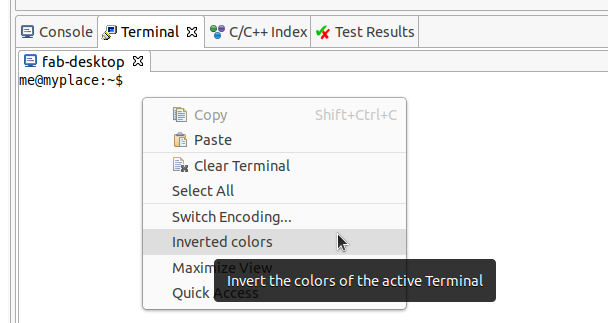
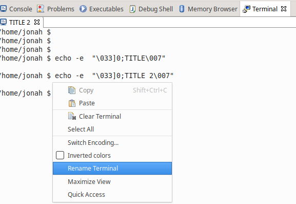

# Release Notes and New & Noteworthy page

This is the New & Noteworthy page for CDT 10.2 which is part of Eclipse 2021-03 Simultaneous Release

# Release Notes

# Java 16 unsupported

Java 16 is unsupported in CDT 10.2 and before.
CDT 10.3 is intending to support Java 16.
See [572250](Bug)(https://bugs.eclipse.org/bugs/show_bug.cgi?id=572250).

## CDT Standalone debugger part of main download

The CDT standalone debugger is no longer provided as a separate download.
Please See [Standalone Debugger on GitHub](https://github.com/eclipse-cdt/cdt/blob/main/StandaloneDebugger.md) and download the Eclipse C/C++ IDE from [main downloads site](https://www.eclipse.org/downloads/).

# Build

## Headless builder accepts "-help" without workspace

In order to help the users to view the "-help" display without defining a workspace, a new bundle has been created in order to avoid the automatic start of the resources bundles.
The new bundle, that only contains a small wrapper class, is called ''org.eclipse.cdt.managedbuilder.headlessbuilderapp''.
See also [Bug 571566](http://eclip.se/571566).

## One failed build configuration fails build with headless builder

Until recently, if a single build configuration in the set of build configurations to build had an error marker, the exit code of the headless builder would only be 1 if that configuration was built last.
In CDT 10.2, this has changed so that regardless of the build order, the failed build configuration will still have the headless builder application exit with a non-zero exit code.
See also [Bug 571458](http://eclip.se/571458).

## Only the CDT builders are invoked when running the headless builder

Until recently, depending on how the headless builder was invoked would affect whether just CDT or other builders would run when using headless build.
In CDT 10.2, this has changed so that regardless the command line options used only the CDT builders are invoked.
See also [Bug 571458](http://eclip.se/571458).

# Terminal

## Invert colors in current terminal

Sometimes, e.g.
when connecting to a remote system, the prompt string
makes assumptions on the colour scheme that result in an almost unreadable
terminal.

The terminal has a preference setting to invert the background colour.
Now a new entry in the pop-up menu allows a user to temporarily modify the setting.

See [bug 570775](https://eclip.se/570775).

## Rename Terminal Tab

The name in the tab can be changed, either with ANSI escape codes (such as `echo -e "\033]0;TITLE\007"`) or by right-clicking and choosing Rename Terminal.
See [bug 341721](https://eclip.se/341721).

# API modifications

## ManagedCommandLineGenerator

The old internal class `org.eclipse.cdt.managedbuilder.internal.core.ManagedCommandLineGenerator` is used by CDT consumers as if it is API.
To reduce the number of warnings/errors for CDT consumers, the class has now been replaced by `org.eclipse.cdt.managedbuilder.core.ManagedCommandLineGenerator` that contains a proper API.
See also [Bug 571433](http://eclip.se/571433).

# Bugs Fixed in this Release

See Bugzilla report [Bugs Fixed in CDT 10.2](https://bugs.eclipse.org/bugs/buglist.cgi?bug_status=RESOLVED&bug_status=VERIFIED&bug_status=CLOSED&classification=Tools&product=CDT&query_format=advanced&resolution=FIXED&target_milestone=10.2.0)
