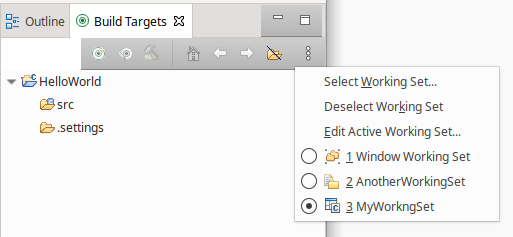

# Release Notes and New & Noteworthy page

This is the New & Noteworthy page for CDT 10.3 which is part of Eclipse 2021-06 Simultaneous Release

# Release Notes

## pack200 (\*.jar.pack.gz) removed

From CDT 10.3 pack.gz (aka pack200) jar files are not included with CDT release.
([bug 572347](http://eclip.se/572347)).

# Build

## Headless builder can now remove projects from workspace.

There are new two options based on the import options that will be executed before a build:

- `-remove /path/to/project` - will remove a single project from workspace.
- `-removeAll /path/to/projectTree` - will remove a tree of projects in this path.

Both options are more precedence than the import options.
That means if you import a project and remove it or the containing project tree in the same command, the project will not be imported. Otherwise it is possible to combine the options with importing in this way:

```sh
-importAll /path/to/projectTree -remove<All> /path/to/projectTree/subProject<Tree>
```

This will import a project tree and remove the sub project or sub project tree.

See also [Bug 573512](http://eclip.se/573512).

## Add verbose option for progress monitor of headless builder.

During operations, such as remove projects, the subtask of a progress monitor has useful information for users. However during a normal build there ends up being lots of output that is of little value.

See also [Bug 573512](http://eclip.se/573512).

## Build command arguments moved to Behavior tab.

The free form text box to customize build (aka make) arguments has been moved the the Behavior tab and split from the Build command text box.

<p align="center"></p>

See also [Bug 568397](http://eclip.se/568397).

## Build Targets (Make) view supports working sets

The Build Targets (Make) view now supports working sets allowing you to focus on what you are actively working on.

<p align="center"></p>

See also [Bug 338776](http://eclip.se/338776).

## Build Targets (Make) view saves and restores its UI state

The selected items, expanded folders and scroll positions of the Build Targets (Make) view are saved when closed and restored when reopened.

See also [Bug 573619](http://eclip.se/573619).

# Debug

## Show opcode as byte sequence

The instruction opcode is shown as sequence of bytes inside the disassembly view.
See [https://eclip.se/572880 bug 572880].

<p align="center"></p>

See also [Bug 572880](http://eclip.se/572880).

## Jump To Memory location context menu

The disassembly view got a new context menu entry to jump to memory location for the current selected entry.

<p align="center"></p>

## View GDB process properties

The GDB process properties page is now populated with launch timestamp, working directory, command line and environment details.
To access the page, select ''Properties'' from the context menu of a GDB process element within the Eclipse ''Debug'' view.

<p align="center"></p>

See also [Bug 572944](http://eclip.se/572944).

# Terminal

## Terminal - New Features

### Open files and links with Ctrl+Click

When pressing the Ctrl key (Cmd key on mac), the word under the mouse pointer is highlighted with an underline and by clicking it the terminal guesses how to open it:

- a web link is opened in the configured browser
- if it can be resolved to a file in the workspace, that file is opened (linux only: the terminal keeps track of the current working directory of the shell to resolve relative paths)
- otherwise the user is prompted with the open resource dialog, pre-filled with the word

<p align="center"></p>

See [bug 563015](https://eclip.se/563015). Also see [bug 573645](https://eclip.se/573645) which is a helpwanted bug for how to detect current path on Windows and macOS.

### Automatically populate Terminal menus and dialogs with WSL

When running on Windows the [WSL (Windows Subsystem for Linux)](https://docs.microsoft.com/en-us/windows/wsl/) will be queried to populate Show In and New Terminal dialogs. The automatically populated commands can be edited in _Preferences -> Terminal -> Local Terminal_.

<p align="center"></p>

See also [Bug 573712](http://eclip.se/573712).

### Local terminals remember the working directory

When restarting the Eclipse IDE, the terminals will remember which path to start in.
On Linux the path will be the detected path of the shell at shutdown, on Windows and macOS the path will be the initial path that shell was created with.

See [bug 453696](https://eclip.se/453696). Also see [bug 573645](https://eclip.se/573645) which is a helpwanted bug for how to detect current path on Windows and macOS.

## Terminal - Key Bug Fixes

### Local terminals remember the shell, args and other settings

When restarting the Eclipse IDE, the terminals will remember which shell and arguments to use.
This is particularly helpful on Windows where many users use git bash for their shell, and prior to this change on restart terminals would be reopened in the default shell, instead of the shell the user had selected.

See also [Bug 460495](http://eclip.se/460495).

### Terminals remember which terminal view they were part of

When restarting the Eclipse IDE, the terminals will remember which view to recreate themselves in.

See also [Bug 573646](http://eclip.se/573646).

## Terminal - Windows Pseudo Console

### Windows Pseudo Console (ConPTY) in preview mode

On Windows the terminal uses the amazing [WinPTY](https://github.com/rprichard/winpty) library to provide a [PTY](https://en.wikipedia.org/wiki/Pseudoterminal) as Windows did not come with one.
For the last number of years, Windows 10 has a native version called Windows Pseudo Console ([ConPTY](https://devblogs.microsoft.com/commandline/windows-command-line-introducing-the-windows-pseudo-console-conpty/)) which programs such as VSCode and Eclipse Theia have converted to using, in part because of the [fundamental bugs](https://github.com/Microsoft/vscode/issues/45693) that can't be fixed in WinPTY.
The WinPTY version in Eclipse is also quite out of date, and hard to develop as it is interfaced to by JNI.

For Eclipse 2021-06 / CDT 10.3.0 the Eclipse CDT will be releasing a preview version of the terminal that will use ConPTY.

In this first version ConPTY won't be enabled by default, it requires system property `org.eclipse.cdt.core.conpty_enabled=true` to be set.
i.e. start Eclipse with `-vmargs -Dorg.eclipse.cdt.core.conpty_enabled=true` command line argument to Eclipse or added to the eclipse.ini.

In a future version the default will change to on if available, so to force it off use: `org.eclipse.cdt.core.conpty_enabled=false`.
There is no plan to remove the WinPTY implementation anytime soon, so if there is a user who feels impacted by the slowdown I encourage them to reach out to the community ([cdt-dev](https://accounts.eclipse.org/mailing-list/cdt-dev) mailing list or provide feedback on [Bug 573730](https://bugs.eclipse.org/bugs/show_bug.cgi?id=573730) and force it off.

See [Bug 562776](https://bugs.eclipse.org/bugs/show_bug.cgi?id=562776) for details on the implementation.

# Code Templates

## Templates are sorted

When a new source file is created from template, the available suggested templates are sorted in alphabetical order first by template key, then by template name between same content type.
E.g. When a new C++ file is created from template it will have few suggested templates grouped into few content types.
The most relevant content type group is still at the top. It makes possible to bring at the top of the drop down list custom templates that does not have a key and whose name sorted will be in front of "Default C++ Source template".

See [Bug 572755](https://bugs.eclipse.org/bugs/show_bug.cgi?id=572755)

## Templates selection is persistent

The template selection is persistent. If a different template has been selected than default one from the top of the list, this selection will be recorded. Next time when a new file is created from template with same extension, the previous chosen template will be selected by default.

See [Bug 573204](https://bugs.eclipse.org/bugs/show_bug.cgi?id=573204)

# API modifications

## org.eclipse.cdt.dsf.gdb

A new method `org.eclipse.cdt.dsf.gdb.service.IGDBBackend.getDebuggerCommandLineArray()` has been added for access to, and customization of, the GDB command line used when launching a debug session.
This method should be overridden by extenders in preference to overriding `org.eclipse.cdt.dsf.gdb.service.GDBBackend.getDebuggerCommandLine()` or `org.eclipse.cdt.dsf.gdb.service.GDBBackend.getGDBCommandLineArray()` which are now deprecated. See [Bug 572944](https://bugs.eclipse.org/bugs/show_bug.cgi?id=572944)

# Bugs Fixed in this Release

See Bugzilla report [Bugs Fixed in CDT 10.3](https://bugs.eclipse.org/bugs/buglist.cgi?bug_status=RESOLVED&bug_status=VERIFIED&bug_status=CLOSED&classification=Tools&product=CDT&query_format=advanced&resolution=FIXED&target_milestone=10.3.0&target_milestone=10.3.1&target_milestone=10.3.2&target_milestone=10.3.3)
