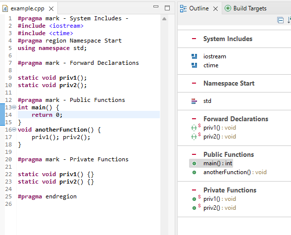

# Release Notes and New & Noteworthy page

This is the New & Noteworthy page for CDT 10.4 which is part of Eclipse 2021-09 Simultaneous Release

---

# Release Notes

## CDT 10.4.0 and CDT 10.4.1 released on the same day

CDT 10.4.0 had already been through release preparation before a critical bug was found that affects CMake4Eclipse.
It was too late to respin CDT 10.4.0, instead CDT 10.4.1 is being released on the same day with the fix.
([bug 575903](http://eclip.se/575903))
|}

# Editor

## Divider Lines in Outline View

The Outline View can display divider lines to help visually organize your code.
Using '''#pragma mark - MESSAGE -''' will display a divider line either side of a MESSAGE.
The leading and trailing '''-''' are optional. '''#pragma region''' and '''#pragma endregion''' will also display in the outline view.
The Quick Outline view (Ctrl-O) also has this feature.
See [bug 546981](https://eclip.se/546981).

# Bugs Fixed in this Release

See Bugzilla report [Bugs Fixed in CDT 10.4](https://bugs.eclipse.org/bugs/buglist.cgi?bug_status=RESOLVED&bug_status=VERIFIED&bug_status=CLOSED&classification=Tools&product=CDT&query_format=advanced&resolution=FIXED&target_milestone=10.4.0&target_milestone=10.4.1)
