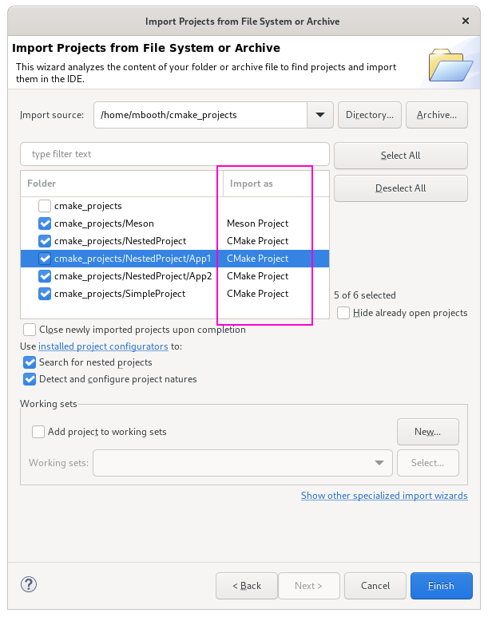
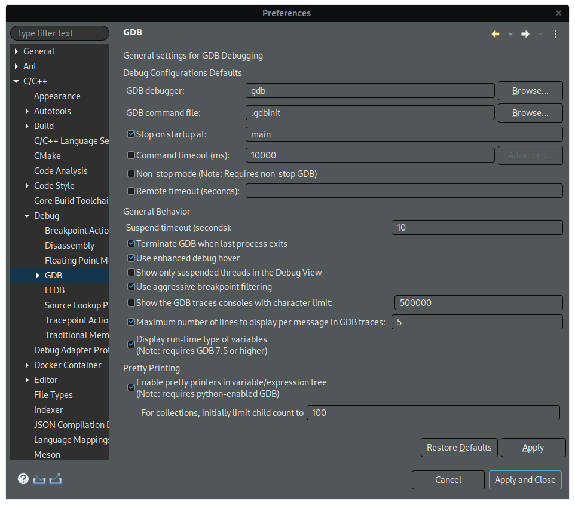

# Release Notes and New & Noteworthy page

This is the New & Noteworthy page for CDT 10.5 which is part of Eclipse 2021-12 Simultaneous Release

---

# Release Notes

## Mac M1 support (Mac on Arm)

CDT 10.5.0 includes support for Mac on Arm by providing CDT's native components for Arm.

# Build

## Improved import workflow for CMake and Meson projects

It's now possible to import your pre-existing, non-Eclipse CMake and Meson projects using the standard Eclipse Smart Import wizard.
By using the _File_ -> _Import_ -> _Projects from Folder or Archive_ wizard, the selected directory or archive will be analysed and CMake and Meson projects will be detected. Multiple projects may be imported at once, even nested projects.
See [Bug 575145](https://bugs.eclipse.org/bugs/show_bug.cgi?id=575145).

# Debug

## Preference for suspend timeout

Previously the suspend timeout was hardcoded to 5 seconds.
Now added a preference in GDB preference page under General Behavior for suspend timeout.
The default timeout is 10 seconds.
See [Bug 576291](https://bugs.eclipse.org/bugs/show_bug.cgi?id=576291).

# API modifications

## org.eclipse.tools.templates.ui

`org.eclipse.tools.templates.ui.ProjectImportConfigurator` is a new API for easily adding support for CDT project types to the standard Eclipse smart project import wizard. Integrators may use this API to offer smart import functionality by registering implementations for their project types using the platform's `org.eclipse.ui.ide.projectConfigurator` extension point. See [Bug 575145](https://bugs.eclipse.org/bugs/show_bug.cgi?id=575145).

# Bugs Fixed in this Release

See Bugzilla report [Bugs Fixed in CDT 10.5](https://bugs.eclipse.org/bugs/buglist.cgi?bug_status=RESOLVED&bug_status=VERIFIED&bug_status=CLOSED&classification=Tools&product=CDT&query_format=advanced&resolution=FIXED&target_milestone=10.5.0)
