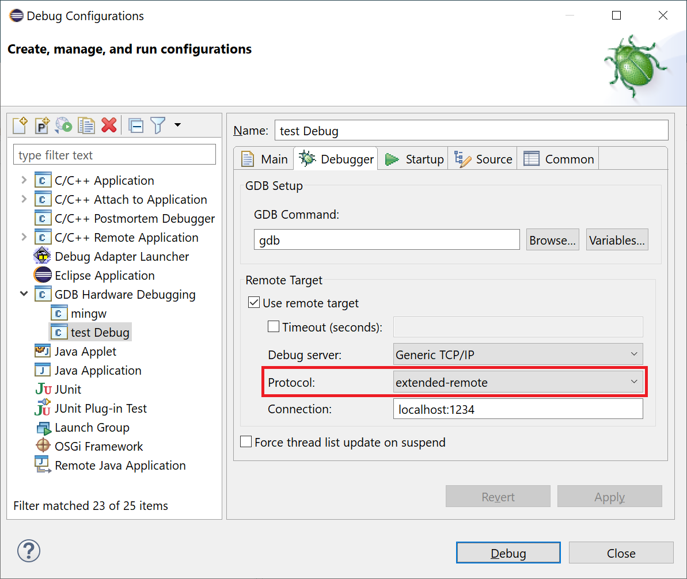

# Release Notes and New & Noteworthy page

This is the New & Noteworthy page for CDT 10.7 which is part of Eclipse 2022-06 Simultaneous Release

---

# Code Analysis

## Evaluate a range of compiler builtins in constexpr contexts

A number of GCC/Clang builtins are now evaluated when occurring in a constexpr evaluation context, matching compiler behavior.
These functions can now be used as template arguments and in other contexts requiring a constant without confusing CDT's code analysis.
([bug 580037](https://bugs.eclipse.org/bugs/show_bug.cgi?id=580037) and [bug 579934](https://bugs.eclipse.org/bugs/show_bug.cgi?id=579934)).

# Build

## Observe command generator and applicability calculator for all MBS tool options

The CDT Managed Build System now allows a command generator and an applicability calculator to be specified for tool options of type `libs` and type `userObjs`.
Extenders at the `org.eclipse.cdt.managedbuilder.core.buildDefinitions` extension point should note that the default command line pattern defined by `org.eclipse.cdt.managedbuilder.internal.core.Tool.DEFAULT_PATTERN` now includes a `${EXTRA_FLAGS}` token at the end of the line.
Existing CDT managed build projects that have overridden the default command line pattern of the linker tool may need to add `${EXTRA_FLAGS}` to the revised pattern.
This enhancement has involved changes to the GNU makefile generator such that an `objects.mk` file is no-longer generated.
([bug 577263](https://bugs.eclipse.org/bugs/show_bug.cgi?id=577263))

## Docker/Linux: Includes are now copied from the Docker image

When building using a Docker-image, include paths detected by the `CDT GCC Build Output Parser`- and the `CDT GCC Built-in Compiler Settings`-providers are now copied out of the docker image to the host (including symlinks).
Unfortunately this is still a bit flaky as you might need to reload the project for the correct paths to be listed in the `Includes` list.

## Docker/Windows: WSL-Build-Support

It is now possible to build projects that are located on the WSL filesystem.
This significantly improves build performance. For this to work you need to expose the daemon via TCP (`Docker-Desktop`->`Settings`->`General`) and enable WSL integration (`Docker-Desktop`->`Settings`->`Resources`->`WSL Integration`).
You can now copy/create your project at `\\wsl$\Ubuntu\...`.
You should probably keep your workspace on the Windows filesystem for performance reasons.

Includes detected by the `CDT GCC Built-in Compiler Settings`-provider should be copied to the host. Unfortunately java.net.URI is not very happy with the $-sign in the WSL-Path, thus `CDT GCC Build Output Parser` will fail as soon as there is a project-related path included.
See [bug 571112](https://bugs.eclipse.org/bugs/show_bug.cgi?id=571112), but there are other places, too.
Mounting the WSL-Path to a Drive (e.g. `Z:`) is not a solution either, as confuses Docker.

# Debug

## Stop auto-opening Modules view

The Modules view does not do much and in most situations is not particularly relevant to many users.
Therefore starting in this release starting a debug session will no longer auto-open it.
The view can still be manually opened as any normal view can, with Window -> Show View -> Other... -> Debug -> Modules, or using the Ctrl-3 shortcut and typing Modules.
([bug 579759](https://bugs.eclipse.org/bugs/show_bug.cgi?id=579759)].

## Support GDB extended-remote protocol

The _GDB Hardware Debugging_ launch configuration type now allows selection of the GDB _extended-remote_ protocol when supported by the configured debug server.
([bug 535143](https://bugs.eclipse.org/bugs/show_bug.cgi?id=535143)].

# Bugs Fixed in this Release

See Bugzilla report [Bugs Fixed in CDT 10.7](https://bugs.eclipse.org/bugs/buglist.cgi?bug_status=RESOLVED&bug_status=VERIFIED&bug_status=CLOSED&classification=Tools&product=CDT&query_format=advanced&resolution=FIXED&target_milestone=10.7.0&target_milestone=10.7.1) and [GitHub milestones](https://github.com/eclipse-cdt/cdt/milestone/1?closed=1) (for work done after migration to GitHub).
