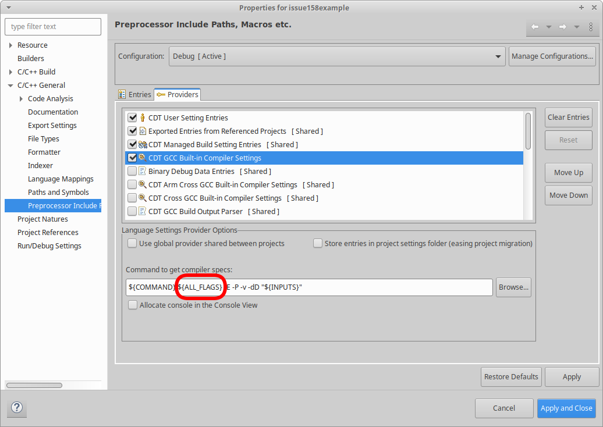
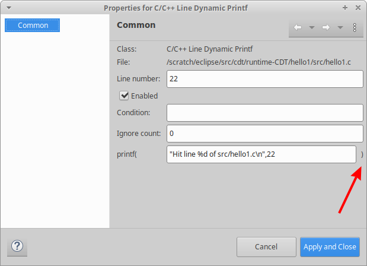

# Release Notes and New & Noteworthy page

This is the New & Noteworthy page for CDT 11.0 which is part of Eclipse 2022-12 Simultaneous Release

---

# Release Notes

## GitHub

The Eclipse CDT project is now hosted on GitHub.
[Eclipse CDT's GitHub Repo](https://github.com/eclipse-cdt/cdt) is the primary source for the CDT project and all other resources (Bugzilla, Gerrit, Wiki) have migrated to GitHub.
Please see the [Git Hub Migration](https://github.com/eclipse-cdt/cdt/blob/main/GitHubMigration.md) for detailed information and the tracking issue https://github.com/eclipse-cdt/cdt/issues/32 for discussion and the TODO list.
We look forward to your feedback on this migration, both from the persepective of users as well as adopters.
Feel free to raise an [issue](https://github.com/eclipse-cdt/cdt/issues) or start a [discussion](https://github.com/eclipse-cdt/cdt/discussions).


## Java 17

Jave 17 is now required to build and run Eclipse CDT. See https://github.com/eclipse-cdt/cdt/issues/80

## Removed plug-ins and features

Various plug-ins and features are no longer part of the CDT release.
Please see the corresponding issue for more details.

- Qt plug-ins (`org.eclipse.cdt.qt.ui/core/feature`) https://github.com/eclipse-cdt/cdt/issues/123 _Note:_ the `org.eclipse.cdt.testsrunner.qttest` plug-in is still part of CDT.
- Non-universal Welcome Screen Content has been removed from `org.eclipse.cdt` plug-in. The universal content is in `org.eclipse.cdt.doc.user`. https://github.com/eclipse-cdt/cdt/pull/136
- CDT's specific LSP and DAP plug-ins. https://github.com/eclipse-cdt/cdt/issues/139, specifically these plug-ins:
  - `org.eclipse.cdt.debug.dap`
  - `org.eclipse.cdt.debug.dap.gdbjtag`
  - `org.eclipse.cdt.lsp.clangd`
  - `org.eclipse.cdt.lsp.core`
  - `org.eclipse.cdt.lsp.cquery`
  - `org.eclipse.cdt.lsp.ui`

## Dwarf Versions

Starting with GCC 11, GCC will default to using Dwarf5 in most circumstances. CDT does not yet support Dwarf5 and therefore to ensure compatibility with CDT compile your programs with `-gdwarf-4`.
For more information, refer to the [GCC 11 release notes](https://gcc.gnu.org/gcc-11/changes.html) and see CDT's tracking issue https://github.com/eclipse-cdt/cdt/issues/198.

# Build

## Scanner Discovery able to consider all flags

By default CDT only considers some other compile flags when computing the compiler built-in includes and macros.
To have CDT consider all compiler flags when computing the compiler built-in includes and macros the `${ALL_FLAGS}` can be specified in  _Command to get compiler specs:_.

For example, when `-ansi` is passed to GCC, the `__STRICT_ANSI__` macros is defined.
For CDT to know that, the `-ansi` needs to be passed to GCC when collecting the compiler built-ins, sometimes in CDT called "scanning" or "compiler specs".
If you code with, for example, `#ifdef __STRICT_ANSI__` it will be highlighted correctly only if CDT knows about it.
Therefore in this situation it may be best to use this new feature.

To enable using all flags when calculating built-ins, change the default `${FLAGS}` to `${ALL_FLAGS}` in _Project Properties_ -\> _C/C++ General_ -\> _Preprocessor Include Paths, Macros etc._ -\> _Providers_ tab -\> _CDT GCC Built-in Compiler Settings_ -\> _Command to get compiler specs:_.

<p align="center"></p>

If your compiler has a command line option that interferes with scanner discovery, it can be declared as such in the `plugin.xml` (see below) or entered into the _Other flags (excluded from discovery)_ option in the _Miscellaneous_ of build settings.

See the online help sections on [scanner discovery](https://help.eclipse.org/latest/topic/org.eclipse.cdt.doc.user/concepts/cdt_c_scanner_discovery.htm) and [scanner discovery preferences](https://help.eclipse.org/latest/topic/org.eclipse.cdt.doc.user/reference/cdt_u_pref_build_scanner_discovery.htm) for more information on scanner discovery.

See https://github.com/eclipse-cdt/cdt/pull/158.

# Debug

## C/C++ Dynamic Printf Breakpoints

Prior to CDT 11 the Dynamic Printf GUI was somewhat over restrictive rejecting formats and parameters that would have been valid for dprintf in the GDB CLI.
To achieve this improvement the checks that verified that the number of format specifiers matched the number of parameters has been removed.
The check that the required the format string to not end with a `)` has been removed as valid format parameters can have a closing paranthesis.
Instead of doing that check, the GUI now displays a `)` to make it obvious to users that the closing `)` should not be included in the setting.

<p align="center"></p>

See [Bug 580873](https://bugs.eclipse.org/bugs/show_bug.cgi?id=580873).

# API Changes, current and planned

Please see [CHANGELOG-API](CHANGELOG-API.md) for details on the breaking API changes in this release as well as future planned API changes.

## New Job Family for background build settings update

When the project is modified the managed build settings needs to update settings.

While much of this update happens synchronously to the `IResourceChangeListener` calls, the final update is done with a job.
If an update needs to be tracked for completion, after making an update the `IJobManager` can be queried using this family.

e.g. a join on the job being completed:

```java
Job.getJobManager().join(ManagedBuilderCorePlugin.BUILD_SETTING_UPDATE_JOB_FAMILY, null);
```

This new job family was added to improve stability of tests to ensure background operations are complete.
It may have other uses to other API consumers as well and is therefore included here.

## New method ManagedBuildManager#createConfigurationForProject()

This should allow ISV's to create MBS based project with a vendor-specific build-system ID without using internal API.

## Binary Parser code uses AutoCloseable

The binary parser classes which open binary files now implement AutoCloseable so they can (and should) be used in a try-with-resources block.
See https://github.com/eclipse-cdt/cdt/pull/132

## Core Build tool chains can now return multiple binary parsers

The `ICBuildConfiguration` and `IToolChain` interfaces now have a method, `getBinaryParserIds` that allows a build configuration or tool chain to return multiple binary parsers.

See https://github.com/eclipse-cdt/cdt/pull/75

## Exclude from scanner discovery flag for options

`IOption` has a new flag called `isExcludedFromScannerDiscovery`.
This flag can be set on options to exclude them from scanner discovery when using the new `${ALL_FLAGS}` variable.

See https://github.com/eclipse-cdt/cdt/pull/158.

# Noteworthy Issues and Pull Requests

See [Noteworthy issues and PRs](https://github.com/eclipse-cdt/cdt/issues?q=is%3Aclosed+label%3Anoteworthy+milestone%3A11.0.0) for this release in the issue/PR tracker.

# Bugs Fixed in this Release

See [GitHub milestones](https://github.com/eclipse-cdt/cdt/milestone/2?closed=1) and for bugs that haven't been transitioned to GitHub please see Bugzilla report [Bugs Fixed in CDT 11.0](https://bugs.eclipse.org/bugs/buglist.cgi?bug_status=RESOLVED&bug_status=VERIFIED&bug_status=CLOSED&classification=Tools&product=CDT&query_format=advanced&resolution=FIXED&target_milestone=11.0.0).
