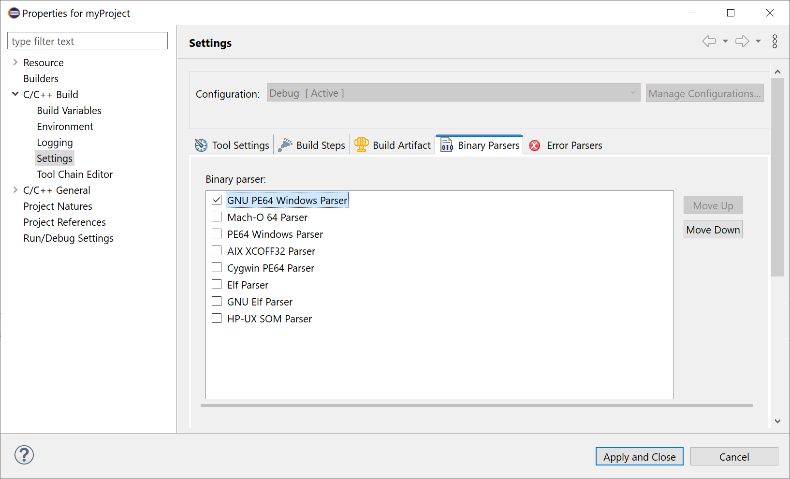

# Release Notes and New & Noteworthy page

This is the New & Noteworthy page for CDT 11.2 which is part of Eclipse 2023-06 Simultaneous Release

---

# Release Notes

# Build

## GNU PE64 Windows Parser

A new binary parser allows projects using a _MinGW GCC_ toolchain to make use of core CDT GNU tool support in the same manner as projects using a _Linux GCC_ toolchain.
For example, users may now invoke GNU `objdump` by double-clicking on a Windows PE64 executable file.
New projects using a _MinGW GCC_ toolchain are now configured to use the _GNU PE64 Windows Parser_ by default.
Existing projects may be configured to use the new parser via the _Binary Parsers_ list on the C/C++ Build > Settings project properties page:

## Cross GCC toolchain uses GNU Elf Parser

Enhancements to core CDT GNU tool support accommodate projects using a _Cross GCC_ toolchain in the same manner as projects using a _Linux GCC_ toolchain.
For example, users may now invoke a build of GNU `objdump` provided by the configured toolchain by double-clicking on an ELF executable file.
The correct GNU tool prefix (eg `arm-none-eabi-`) is provided by a CDT _Build Variable_ named `gnu_tool_prefix` when a project is configured to use the _GNU Elf Parser_.
New projects using a _Cross GCC_ toolchain are now configured to use this binary parser by default.
Existing projects may be configured to use the _GNU Elf Parser_ via the _Binary Parsers_ list on the C/C++ Build > Settings project properties page.

# API Changes, current and planned

Please see [CHANGELOG-API](CHANGELOG-API.md) for details on the breaking API changes in this release as well as future planned API changes.

## `FinalLaunchSequence.stepRemoteConnection()` and `FinalLaunchSequence.stepAttachRemoteToDebugger()` are deprecated

The remote connection for attach launch will be moved in the implementation of `IGDBProcesses.attachDebuggerToProcess()`

## New class `AbstractGnuToolPrefixMacro`

A new abstract class assists in the integration of managed build GNU toolchain extensions with core CDT GNU tool support.
Extenders may sub-class `AbstractGnuToolPrefixMacro` to describe the GNU tool prefix (eg `arm-none-eabi-`) used by their toolchain.
The resulting build macro may be associated with a managed build GNU toolchain extension using an `IConfigurationBuildMacroSupplier` to ensure that the correct prefix is used when invoking GNU tools such as `objdump`.
Refer to `org.eclipse.cdt.internal.build.crossgcc.CrossBuildMacroSupplier` for a usage example.

# Noteworthy Issues and Pull Requests

See [Noteworthy issues and PRs](https://github.com/eclipse-cdt/cdt/issues?q=is%3Aclosed+label%3Anoteworthy+milestone%3A11.2.0) for this release in the issue/PR tracker.

# Bugs Fixed in this Release

See [GitHub milestones](https://github.com/eclipse-cdt/cdt/milestone/5?closed=1)
