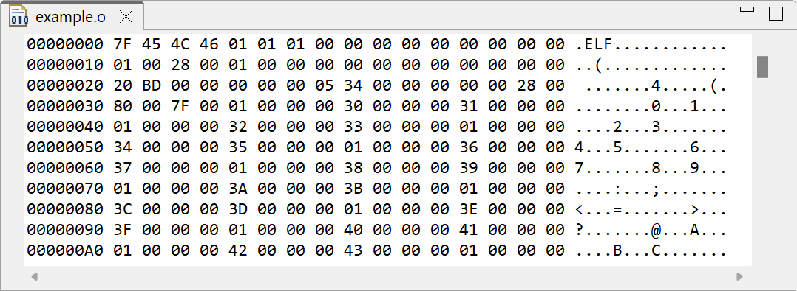

# Release Notes and New & Noteworthy page

This is the New & Noteworthy page for CDT 11.3 which is part of Eclipse 2023-09 Simultaneous Release

---

# Release Notes

# Build

## Default Binary File Viewer

Enhancements to the _Default Binary File Viewer_ accommodate archive files in the same manner as other binary files.
Users may now invoke GNU `objdump` by double-clicking on a GNU archive file.
In cases where the configured binary parser does not support the launching of GNU tools, the viewer now presents a hex dump of the binary file rather than raw text:

# API Changes, current and planned

Please see [CHANGELOG-API](CHANGELOG-API.md) for details on the breaking API changes in this release as well as future planned API changes.

# Noteworthy Issues and Pull Requests

See [Noteworthy issues and PRs](https://github.com/eclipse-cdt/cdt/issues?q=is%3Aclosed+label%3Anoteworthy+milestone%3A11.3.0) for this release in the issue/PR tracker.

# Bugs Fixed in this Release

See [GitHub milestones](https://github.com/eclipse-cdt/cdt/milestone/7?closed=1)
