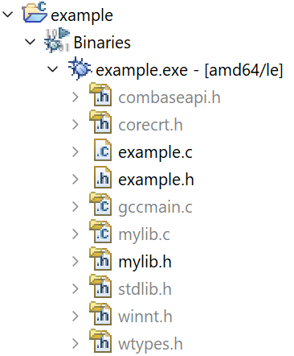
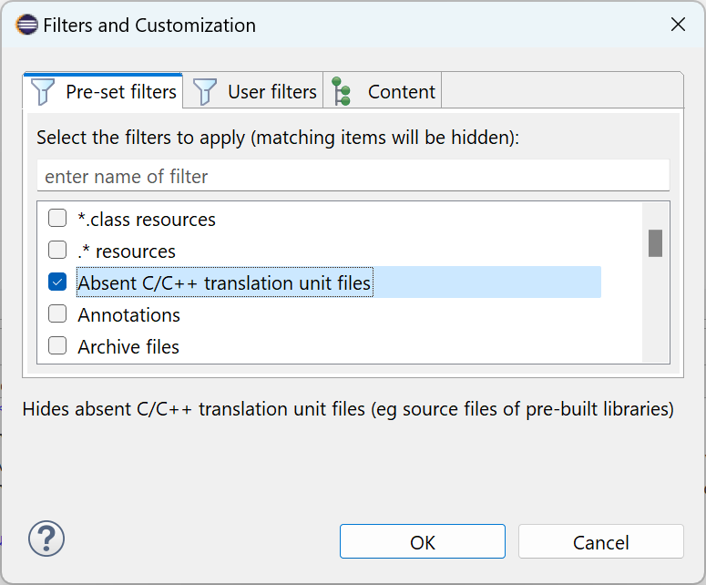

# Release Notes and New & Noteworthy page

This is the New & Noteworthy page for CDT 11.4 which is part of Eclipse 2023-12 Simultaneous Release

---

# Release Notes

# Build

## Source and header file presentation

The presentation of translation unit file information under an executable file within the _Project Explorer_ view has been improved. This information is obtained from debug records within the executable file. The file names are now sorted correctly. The icons for _external_ translation unit files (those residing outside the current Eclipse workspace) are now decorated with a folder image. Source and header files that are not present in the local file system are now shown with gray text:

Users can opt to show or hide absent translation unit files using a new _Absent C/C++ translation unit files_ viewer filter:

# API Changes, current and planned

## Changes to org.eclipse.tools.templates APIs

Re-exports from org.eclipse.tools.templates.freemarker & org.eclipse.tools.templates.ui have been removed. Please see for full details [CHANGELOG-API](CHANGELOG-API.md)

## Breaking API changes

Please see [CHANGELOG-API](CHANGELOG-API.md) for details on the breaking API changes in this release as well as future planned API changes.

# Noteworthy Issues and Pull Requests

See [Noteworthy issues and PRs](https://github.com/eclipse-cdt/cdt/issues?q=is%3Aclosed+label%3Anoteworthy+milestone%3A11.4.0) for this release in the issue/PR tracker.

# Bugs Fixed in this Release

See [GitHub milestones](https://github.com/eclipse-cdt/cdt/milestone/8?closed=1)
