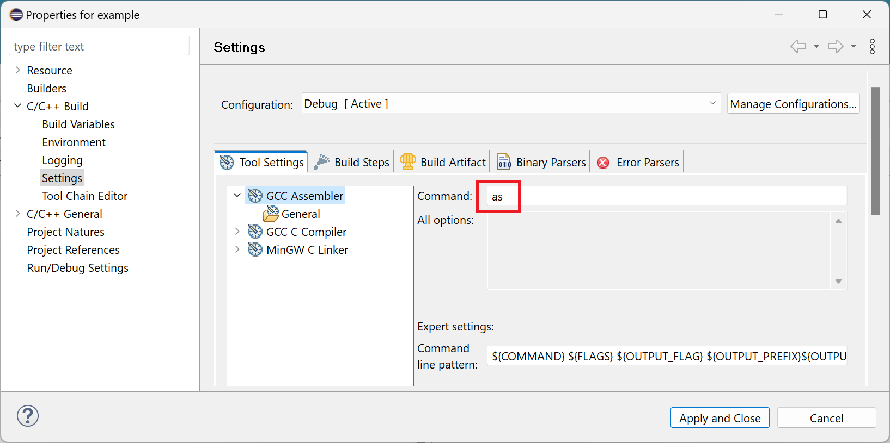

# Release Notes and New & Noteworthy page

This is the New & Noteworthy page for CDT 11.5 which is part of Eclipse 2024-03 Simultaneous Release

---

# Release Notes

# Build

## Preprocessor activation for GNU assembly language files

The managed build system now invokes `gcc -c` to build GNU assembly language source files rather than invoking `as` directly. The revised behaviour ensures that the GNU preprocessor is active when building `*.S` and `*.sx` files to match user expectations. In the case of existing managed build projects, a new GNU assembler tool command generator applies the `-Wa,` prefix to user-specified assembler flags where appropriate. Users may revert to the previous behaviour by overriding the assembler command within the project properties dialog:

The new behaviour applies to managed build configurations using a _Cross GCC_, _Cygwin GCC_, _Linux GCC_ or _MinGW GCC_ toolchain.

# API Changes, current and planned

## Breaking API changes

Please see [CHANGELOG-API](CHANGELOG-API.md) for details on the breaking API changes in this release as well as future planned API changes.

# Noteworthy Issues and Pull Requests

See [Noteworthy issues and PRs](https://github.com/eclipse-cdt/cdt/issues?q=is%3Aclosed+label%3Anoteworthy+milestone%3A11.5.0) for this release in the issue/PR tracker.

# Bugs Fixed in this Release

See [GitHub milestones](https://github.com/eclipse-cdt/cdt/milestone/9?closed=1)
