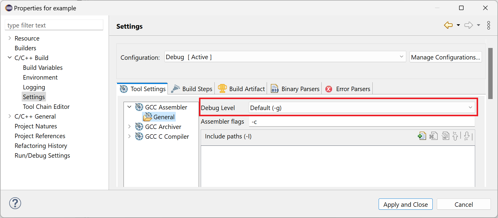

# Release Notes and New & Noteworthy page

This is the New & Noteworthy page for CDT 11.6 which is part of Eclipse 2024-06 Simultaneous Release

---

# Release Notes

# Build

## Debug information for GNU assembly language files

The managed build system now provides an option to generate debug information when building GNU assembly language source files. The debug information enables stepping into assembly language files when debugging at source code level. The new option is enabled by default for _Debug_ build configurations using a _Cross GCC_, _Cygwin GCC_, _Linux GCC_ or _MinGW GCC_ toolchain:

# API Changes, current and planned

## Breaking API changes

Please see [CHANGELOG-API](CHANGELOG-API.md) for details on the breaking API changes in this release as well as future planned API changes.

# Noteworthy Issues and Pull Requests

See [Noteworthy issues and PRs](https://github.com/eclipse-cdt/cdt/issues?q=is%3Aclosed+label%3Anoteworthy+milestone%3A11.6.0) for this release in the issue/PR tracker.

# Bugs Fixed in this Release

See GitHub milestones:
- 
- 

