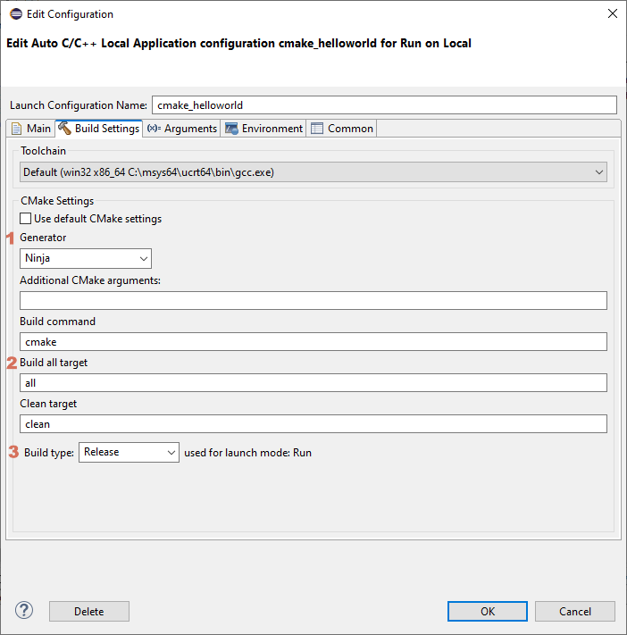
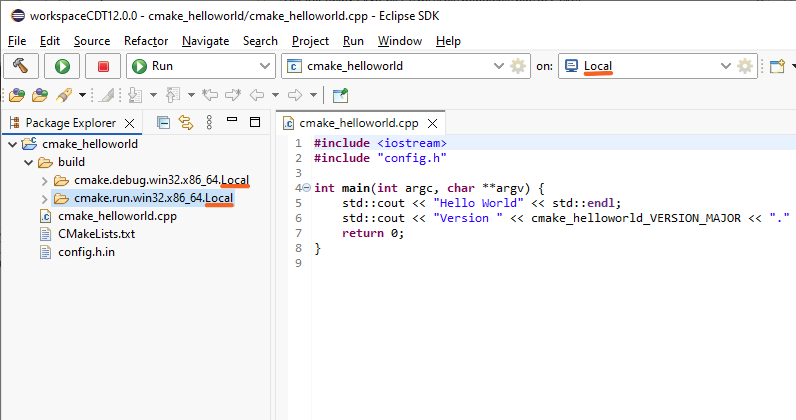
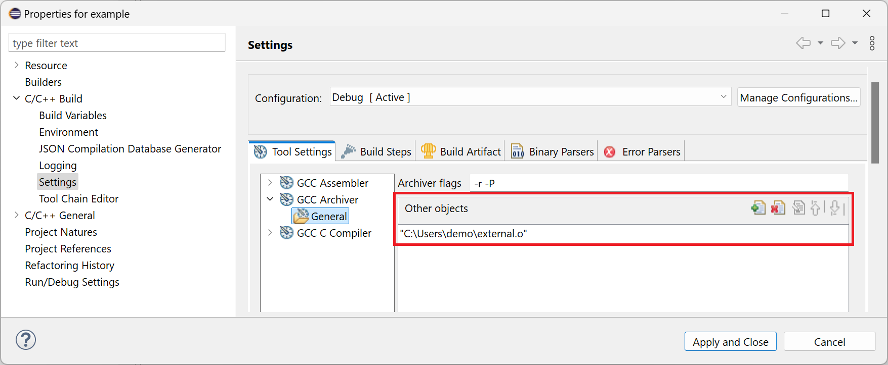
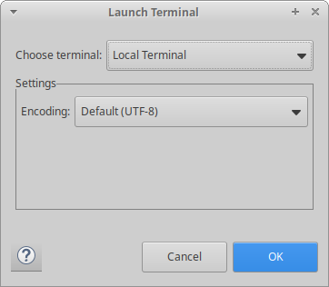
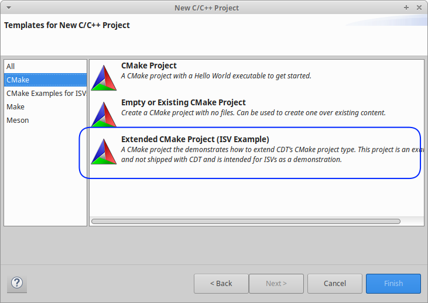

# Release Notes and New & Noteworthy page

This is the New & Noteworthy page for CDT 12.0 which is part of Eclipse 2025-03 Simultaneous Release

---

# Release Notes

## Minimum version of GLIBC required

The minimum version of GLIBC required is now 2.31.
This version can be found in Ubuntu 20.04 and later, RHEL 9.0 and later and other distros as well.
CDT's native components will likely work with older versions of glibc too, assuming they provide the required APIs for Eclipse CDT.

# Core Build

## Default build system generator for CMake changed to Ninja on all platforms

The default for CMake's  build system generator is now Ninja on all platforms.
Users who want to use other build system generators can select their desired generator in the build settings.

## More CMake build settings are now available in the user interface

The CMake build setting GUI has been updated to include more CMake settings, and some of the settings that did not used to do the correct thing have been updated for more consistent behavior.
The way these settings are saved has been slightly modified, meaning workspaces with CMake projects from before CDT 12 will have their build settings restored to defaults.
Build settings can be customized by unchecking "Use default CMake settings".

The Build Settings tab has the following changes:

(1) "Generator" is now a dropdown to make selection clearer. A custom value can also be set.

(2) "Build all target" was added so it's now possible to change the "--target" value passed to the CMake building stage.
See [Issue #1046](https://github.com/eclipse-cdt/cdt/issues/1046)

(3) "Build type" was added so it's now possible to change the CMAKE_BUILD_TYPE value passed to the CMake configuring stage, including a custom value.
See [Issue #1090](https://github.com/eclipse-cdt/cdt/issues/1090)

## Core Build Configuration naming improvements

### Launch Target now used for tracking Core Build configurations

Previously the active launch mode and selected toolchain were used to choose the active Core Build configuration. Now the active launch target is also used. You can see the affect of this in the project's build output directory name. Notice the name of the build directory; "cmake.debug.win32.x86_64.Local" and "cmake.run.win32.x86_64.Local" end with the name "Local" which corresponds to the currently active Launch Target.

See [Issue #1076](https://github.com/eclipse-cdt/cdt/issues/1076)

Additionally, the build output directory name may be customized by ISVs - see [Core Build configuration build output directory name may be customized by ISVs](#core-build-configuration-build-output-directory-name-may-be-customized-by-isvs)

### "Default" name no longer used for Core Build configuration name

Previously the name "default" would appear as one of the project's build directory names. This is no longer used and the name will always follow the pattern described above.

See [Issue #1084](https://github.com/eclipse-cdt/cdt/issues/1084)

# Managed Build

## New *C Project* and new *C++ Project* available via *New C/C++ Project* wizard

The separate new C and C++ project wizards are now exclusively available via the *New C/C++ Project* wizard.
From the second page of *New C/C++ Project* wizard select *C Managed Build* to access the *New C Project* wizard and select *C++ Managed Build* to access the *New C++ Project* wizard.

See [Issue #965](https://github.com/eclipse-cdt/cdt/issues/965) for additional details, including how to restore these menu entries if your Eclipse CDT product depends on it.

## New *Makefile Project with Existing Code* available via *Existing Code as Makefile Project* import wizard

The *Makefile Project with Existing Code* wizard is no longer available in the new project wizard.
For users who need it, it remains available in the *Existing Code as Makefile Project* import wizard.
Most users should be using the *Makefile project* type in the *New C/C++ Project* wizard.

See [Issue #965](https://github.com/eclipse-cdt/cdt/issues/965) for additional details, including how to restore these menu entries if your Eclipse CDT product depends on it.

## Other objects for GNU archive files

The managed build system now provides an option to specify other object files to be included when building GNU archive files:

The new option applies to static library projects using a _Cross GCC_, _Cygwin GCC_, _Linux GCC_ or _MinGW GCC_ toolchain.

# Debug

## DSF Preference Pages always visible

The DSF Preference pages (Preferences -> C/C++ -> Debug -> GDB and children) are not always shown to users.
Prior to CDT 12 these were not visible until after the first debug session was started.

At the first debug session CDT enables the [activity](https://help.eclipse.org/latest/topic/org.eclipse.platform.doc.isv/reference/extension-points/org_eclipse_ui_activities.html) for DSF (`org.eclipse.cdt.debug.dsfgdbActivity`), with this change nothing in CDT is bound to this activity key anymore.

## Preferences -> Run/Debug -> View Performance relocated

The View Performance preference page, which is CDT specific, has been relocated to the Preferences -> C/C++ -> Debug section of preferences.
This only affects where in the Preferences tree the page is located, the preferences and key names have not changed.
In addition, this page is always visible.

# Terminal

## Default encoding for terminal is now UTF-8

For a [while](https://eclipse.dev/eclipse/news/4.24/platform.html#explicit-encoding-workspaces), the default encoding in Eclipse has been UTF-8.
Starting in CDT 12, the Terminal will now default to UTF-8.

# API Changes, current and planned

## CMake Support easier for extenders and ISVs

Improvements to the API for CMake has made it easier to extend and specialize CMake for ISVs.
A fully worked example demonstrating the support is now provided in the CDT source in [org.eclipse.cdt.cmake.example](https://github.com/eclipse-cdt/cdt/tree/main/cmake/org.eclipse.cdt.cmake.example).
This example demonstrates the API, and how to contribute a new project wizard to make such a project.

## Core Build configuration build output directory name may be customized by ISVs

The name used for the Core Build Configuration build output can now be customized by extending:

[org.eclipse.cdt.core.build.ICBuildConfigurationProvider#getCBuildConfigName](https://github.com/eclipse-cdt/cdt/blob/main/core/org.eclipse.cdt.core/src/org/eclipse/cdt/core/build/ICBuildConfigurationProvider.java##L76-L94).

## Breaking API changes

Please see [CHANGELOG-API](CHANGELOG-API.md) for details on the breaking API changes in this release as well as future planned API changes.

# Noteworthy Issues and Pull Requests

See [Noteworthy issues and PRs](https://github.com/eclipse-cdt/cdt/issues?q=is%3Aclosed+label%3Anoteworthy+milestone%3A12.0.0) for this release in the issue/PR tracker.

## Improved launch configuration for CMake and other Core Build System projects

The CMake and CBS Makefile project launch configurations for local applications have an improved Main tab and new Arguments, Environment, Debugger, Source, and Common tabs.

# Bugs Fixed in this Release

See GitHub milestones:
- 
- 
- 
- 
