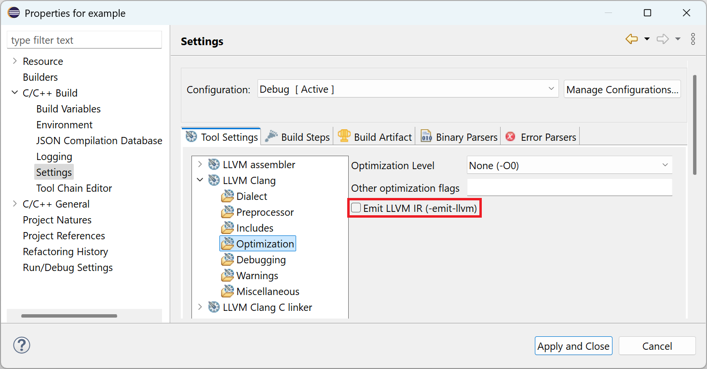

# Release Notes and New & Noteworthy page

This is the New & Noteworthy page for CDT 12.2 which is part of Eclipse 2025-09 Simultaneous Release

---

# Release Notes

## Homebrew integration

External build and debug tools are now located automatically when installed using the [Homebrew](https://brew.sh) package manager.

## Clang toolchain for Managed Build

The _LLVM with Clang_ toolchain description for CDT managed build now supports compilation to native object code as an alternative to generating LLVM bitcode. This behaviour is configurable using the _Emit LLVM IR_ option on the C/C++ Build > Settings page of the Project Properties dialog:

## LLDB debugger support

The _Memory_ view is now populated correctly when debugging using LLDB. The _LLDB-MI Debug Process Launcher_ is selected by default when creating local _C/C++ Application_ debug configurations for macOS on Apple silicon (AArch64). A new Homebrew _tap_ allows for easy installation of the `lldb-mi` tool on macOS. Refer to the [Before you begin](https://github.com/eclipse-cdt/cdt/blob/main/doc/org.eclipse.cdt.doc.user/src/concepts/cdt_c_before_you_begin.adoc#macos) help page for updated tool installation instructions and to the [CDT FAQ](https://github.com/eclipse-cdt/cdt/blob/main/FAQ/README.md#how-do-i-install-the-lldb-debugger-integration) for LLDB integration setup details.

# API Changes, current and planned

## Migrate Terminal bundles to Eclipse Platform

Most of the rest of the terminal has now been migrated to Eclipse Platform.
For users this does not change anything (other than fresh development, bug fixes, improved icons and much more).
For ISVs there is a new namespace to use `org.eclipse.terminal` and follow future developments in [Eclipse Platform](https://github.com/eclipse-platform/) project.

Read more in the [API changelog for 12.2](https://github.com/eclipse-cdt/cdt/blob/main/NewAndNoteworthy/CHANGELOG-API.md#api-changes-in-cdt-122) and see announcements in [Eclipse Platform's news](https://eclipse.dev/eclipse/markdown/?f=news/4.37/platform_isv.md)

## Breaking API changes

Please see [CHANGELOG-API](CHANGELOG-API.md) for details on the breaking API changes in this release as well as future planned API changes.

# Noteworthy Issues and Pull Requests

See [Noteworthy issues and PRs](https://github.com/eclipse-cdt/cdt/issues?q=is%3Aclosed+label%3Anoteworthy+milestone%3A12.2.0) for this release in the issue/PR tracker.

# Bugs Fixed in this Release

See GitHub milestone for CDT  and CDT LSP 
