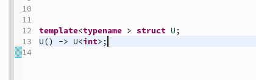

# CDT Release Notes and New & Noteworthy

What's new and noteworthy in:

- [CDT 12.0/2025-03](CDT-12.0.md)
- [CDT 11.6/2024-06](CDT-11.6.md)
- [CDT 11.5/2024-03](CDT-11.5.md)
- [CDT 11.4/2023-12](CDT-11.4.md)
- [CDT 11.3/2023-09](CDT-11.3.md)
- [CDT 11.2/2023-06](CDT-11.2.md)
- [CDT 11.1/2023-03](CDT-11.1.md)
- [CDT 11.0/2022-12](CDT-11.0.md)
- [CDT 10.7/2022-06](CDT-10.7.md)
- [CDT 10.6/2022-03](CDT-10.6.md)
- [CDT 10.5/2021-12](CDT-10.5.md)
- [CDT 10.4/2021-09](CDT-10.4.md)
- [CDT 10.3/2021-06](CDT-10.3.md)
- [CDT 10.2/2021-03](CDT-10.2.md)
- [CDT 10.1/2020-12](CDT-10.1.md)
- [CDT 10.0/2020-09](CDT-10.0.md)

## CDT LSP

The [CDT LSP (LSP based C/C++ Editor)](https://github.com/eclipse-cdt/cdt-lsp#readme) provides its own [changelog](https://github.com/eclipse-cdt/cdt-lsp/blob/master/CHANGELOG.md) highlighting its release notes and new and noteworthy entries.

## Older Versions

<details>
<summary>Older Versions</summary>

## Older Versions

Older versions of CDT's New & Noteworthy page have not been converted from Wikitext to GitHub markdown, instead these older pages have simply been saved from the browser to preseve them.
This may lead to some minor rendering issues that hopefully do not detract too much from the overall information provided.

- [CDT 9.11/2020-03](https://htmlpreview.github.io/?https://raw.githubusercontent.com/eclipse-cdt/cdt/blob/main/NewAndNoteworthy/OlderReleases/CDT-9.11.html)
- [CDT 9.10/2019-12](https://htmlpreview.github.io/?https://raw.githubusercontent.com/eclipse-cdt/cdt/blob/main/NewAndNoteworthy/OlderReleases/CDT-9.10.html)
- [CDT 9.9/2019-09](https://htmlpreview.github.io/?https://raw.githubusercontent.com/eclipse-cdt/cdt/blob/main/NewAndNoteworthy/OlderReleases/CDT-9.9.html)
- [CDT 9.8/2019-06](https://htmlpreview.github.io/?https://raw.githubusercontent.com/eclipse-cdt/cdt/blob/main/NewAndNoteworthy/OlderReleases/CDT-9.8.html)
- [CDT 9.7/2019-03](https://htmlpreview.github.io/?https://raw.githubusercontent.com/eclipse-cdt/cdt/blob/main/NewAndNoteworthy/OlderReleases/CDT-9.7.html)
- [CDT 9.6/2018-12](https://htmlpreview.github.io/?https://raw.githubusercontent.com/eclipse-cdt/cdt/blob/main/NewAndNoteworthy/OlderReleases/CDT-9.6.html)
- [CDT 9.5/Photon](https://htmlpreview.github.io/?https://raw.githubusercontent.com/eclipse-cdt/cdt/blob/main/NewAndNoteworthy/OlderReleases/CDT-9.5.html)
- [CDT 9.4/Oxygen.2](https://htmlpreview.github.io/?https://raw.githubusercontent.com/eclipse-cdt/cdt/blob/main/NewAndNoteworthy/OlderReleases/CDT-9.4.html)
- [CDT 9.3/Oxygen](https://htmlpreview.github.io/?https://raw.githubusercontent.com/eclipse-cdt/cdt/blob/main/NewAndNoteworthy/OlderReleases/CDT-9.3.html)
- [CDT 9.2/Neon.2](https://htmlpreview.github.io/?https://raw.githubusercontent.com/eclipse-cdt/cdt/blob/main/NewAndNoteworthy/OlderReleases/CDT-9.2.html)
- [CDT 9.1/Neon.1](https://htmlpreview.github.io/?https://raw.githubusercontent.com/eclipse-cdt/cdt/blob/main/NewAndNoteworthy/OlderReleases/CDT-9.1.html)
- [CDT 9.0/Neon](https://htmlpreview.github.io/?https://raw.githubusercontent.com/eclipse-cdt/cdt/blob/main/NewAndNoteworthy/OlderReleases/CDT-9.0.html)
- [CDT 8.8/Mars.1](https://htmlpreview.github.io/?https://raw.githubusercontent.com/eclipse-cdt/cdt/blob/main/NewAndNoteworthy/OlderReleases/CDT-8.8.html)
- [CDT 8.7/Mars](https://htmlpreview.github.io/?https://raw.githubusercontent.com/eclipse-cdt/cdt/blob/main/NewAndNoteworthy/OlderReleases/CDT-8.7.html)
- [CDT 8.6](https://htmlpreview.github.io/?https://raw.githubusercontent.com/eclipse-cdt/cdt/blob/main/NewAndNoteworthy/OlderReleases/CDT-8.6.html)
- [CDT 8.5](https://htmlpreview.github.io/?https://raw.githubusercontent.com/eclipse-cdt/cdt/blob/main/NewAndNoteworthy/OlderReleases/CDT-8.5.html)
- [CDT 8.4/Luna](https://htmlpreview.github.io/?https://raw.githubusercontent.com/eclipse-cdt/cdt/blob/main/NewAndNoteworthy/OlderReleases/CDT-8.4.html)
- [CDT 8.3](https://htmlpreview.github.io/?https://raw.githubusercontent.com/eclipse-cdt/cdt/blob/main/NewAndNoteworthy/OlderReleases/CDT-8.3.html)
- [CDT 8.2/Kepler](https://htmlpreview.github.io/?https://raw.githubusercontent.com/eclipse-cdt/cdt/blob/main/NewAndNoteworthy/OlderReleases/CDT-8.2.html)
- [CDT 8.1/Juno](https://htmlpreview.github.io/?https://raw.githubusercontent.com/eclipse-cdt/cdt/blob/main/NewAndNoteworthy/OlderReleases/CDT-8.1.html)
- [CDT 8.0/Indigo](https://htmlpreview.github.io/?https://raw.githubusercontent.com/eclipse-cdt/cdt/blob/main/NewAndNoteworthy/OlderReleases/CDT-8.0.html)
- [CDT 7.0/Helios](https://htmlpreview.github.io/?https://raw.githubusercontent.com/eclipse-cdt/cdt/blob/main/NewAndNoteworthy/OlderReleases/CDT-7.0.html)
- [CDT 6.0/Galileo](https://htmlpreview.github.io/?https://raw.githubusercontent.com/eclipse-cdt/cdt/blob/main/NewAndNoteworthy/OlderReleases/CDT-6.0.html)
- [CDT 5.0](https://htmlpreview.github.io/?https://raw.githubusercontent.com/eclipse-cdt/cdt/blob/main/NewAndNoteworthy/OlderReleases/CDT-5.0.html)
- [CDT 4.0](https://htmlpreview.github.io/?https://raw.githubusercontent.com/eclipse-cdt/cdt/blob/main/NewAndNoteworthy/OlderReleases/CDT-4.0.html)

</details>

## API Changes

The Eclipse CDT project announces and tracks breaking API changes in [CHANGELOG-API](CHANGELOG-API.md).

<details>
<summary>How to write a New & Noteworthy entry</summary>

## How to write a New & Noteworthy entry

Use the model of any of the previous New & Noteworthy entry pages as a starting point.
[CDT 10.3/2021-06](CDT-10.3.md) is a fairly extensive entry and is a useful page to copy examples from.

### Using Images

Upload images to the [`images/`](images) subfolder and prefix the file with the version number, e.g. `CDT-10.5-`.
The images should be embedded using the `` tag with (gernally) a width of `50%` like this:

```md
<p align="center"></p>
```

### Referecing Code

Especially when writing New & Noteworthy entries about API it is useful to link to the file.
This should be done using a relative path, such as:

```md
The [SerialPort](../native/org.eclipse.cdt.native.serial/src/org/eclipse/cdt/serial/SerialPort.java) supports arbitrary baud rates.
```

which renders like this:

The [SerialPort](../native/org.eclipse.cdt.native.serial/src/org/eclipse/cdt/serial/SerialPort.java) supports arbitrary baud rates.

### API Changes and Improvements

Improvements and changes to API should be announced in the New and Noteworthy for the release so they get visibility.
Linking directly to the code or Javadoc for the new API is encouraged.

### API Breakages and Removals

Anything that breaks or removes API should be listed in the [CHANGELOG-API](CHANGELOG-API.md).
If the API change is very significant (such as a new version of Java) listing it in the New and Noteworthy for the release is also advisable.

</details>
