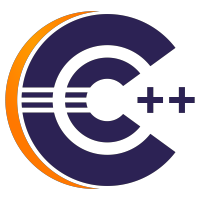

# Eclipse CDT™ C/C++ Development Tools

    

The Eclipse CDT™ Project provides a fully functional C and C++ Integrated Development Environment based on the Eclipse platform. Features include: support for project creation and managed build for various toolchains, standard make build, source navigation, various source knowledge tools, such as type hierarchy, call graph, include browser, macro definition browser, code editor with syntax highlighting, folding and hyperlink navigation, source code refactoring and code generation, visual debugging tools, including memory, registers, and disassembly viewers.

Highlights of recent releases and release notes are available in the [New & Noteworthy](NewAndNoteworthy/README.md).

See also https://projects.eclipse.org/projects/tools.cdt and https://eclipse.org/cdt

## Download

The recommended way to obtain Eclipse CDT is to download it as part of the complete *Eclipse IDE for C/C++ Developers* or *Eclipse IDE for Embedded C/C++ Developers* from the main [Eclipse IDE download site](https://eclipseide.org/release/).

Alternatively Eclipse CDT can be installed into an existing Eclipse installation using this p2 URL: `https://download.eclipse.org/tools/cdt/releases/latest/` ([see how](https://help.eclipse.org/topic/org.eclipse.platform.doc.user/tasks/tasks-127.htm))

### Download Development Builds

Milestone builds of the *Eclipse IDE for C/C++ Developers* or *Eclipse IDE for Embedded C/C++ Developers* can be found on the [Eclipse Downloads page](https://www.eclipse.org/downloads/packages/) by clicking on the Eclipse Developer Builds tab (only present when there is a milestone build newer than the latest release).

Alternatively, milestone builds of Eclipse CDT can be installed into an existing Eclipse installation using one of the p2 URLs in: <https://download.eclipse.org/tools/cdt/builds> ([see how](https://help.eclipse.org/topic/org.eclipse.platform.doc.user/tasks/tasks-127.htm)).
See [cdt.aggrcon](https://github.com/eclipse-simrel/simrel.build/blob/main/cdt.aggrcon#L3) for which milestone is currently contributed to Eclipse SimRel.

Bleeding edge continuous (aka nightly) builds are available for the main branch from the p2 software repository: `https://download.eclipse.org/tools/cdt/builds/cdt/main/`

### Download older versions

Downloads links for older versions are available in [Downloads](Downloads.md).

## Help & Support

The Eclipse CDT (C/C++ Development Tools) User Guide can be found in the [Eclipse Help - C/C++ Development User Guide](https://help.eclipse.org/latest/topic/org.eclipse.cdt.doc.user/concepts/cdt_o_home.htm).

The Eclipse forum for [C/C++ IDE (CDT)](https://www.eclipse.org/forums/index.php/f/80/) is for users to ask questions on how to use Eclipse CDT. It is monitored by fellow users in the community for support. Stack Overflow also has an [eclipse-cdt](https://stackoverflow.com/questions/tagged/eclipse-cdt) tag that can be added to questions or searched for prevous similar questions.

The Eclipse CDT Plug-in Developer Guide can also be found in the [Eclipse Help - CDT Plug-in Developer Guide](https://help.eclipse.org/latest/topic/org.eclipse.cdt.doc.isv/guide/index.html).

There is an [FAQ](FAQ/README.md) covering many commonly asked questions for both user and developers and a [Contribution Guide](CONTRIBUTING.md) for guidance on editing Eclipse CDT's source and submitting changes.

## Reporting issues

Please report issues in the [GitHub issue tracker](https://github.com/eclipse-cdt/cdt/issues). 

## Vendor Supplied Eclipse CDT

Did you get your version of Eclipse CDT from a vendor (such as a chip maker)? If so, they generally support their customers. In that case issues and support questions should be directed at the vendor in the first instance.

We encourage all vendors who are extending and redistributing Eclipse CDT to engage with the project and contribute fixes and improvements back to the Eclipse CDT project.

## CDT LSP (LSP based C/C++ Editor)

The Eclipse CDT project also provides an LSP based C/C++ Editor.
Please see the [CDT LSP repo](https://github.com/eclipse-cdt/cdt-lsp#readme) for more details on that project and the future plans for language server protocol and clangd support in Eclipse CDT.

## Contributing

[Contributions are always welcome!](./CONTRIBUTING.md)

Please bear in mind that this project is almost entirely developed by volunteers. If you do not provide the implementation yourself (or pay someone to do it for you), the bug might never get fixed. If it is a serious bug, other people than you might care enough to provide a fix.

## Add-ons for CDT

There are many third-party addons for CDT to make it more productive.

* [CDT LSP](https://github.com/eclipse-cdt/cdt-lsp#readme): LSP based C/C++ Editor provided by the Eclipse CDT project
* [cmake4eclipse](https://github.com/15knots/cmake4eclipse#abstract): This Eclipse plug-in automatically generates build-scripts for the Eclipse CDT managed build system from CMake scripts.
* [Sloeber](http://eclipse.baeyens.it/): Eclipse Plugins based on Arduino toolchains or a enhanced Arduino IDE.
* [SonarQube for Eclipse](https://marketplace.eclipse.org/content/sonarqube-ide): Eclipse plug-in for static analysis for quality and security issues in your C/C++ code directly inside the IDE.
* [CUTE](https://cute-test.com/): C++ unit testing plug-in
* [Bracketeer2](https://marketplace.eclipse.org/content/bracketeer2): Auto-comments on closing brackets and highlight of matching/mismatching brackets
* And many more in the [Eclipse Marketplace](https://marketplace.eclipse.org/), for example, try the [CDT tag](https://marketplace.eclipse.org/category/free-tagging/cdt)

_Have a tool that you want listed here? Please open a [PR](https://github.com/eclipse-cdt/cdt/pulls)_
## Code of Conduct

This project follows the [Eclipse Community Code of Conduct](https://www.eclipse.org/org/documents/Community_Code_of_Conduct.php).

## Migration from Gerrit, Bugzilla, Wiki, Eclipse Forums

In the summer of 2022 the Eclipse CDT project migrated from Gerrit, Bugzilla, Wiki, Eclipse Forums to GitHub based solutions. Please see [GitHub Migration](GitHubMigration.md) for more details.
