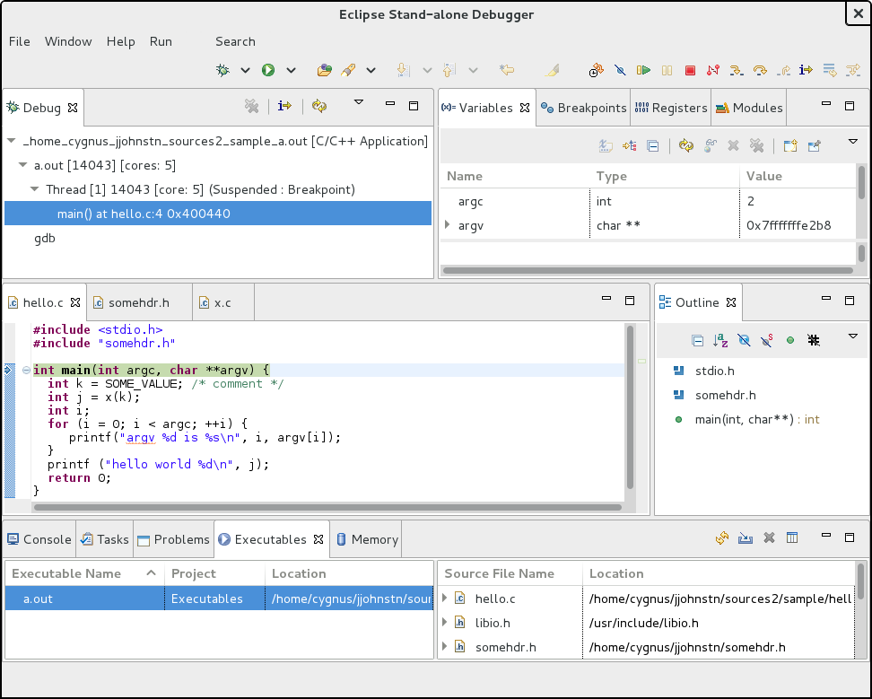

This page details the effort to create a stand-alone C/C++ Debugger using Eclipse.

## What is it?

The Standalone Debugger is an Eclipse application that starts up a subset of the Eclipse CDT (C/C++ Development Tooling) plug-ins that pertain specifically to C/C++ debugging.
The application has an accompanying command-line script which allows an end-user to start up the debugger from the command-line and pass arguments that will start the debugger for the appropriate task.

The end-user can specify either to debug an application, to attach to an existing process, or to debug a core-file.
In addition, a build log can be specified to aid the Debugger in locating include files and calculate what flags were used to compile the source code.
This allows the CDT indexer to parse the code properly which is needed for tasks such as searching code for C/C++ constructs and locating declarations and implementation of C/C++ methods and functions.

The following details the help text of the downloaded version of the script:

```
Usage: cdtdebug.sh [ECLIPSE_OPTIONS] [-b BUILD_LOG] [TARGET_OPTION]

Debug an executable, core-file, or an existing process using the Eclipse
C/C++ Stand-alone Debugger. Eclipse command-line options may be passed
except for -vmargs which is being used to start up the Eclipse Debugger.

Operation modes:
 -h, --help print this help, then exit

Indexing assist options:
 -b BUILD_LOG build log to use for compiler includes/flags

Target options:
 -a [pid] attach using the optional pid or prompt for a pid
 -c COREFILE debug core-file (should also specify executable)
 -e EXECUTABLE [ARGS...] debug given executable (passing ARGS to main)
 -r ADDRESS:PORT debug toward the specified remote server. Can be
 combined with the -a option.

The -e option must be used last as subsequent options are passed to main.

Specifying insufficient arguments for a particular target will result in a
dialog displayed to enter the required values for that target. Specifying
no target option brings up a dialog for debugging an executable with the
executable path, program arguments, and build log filled in from the last -e
invocation, if one exists.

More info: https://github.com/eclipse-cdt/cdt/blob/main/StandaloneDebugger.md
```

The Standalone Debugger is designed to make debugging easier for the C/C++ developer that has little to no experience with Eclipse.

Normally, to use the C/C++ tools in Eclipse, a user needs to set up an Eclipse project.
An Eclipse project has natures which dictates various menus and actions that are appropriate for the project.
For example, one might have Eclipse loaded with Java and C/C++ support, but a user does not want to see Java-specific menu items for a project that has been designated C/C++.
For C/C++, there are multiple natures that may apply due to the fact that there are multiple types of C/C++ projects based on how the project is built (e.g.
an Autotools project vs a project which maintains its own Makefile).
Rather than impose the Eclipse project model on the end-user that just wishes to debug, the Standalone Debugger automatically creates a C/C++ project on behalf of the end-user.
As mentioned, the Standalone Debugger only loads a subset of the all the CDT plug-ins pertaining to debugging and build plug-ins are not included in this list.
Thus, the Standalone debugger does not have to be concerned with adding natures pertaining to build.

To debug an application, attached process, or core-file, in Eclipse, a user would normally have to set up an Eclipse launch configuration.
Launch configurations store all the information required to launch an application such as what application is being launched, parameters passed, environment variables, etc...
In the case of a debug launch configuration this includes what debugger is used and parameters to the debugger itself.
At present, the debugger used is gdb.
Launch configurations can have different types based on what is being launched.
This allows the UI to request the appropriate info from the user (e.g.
if launching a core-file, the core-file location plus the executable location is needed).
Rather than force an end-user to learn how to use launch configurations, the Standalone Debugger creates an Eclipse launch configuration on behalf of the end-user based on the parameters used.
The debug session is automatically started so the end-user basically just has to start debugging which is fairly intuitive in the Eclipse IDE.

While knowledge of Eclipse launch configurations and projects are not required for users of the Standalone Debugger, they still exist and experienced Eclipse users can manipulate the default projects and launch configurations created if so desired.

Once the IDE is started, a user may debug other executables, attached processes, or core-files manually.
These actions are provided under the top-level File menu and each action will prompt the user for the required information.

The following shows the debugger once started:



## How to try it out

There are two flavours of the Standalone Debugger:

1. Downloaded from eclipse.org as part of a full Eclipse installation
1. Installed as part of a Linux distro

### Try out Full Eclipse Installation

To try out the Standalone Debugger from eclipse.org as part of a full
Eclipse installation:

1. Download the IDE for C/C++ Developers tar file for your platform - <https://www.eclipse.org/downloads>
2. Untar the C/C++ IDE into a local directory (let's call this `$CDT_DIR`)
3. `cd $CDT_DIR/eclipse/plugins/org.eclipse.cdt.debug.application_*/scripts`
4. There, run the command:
    - `/bin/sh ./install.sh`
    - this will create the directory: `$HOME/cdtdebugger` for you where
      the `cdtdebug.sh` script will be installed
5. To run the debugger:
    - `$HOME/cdtdebugger/cdtdebug.sh` ... (see above or use --help option for arguments)
    - this will default to use the workspace: workspace-cdtdebug if you do not specifiy a workspace via the -data option

### Try out Linux Distro

To try out the Standalone Debugger on a Linux distro:

1. Install or update the eclipse-cdt package to 8.4.0-1 or higher
2. The installation of the package will install a cdtdebug script for you in a shared folder (e.g. /usr/bin/cdtdebug)
3. Running the cdtdebug binary will create a unique folder for you in your $HOME directory (e.g. `$HOME/fcdtdebugger` for Fedora)
    - This enables you to have both the downloaded version and installed distro version at the same time
4. cdtdebug .... (see above or use `--help` option for arguments)

The two versions are essentially the same except for the config.ini files that are used in start-up.
For a distro version of eclipse-cdt, CDT plug-ins and features need to be specified as file locations whereas in the download case, it is sufficient to specify Eclipse bundle names.

In the case of the downloaded version, updating some plug-ins and features is fine since the bundle names do not change.
For the distro version, the CDT is updated by updating the entire eclipse-cdt package at once and this will update the cdtdebug script and its accompanying config.ini file.

Mixing the two types of CDT is not supported for the Standalone Debugger.
This can occur if the user installs a distro version of the Eclipse platform and then uses the Eclipse Update within the IDE to download the CDT Standalone Debugger from eclipse.org.
This installs the feature and plug-ins into the user's local $HOME/.eclipse folder.
Running the install.sh script from there will check for this and give an error.
