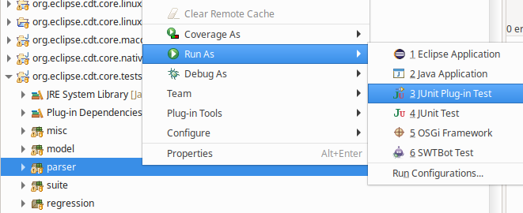
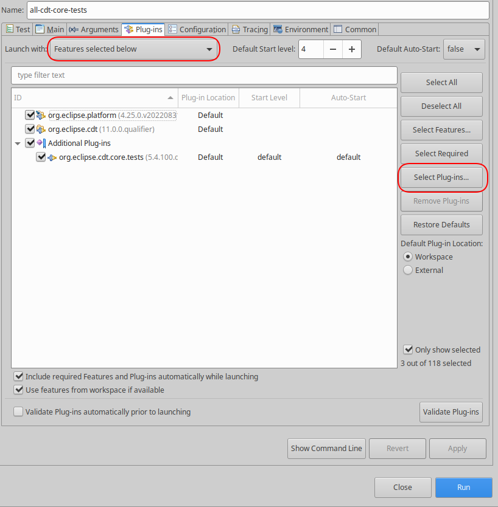
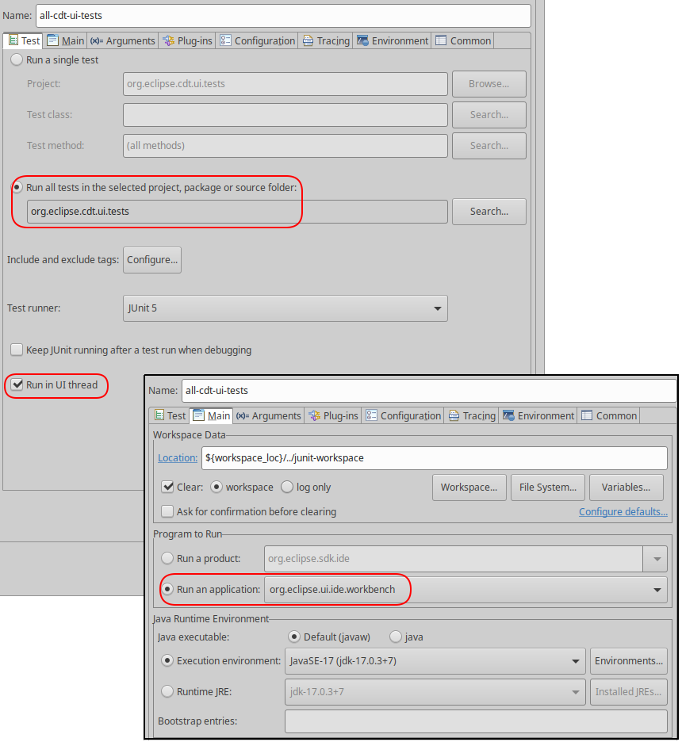
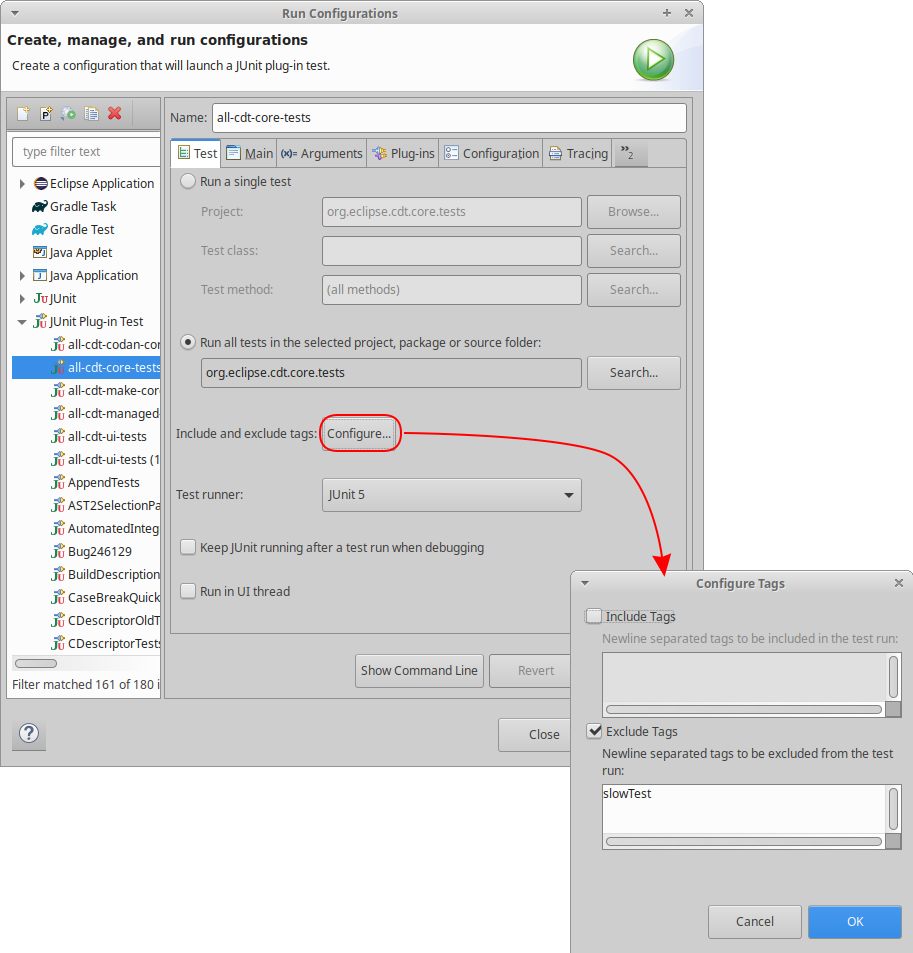
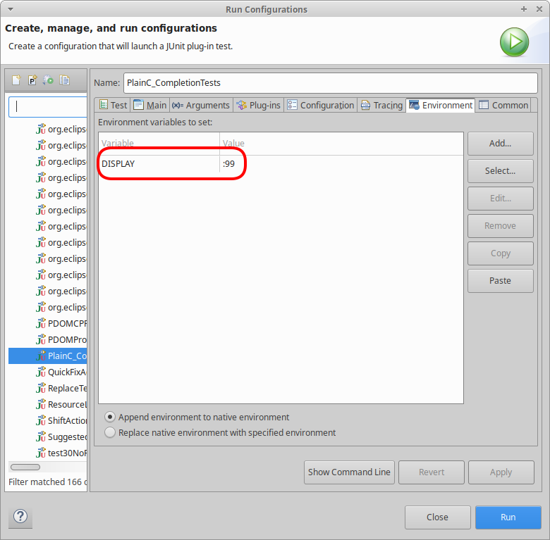

# Eclipse CDT Testing notes

This document is a collection of various notes on testing and writing JUnit tests in Eclipse CDT.

## Contributing to and Editing Eclipse CDT

Please see [CONTRIBUTING.md](./CONTRIBUTING.md) for contributing information, including setting up a development environment.

## How do I run CDT JUnit test suite?

There are special Java packages to test CDT itself.
Their names generally end with suffix `.tests`.
They are normally run during the build of CDT for example you can see results for Jenkins builds [here](https://ci.eclipse.org/cdt/job/cdt/job/main/lastCompletedBuild/testReport).

You can run JUnit Plug-in tests in UI this way:

1. Select test CDT package (ends with `.tests`, for example org.eclipse.cdt.core.tests).
2. Right-click on the class, suite, package, source folder or project you want to run in Package Explorer and select _Run As_ -\> _JUnit Plugin Test_.



### Using limited sets of plug-ins in tests

You may want to restrict the plug-ins included in the launch configuration.
This has benefits:

1. Start-up time of the tests can be much faster, leading to faster development cycles.
2. Other plug-ins can cause unrelated errors in the error log.
3. More closely matches what happens at the command line with Maven + Tycho Surefire

For most of the test plug-ins including only the `org.eclipse.cdt` and `org.eclipse.platform` feature + the test bundle is the recommended flow.
For example to run tests in the `org.eclipse.cdt.core.tests` project, configure the _Plug-ins_ tab like this:



Refer to the `tycho-surefire-plugin` section in the `pom.xml` to see what features are included when testing with Maven + Tycho Surefire.

### Controlling which test runner to use

When running JUnit plug-in tests there are two critical settings to control how the tests run:

- Which thread the JUnit test code runs in.
Some tests, e.g. SWT Bot tests, expect the JUnit code to be run outside the `main` thread.
Other tests rely running the JUnit code on the `main` thread.
  - In the Eclipse IDE this is controlled with the _Run in UI thread_ setting in the _Test_ tab of the launch configuration.
  - With Maven + Tycho Surefire this corresponds to the [`useUIThread`](https://tycho.eclipseprojects.io/doc/latest/tycho-surefire-plugin/test-mojo.html#useUIThread) setting.
  - Refer to the `pom.xml` to see what it the correct setting for any individual project.
- Whether or not to start a UI.
Headless tests, those that don't test the UI like `org.eclipse.cdt.core.tests`, don't require a UI to be running.
  - For these tests launching with the `[No Application] - Headless Mode` application is recommended in the _Main_ tab of the launch configuration.
  - For tests that need the UI the `org.eclipse.ui.ide.workbench` application is recommended in the _Main_ tab of the launch configuration.
  - With Maven + Tycho Surefire this corresponds to the [`useUIHarness`](https://tycho.eclipseprojects.io/doc/latest/tycho-surefire-plugin/test-mojo.html#useUIHarness) setting.
  - Refer to the `pom.xml` to see what it the correct setting for any individual project.

Generally speaking:

- core tests don't use UI thread and use the headless harness.
- ui tests use the UI thread and the UI harness
- swtbot tests don't use the UI thread but do use the UI harness

As an example, this is how the `org.eclipse.cdt.core.tests` project is configured:



## File name patterns

The build machine generally use the standard [Tycho Surefire](https://www.eclipse.org/tycho/sitedocs/tycho-surefire-plugin/plugin-info.html) class name patterns for [includes](https://www.eclipse.org/tycho/sitedocs/tycho-surefire-plugin/integration-test-mojo.html#includes) and [excludes](https://www.eclipse.org/tycho/sitedocs/tycho-surefire-plugin/integration-test-mojo.html#excludes) to identify tests during automated builds.
See [BUILDING](BUILDING.md) for more information.

## Marking tests as Slow or Flaky

Note that there could be intermittent failures in random tests, if you are getting those, try to rerun the tests.

Tests in CDT can be marked as Slow or Flaky to prevent them running as part of the standard test suites.
See excludedGroups section in [BUILDING](BUILDING.md) to skip slow or flaky tests sections above.

To exclude (or run) slow or flaky tests in the GUI, configure the `Include and exclude tags` in the JUnit launch configuration.



The proper way to mark a test as slow or flaky is to add a JUnit5 @Tag on the test with `flakyTest` or `slowTest`. The canonical values for these are in the JUnit5 base test `org.eclipse.cdt.core.testplugin.util.BaseTestCase5`.

These tags can only be applied to JUnit5 (aka Jupiter) tests. If a test needs converting, do that in a separate commit before adding the tags so that the test refactoring can be verified before excluding the test from normal runs.

## Converting tests to JUnit5

To take advantage of new features, such as excluding flaky and slow tests, individual tests need to JUnit5 (aka Jupiter). If a test is currently written in JUnit4 or JUnit3 style it needs to be converted to JUnit5 first. Those tests that currently derive from `org.eclipse.cdt.core.testplugin.util.BaseTestCase` (or `org.eclipse.cdt.ui.tests.BaseUITestCase` for UI tests) can change to `org.eclipse.cdt.core.testplugin.util.BaseTestCase5` (`org.eclipse.cdt.ui.tests.BaseUITestCase5` for UI tests) and make further adjustments. Common adjustments are:
- refactoring `setUp`/`tearDown` methods to use `@BeforeEach` and `@AfterEach` annotations
- refactor complicated uses of TestSuites in JUnit3 that were workarounds for the lack of JUnit features like `@BeforeAll` and `@AfterAll`.
- add `@Test` annotation (make sure to use `org.junit.jupiter.api.Test` and not JUnit4's `org.junit.Test`)
- statically import assert methods from `org.junit.jupiter.api.Assertions` (note that in JUnit5 the message is now last instead of first, this generally leads to an error by changing the imports, except in the case of `assertEquals` where the first and third parameter are `String`)

## Running GUI tests in the background (Linux only)

When running tests that have a UI the test runs can interfere with using your computer.
To avoid this, a dedicated `DISPLAY` can be used by the tests to run them in a way that does not interfere.
Using Xvfb we can create an in memory only X-Server, this is what the test machines do.

One time set-up:

```sh
sudo apt install xvfb # or see your distribution for install instructions
```

Create the X-Server on `99`:

```sh
Xvfb -ac :99 -screen 0 1280x1024x24 &
```

Then when running tests, use `DISPLAY=:99` as a prefix to the command, like this:

```sh
DISPLAY=:99 mvn verify
```

or specify the `DISPLAY` in the Eclipse JUnit launch configuration:


